## Table of Contents

1. [Redis Architecture: The Complete Picture](#redis-architecture-the-complete-picture)
2. [Fundamentals](#fundamentals)
3. [Data Structures and Operations](#data-structures-and-operations)
4. [Persistence Mechanisms](#persistence-mechanisms)
5. [RDB and AOF File Formats Deep Dive](#rdb-and-aof-file-formats-deep-dive)
6. [Replication and High Availability](#replication-and-high-availability)
7. [Redis Cluster and Sharding](#redis-cluster-and-sharding)
8. [Hash Slots Deep Dive](#hash-slots-deep-dive)
9. [Operational Considerations](#operational-considerations)
10. [Mental Model Summary](#mental-model-summary)
11. [Quick Reference Guide](#quick-reference-guide)

---

## Redis Architecture: The Complete Picture

Before diving into details, here's the **complete Redis ecosystem** at a glance:

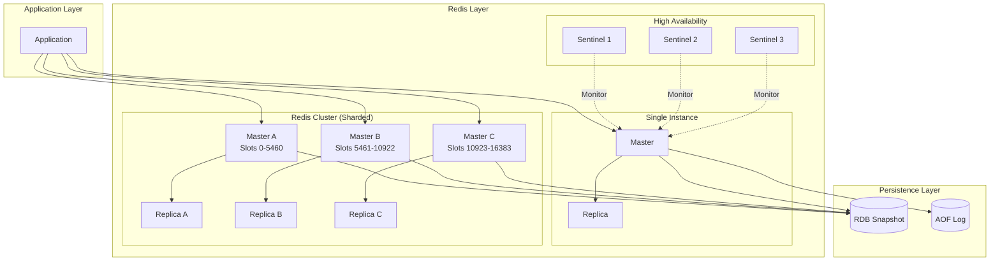

**Key Components:**

| Component | Purpose | When to Use |
|-----------|---------|-------------|
| **Single Master** | Basic Redis instance | Small datasets, simple caching |
| **Master + Replica** | Read scaling + failover | Read-heavy workloads |
| **Sentinel** | Automatic failover | High availability without sharding |
| **Redis Cluster** | Horizontal scaling (sharding) | Large datasets exceeding single node |
| **RDB** | Point-in-time snapshots | Fast restarts, backups |
| **AOF** | Write operation log | Maximum data durability |

**Decision Tree:**

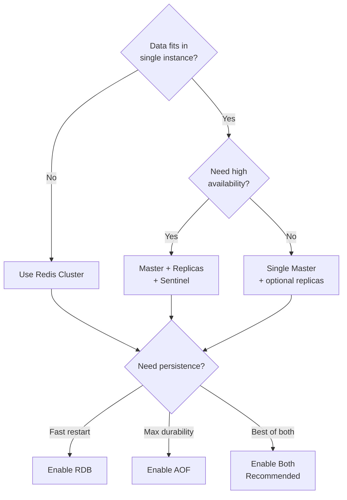

---

## Fundamentals

### What Is Redis?

**Redis** stands for **REmote DIctionary Server**.

At its heart, Redis is:

* An **in-memory data store**
* Extremely **fast** (microsecond latency)
* Used as:
  * Cache
  * Database
  * Message broker
  * Counter system
  * Coordination system

### Redis in One Sentence

> Redis is a **single-threaded, in-memory data structure server** optimized for **speed, simplicity, and predictable behavior**.

### Where Redis Fits in a System

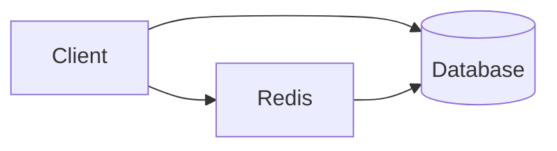

Redis often sits **between your application and your database** to:

* Reduce load
* Improve latency
* Handle real-time data

### Core Redis Philosophy

Redis makes several **strong design choices**:

| Principle              | Meaning                      |
| ---------------------- | ---------------------------- |
| In-memory              | Data lives in RAM for speed  |
| Single-threaded        | No locks, no race conditions |
| Simple data structures | Predictable performance      |
| Explicit durability    | You choose persistence level |

### Why Single-Threaded Is a Feature (Not a Bug)

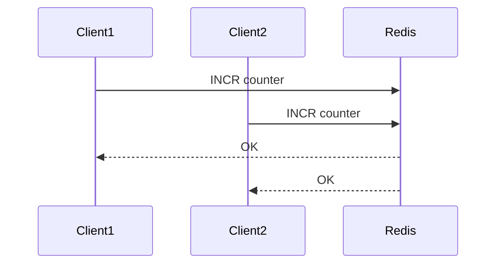

Because Redis processes **one command at a time**:

* No locks
* No inconsistent states
* Operations like `INCR` are **naturally atomic**

### Redis Consistency Model

Redis favors:

> **Consistency per key, not global consistency**

**Key Guarantees:**

* Single command = atomic
* No partial writes
* Replica lag possible
* Cluster operations limited across shards

### Redis Performance Model

Why Redis is fast:

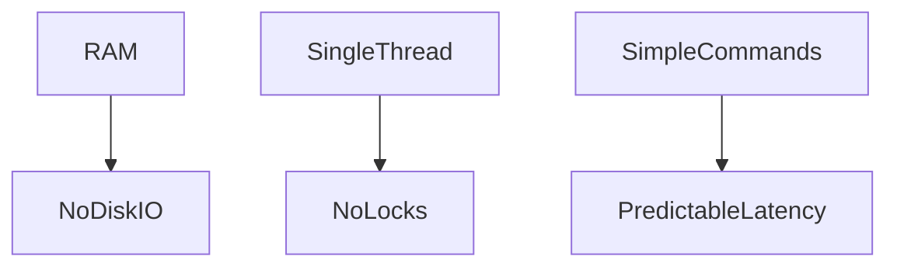

**Typical Latency:**

| Operation   | Latency       |
| ----------- | ------------- |
| GET         | ~1µs          |
| INCR        | ~1–2µs        |
| Network RTT | Dominant cost |

### Redis Is Not a Silver Bullet

Redis trades **features for speed**.

**What Redis Is Great At:**

* Counters
* Caching
* Rate limiting
* Queues
* Leaderboards
* Distributed locks

**What Redis Is Not Good At:**

* Complex queries
* Large cold datasets
* Long-term storage without planning

---

## Data Structures and Operations

### Redis Data Model (Mental Model)

Redis is **not a table store**.

Think of Redis as a **huge hash map in memory**:

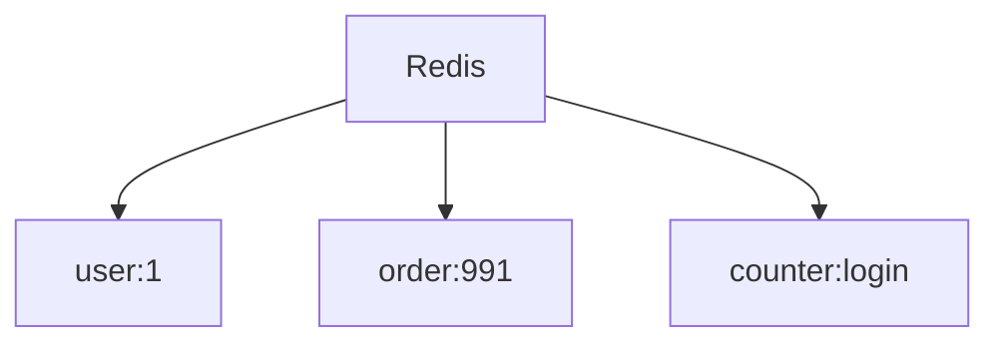

Each key:

* Is a string
* Maps to a **data structure**, not just a value

### Redis Data Structures (Conceptual View)

Redis supports **rich native data types**:

| Type       | Think of it as        |
| ---------- | --------------------- |
| String     | Basic value / counter |
| Hash       | Object                |
| List       | Queue / Stack         |
| Set        | Unique collection     |
| Sorted Set | Ranking system        |
| Stream     | Append-only log       |

**Example Mental Mapping:**

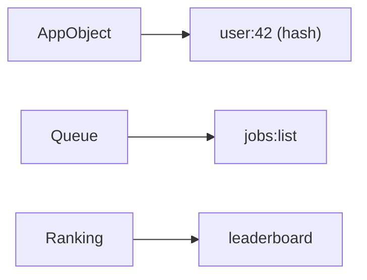

### Redis as a Counter System (`INCR`)

Counters are one of Redis's **killer features**.

**Why `INCR` Is Special:**

* Atomic
* Lock-free
* Extremely fast
* Works under massive concurrency

**How `INCR` Works Internally:**

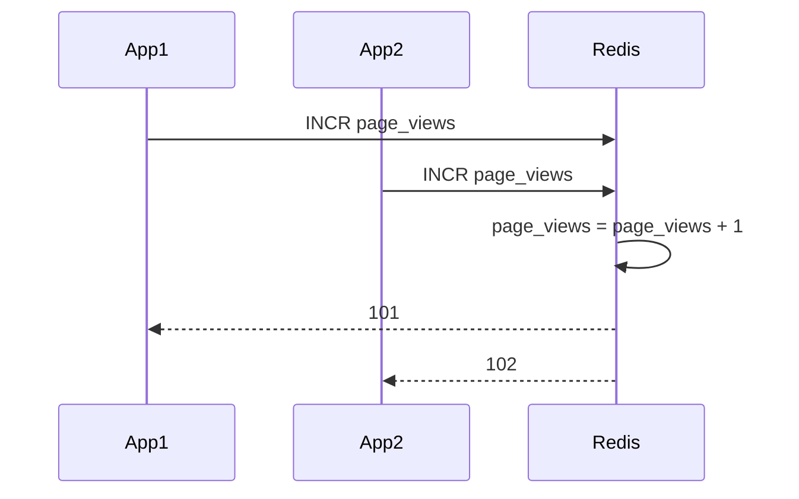

Because Redis is single-threaded:

* No race conditions
* No lost updates

### How Redis Stores Data

**Important Clarification:**

Redis does **NOT** understand `{ "user": "whereq" }` as a data structure by default. Redis only sees **bytes**.

The application must decide how to store data:

**Option 1: Simple key-value**

```bash
SET user whereq
```

Stored as:

```text
"user" -> "whereq"
```

**Option 2: Namespaced key**

```bash
SET user:whereq ""
```

Stored as:

```text
"user:whereq" -> ""
```

**Option 3: JSON serialized**

```bash
SET user:whereq '{"user":"whereq"}'
```

Stored as:

```text
"user:whereq" -> '{"user":"whereq"}'
```

**Option 4: Redis Hash (logical structure)**

```bash
HSET user:whereq user whereq
```

Stored internally as:

```text
"user:whereq" -> hash(user=whereq)
```

---

## Persistence Mechanisms

### Overview

Redis is fundamentally an **in-memory** database, but it provides **optional durability** through two complementary persistence mechanisms:

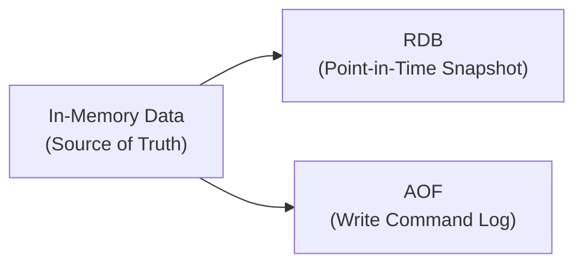

**Key Principle:**

> **Memory is always the source of truth. RDB and AOF are derived artifacts for recovery.**

| Aspect | RDB | AOF |
|--------|-----|-----|
| **What it stores** | Binary snapshot of all data | Sequential log of write commands |
| **When it writes** | Periodic (configurable intervals) | After every write (configurable) |
| **Recovery speed** | Fast (binary load) | Slower (replay commands) |
| **Data loss risk** | Higher (between snapshots) | Lower (per-write durability) |
| **File size** | Compact | Larger (needs rewriting) |
| **Best for** | Backups, replica sync | Maximum durability |

**Data Flow Through Persistence:**

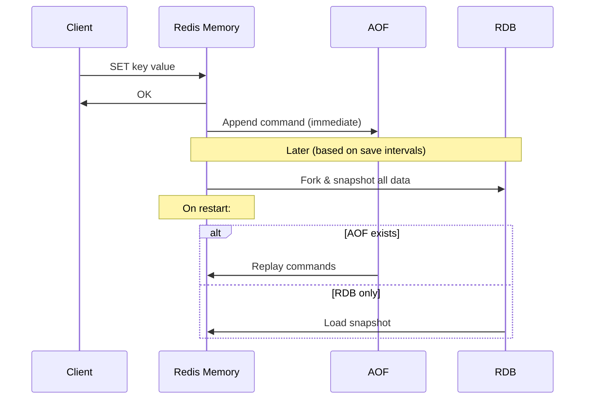

**Relationship Between Components:**

```text
┌───────────────────────────────────────────────┐
│                                               │
│         WRITES FLOW (Write Command)           │
│                                               │
│  Client → Memory → AOF (append)               │
│              ↓                                │
│         (periodic)                            │
│              ↓                                │
│            RDB (snapshot)                     │
│                                               │
└───────────────────────────────────────────────┘

┌───────────────────────────────────────────────┐
│                                               │
│         RECOVERY FLOW (Redis Restart)         │
│                                               │
│  1. Check if AOF exists?                      │
│     ├─ Yes → Load AOF (replay all commands)   │
│     └─ No  → Load RDB (restore snapshot)      │
│                                               │
│  2. Memory rebuilt                            │
│  3. Ready to serve                            │
│                                               │
└───────────────────────────────────────────────┘
```

### RDB (Snapshotting)

**What RDB Really Is:**

**RDB = Redis DataBase file**

It is:

* A **binary file on disk**
* Representing a **point-in-time snapshot of Redis memory**
* Created **by Redis itself**, not by the OS

Think of RDB as:

> 📸 "A photograph of all Redis data at a specific moment in time"

**What is inside an RDB file?**

* Every key
* Every value
* The data type of each value
* Expiration metadata (TTL)

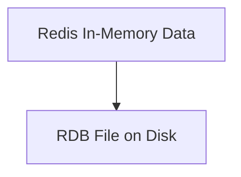

**Is RDB a runtime state?**

**No.** RDB exists **outside Redis memory**.

Redis runtime state is:

* Live data in RAM
* Active connections
* Client buffers

RDB is only used for:

* Restart recovery
* Backup
* Replication bootstrap

**How RDB is created (conceptually):**

Redis:

1. Forks a child process
2. Child process reads memory
3. Writes a compact binary file
4. Parent keeps serving requests

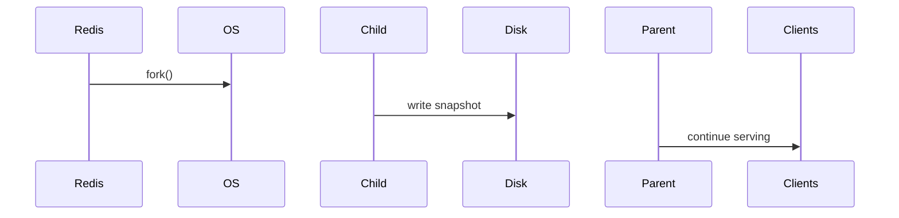

✅ No blocking of the main Redis thread
❗ Extra memory during fork (copy-on-write)

**When Redis uses RDB:**

| Situation              | Use RDB? |
| ---------------------- | -------- |
| Redis restart          | ✅        |
| Full data reload       | ✅        |
| Replica sync (initial) | ✅        |
| Incremental updates    | ❌        |

**Characteristics:**

* Periodic full snapshot
* Fast restart
* Risk of data loss between snapshots

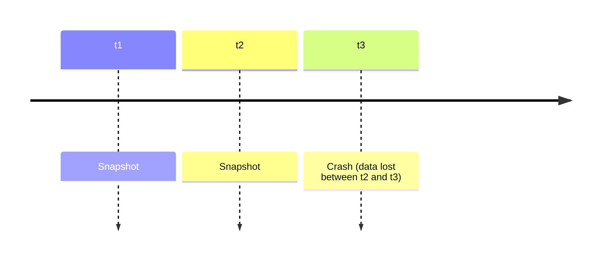

### AOF (Append Only File)

**What AOF Is:**

* Logs every write
* More durable
* Slightly slower


### How Redis Manages Both RDB and AOF Together

**Key clarification:**

There is **NO extra daemon**, **NO sync process**, **NO background service**.

Everything is handled by **the Redis server process itself**.

**RDB vs AOF – different purposes:**

| RDB          | AOF         |
| ------------ | ----------- |
| Snapshot     | Command log |
| Periodic     | Continuous  |
| Fast restore | Durable     |
| Compact      | Larger      |

They **do not sync with each other**.

**How Redis actually works with both enabled:**

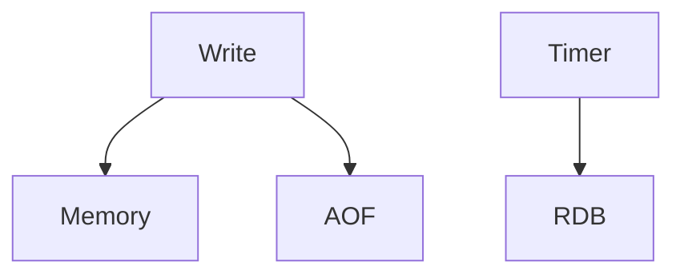

**Important insight:**

* **Memory is the source of truth**
* RDB and AOF are **derived artifacts**

**Restart logic (very important):**

When Redis restarts:

1. If AOF exists → **AOF is used**
2. Else → RDB is used

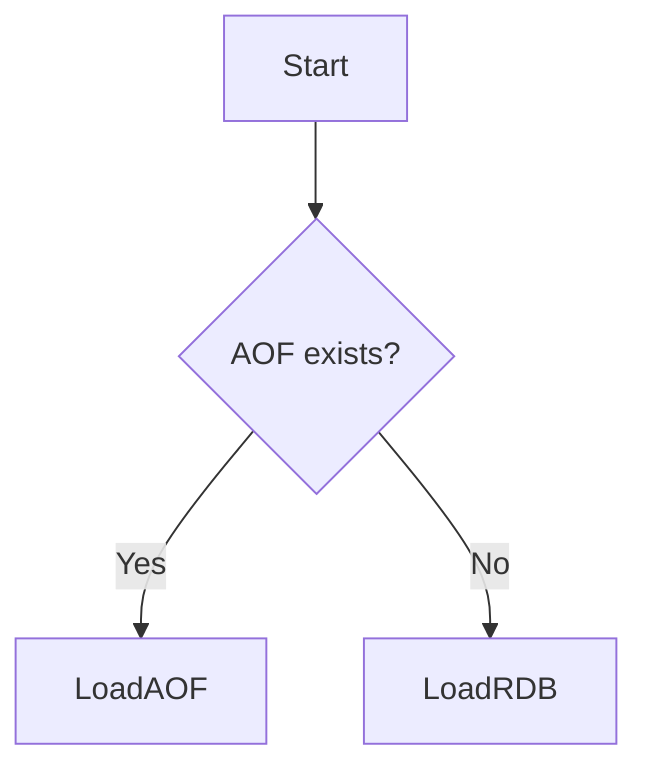

**Why no syncing is needed:**

Because:

* Redis never writes **from RDB to AOF**
* Redis never writes **from AOF to RDB**
* Both are written **from memory**

Memory → Persistence
Not persistence → memory → persistence

**Production Reality:**

Most systems use:

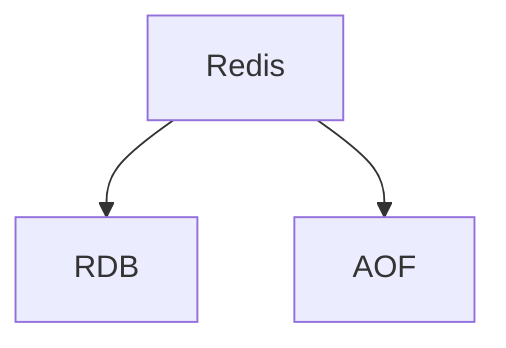

Snapshots for speed + AOF for safety.

### Persistence and Migration

**When slot migration occurs:**

* Migration moves **keys in RAM**
* Does **NOT** force persistence
* Persistence happens later

**If a master crashes after migration but before snapshot:**

Redis handles this safely:

1. Master restarts and loads entire RDB into RAM
2. Cluster metadata (slot ownership) overrides RDB contents
3. Keys that no longer belong to this master are marked invalid
4. They will NOT be served and will eventually be deleted

**Key Principle:**

> **Cluster metadata (slot ownership) overrides RDB contents**

**Will snapshot happen automatically after migration?**

**No.** Slot migration does NOT automatically trigger an RDB snapshot.

Redis deliberately decouples:

* **data movement**
* **persistence timing**

Otherwise, resharding would cause massive disk IO spikes and latency stalls.

**Important:**

* RDB = local historical photo
* RAM = source of truth
* Slots = routing metadata
* Migration = RAM → RAM transfer
* Persistence = future snapshots reflect reality

---

## RDB and AOF File Formats Deep Dive

This section explores the **internal structure** of Redis persistence files, how they are organized on disk, and the engineering trade-offs made in their design.

### RDB File Format and Structure

**What's Inside an RDB File?**

An RDB file is a **binary serialization** of Redis's entire in-memory dataset at a specific point in time.

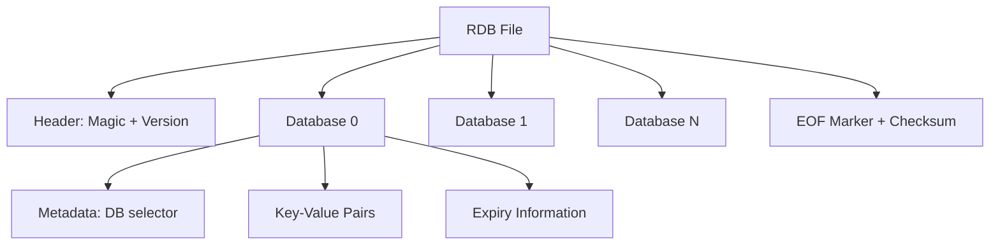

**RDB File Structure (Sequential Layout):**

```text
┌─────────────────────────────────────────────────────────┐
│ MAGIC NUMBER: "REDIS" (5 bytes)                         │
├─────────────────────────────────────────────────────────┤
│ VERSION: "0009" (4 bytes, current version)              │
├─────────────────────────────────────────────────────────┤
│ AUXILIARY FIELDS (optional metadata)                    │
│  - Redis version                                        │
│  - Creation timestamp                                   │
│  - Used memory                                          │
│  - Replication info                                     │
├─────────────────────────────────────────────────────────┤
│ DATABASE SELECTOR (e.g., DB 0)                          │
├─────────────────────────────────────────────────────────┤
│ RESIZE DB (hash table size hints)                       │
├─────────────────────────────────────────────────────────┤
│ KEY-VALUE PAIRS                                         │
│  ┌──────────────────────────────────────┐               │
│  │ Type byte (string/list/hash/etc.)    │               │
│  │ Key (encoded string)                 │               │
│  │ Value (type-specific encoding)       │               │
│  │ Expiry (optional, millisecond TTL)   │               │
│  └──────────────────────────────────────┘               │
│  ... (repeat for all keys in DB)                        │
├─────────────────────────────────────────────────────────┤
│ DATABASE SELECTOR (e.g., DB 1)                          │
│ ... (more key-value pairs)                              │
├─────────────────────────────────────────────────────────┤
│ EOF MARKER (0xFF)                                       │
├─────────────────────────────────────────────────────────┤
│ CRC64 CHECKSUM (8 bytes)                                │
└─────────────────────────────────────────────────────────┘
```

**Key-Value Encoding:**

Each data type has optimized encoding:

| Data Type | Encoding Strategy | Example |
|-----------|------------------|---------|
| **String** | Raw bytes, integer encoding for numbers | `"123"` → 3-byte integer vs 3-byte string |
| **List** | Ziplist (compact) or LinkedList | Small lists: compressed format |
| **Hash** | Ziplist or Hash Table | Depends on size thresholds |
| **Set** | IntSet or Hash Table | Integer-only sets: compact array |
| **Sorted Set** | Ziplist or Skip List | Hybrid encoding based on size |
| **Stream** | Radix tree nodes | Specialized compact format |

**Example: String Encoding**

```text
Small integers (0-9999):
  Type: 1 byte (REDIS_ENCODING_INT)
  Value: variable length integer encoding

Short strings (<= 20 bytes):
  Type: 1 byte
  Length: 1 byte
  Data: N bytes

Long strings:
  Type: 1 byte
  Length: 4 bytes (encoded)
  Data: N bytes

LZF Compressed strings:
  Type: 1 byte + compression flag
  Compressed length: variable
  Uncompressed length: variable
  Compressed data: N bytes
```

**Does RDB Have Indexes?**

❌ **No** — RDB has **NO internal indexes**.

RDB is designed for:

* **Sequential write** (fast snapshot creation)
* **Sequential read** (fast full restore)
* **Minimal file size** (no index overhead)

**How RDB Restore Works:**

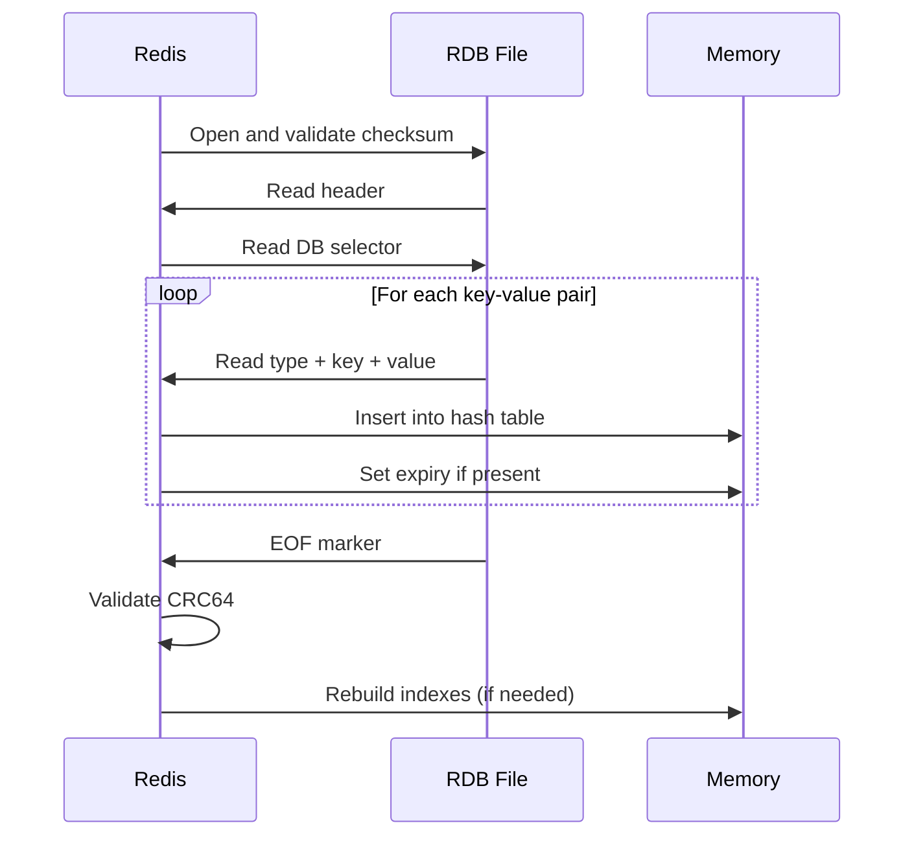

**Key Point:**

> RDB is a **dump**, not a database. It's optimized for bulk I/O, not random access.

**RDB Trade-offs:**

| Advantage ✅ | Disadvantage ❌ |
|-------------|-----------------|
| Compact binary format | No indexes = can't query RDB directly |
| Fast to write (sequential I/O) | Must load entire file to access any data |
| Fast to read (sequential load) | Memory spike during fork (copy-on-write) |
| Built-in compression (LZF) | Periodic snapshots = potential data loss |
| CRC64 integrity check | Large datasets = long snapshot time |
| Portable across architectures | Not human-readable |

**RDB Creation Process (Technical Details):**

```mermaid
flowchart TD
    Start[Write command triggers save] --> Fork[fork() creates child process]
    Fork --> COW[Parent uses Copy-on-Write]
    Fork --> Child[Child has memory snapshot]

    COW --> Parent[Parent continues serving requests]
    Child --> Iterate[Iterate all databases]
    Iterate --> Encode[Encode each key-value]
    Encode --> Write[Sequential write to temp file]
    Write --> Rename[Atomic rename to dump.rdb]
    Rename --> Exit[Child exits]

    Parent --> Continue[Continues normally]
    Exit --> Continue
```

**Why RDB Uses fork():**

* Parent process **never blocks** on disk I/O
* Child gets consistent **point-in-time snapshot**
* Copy-on-write = minimal memory overhead (only modified pages are copied)

**Storage Organization:**

```text
Redis Data Directory:
/var/lib/redis/
├── dump.rdb           ← Current RDB snapshot
├── temp-<pid>.rdb     ← Temporary file during save (deleted after rename)
└── appendonly.aof     ← AOF file (if enabled)
```

**RDB Configuration:**

```conf
# Automatic snapshots
save 900 1      # After 900 sec (15 min) if at least 1 key changed
save 300 10     # After 300 sec (5 min) if at least 10 keys changed
save 60 10000   # After 60 sec if at least 10000 keys changed

# Compression
rdbcompression yes    # Use LZF compression (CPU vs size trade-off)

# Checksum
rdbchecksum yes       # CRC64 integrity check
```

### AOF File Format and Structure

**What's Inside an AOF File?**

AOF (Append-Only File) is a **text-based log** of every write operation, stored in **RESP protocol format** (Redis Serialization Protocol).

```mermaid
graph TD
    AOF[AOF File] --> Cmd1[Command 1: SET key1 value1]
    AOF --> Cmd2[Command 2: INCR counter]
    AOF --> Cmd3[Command 3: LPUSH list item]
    AOF --> CmdN[Command N: ...]

    Cmd1 --> RESP1[RESP Format]
    Cmd2 --> RESP2[RESP Format]
```

**AOF File Structure (Sequential Log):**

```text
┌─────────────────────────────────────────────────────────┐
│ *2                          ← Array with 2 elements     │
│ $6                          ← Bulk string, 6 bytes      │
│ SELECT                      ← Command name              │
│ $1                          ← Bulk string, 1 byte       │
│ 0                           ← Database number           │
├─────────────────────────────────────────────────────────┤
│ *3                          ← Array with 3 elements     │
│ $3                          ← Bulk string, 3 bytes      │
│ SET                         ← Command name              │
│ $4                          ← Bulk string, 4 bytes      │
│ key1                        ← Key                       │
│ $6                          ← Bulk string, 6 bytes      │
│ value1                      ← Value                     │
├─────────────────────────────────────────────────────────┤
│ *2                                                       │
│ $4                                                       │
│ INCR                                                     │
│ $7                                                       │
│ counter                                                  │
├─────────────────────────────────────────────────────────┤
│ ... (commands continue chronologically)                 │
└─────────────────────────────────────────────────────────┘
```

**RESP Protocol Format:**

```text
RESP Types:
  *N      = Array with N elements
  $N      = Bulk string with N bytes
  +       = Simple string
  -       = Error
  :       = Integer
```

**Example: Storing a Hash**

```bash
HSET user:1 name "Alice" age 30
```

Becomes in AOF:

```text
*5
$4
HSET
$6
user:1
$4
name
$5
Alice
$3
age
$2
30
```

**Does AOF Have Indexes?**

❌ **No** — AOF also has **NO indexes**.

AOF is:

* **Append-only** (writes only at the end)
* **Sequential read** (replay from start)
* **No random access needed**

**How AOF Restore Works:**

```mermaid
sequenceDiagram
    participant Redis
    participant AOF File
    participant Memory

    Redis->>AOF File: Open file
    loop For each command
        AOF File->>Redis: Read RESP command
        Redis->>Redis: Parse command
        Redis->>Memory: Execute command
        Redis->>Memory: Update data structures
    end
    AOF File->>Redis: EOF reached
    Redis->>Memory: Ready to serve
```

**AOF Rewrite Process:**

Over time, AOF grows as it logs **every** write. Redis periodically **rewrites** AOF to compact it.

```mermaid
flowchart TD
    Start[AOF grows too large] --> Trigger[Auto-rewrite triggered]
    Trigger --> Fork[fork() child process]

    Fork --> Parent[Parent: Continue logging to old AOF]
    Fork --> Child[Child: Iterate current memory]

    Child --> Snapshot[Read current state from memory]
    Snapshot --> Generate[Generate minimal commands]
    Generate --> NewAOF[Write to temp AOF file]

    Parent --> Buffer[Buffer new writes in memory]
    NewAOF --> Append[Append buffered writes]
    Append --> Rename[Atomic rename to appendonly.aof]
    Rename --> Replace[Old AOF replaced]
```

**Before Rewrite:**

```text
SET counter 1
INCR counter
INCR counter
INCR counter
DEL temp_key
SET temp_key value
DEL temp_key
SET user:1 Alice
SET user:1 Bob
... (thousands of operations)
```

**After Rewrite:**

```text
SET counter 4
SET user:1 Bob
... (only final state)
```

**AOF Rewrite = Converting history into current state**

**AOF Fsync Strategies:**

AOF offers **three durability levels** via `appendfsync`:

| Strategy | Behavior | Durability | Performance | Data Loss Risk |
|----------|----------|------------|-------------|----------------|
| `always` | fsync() after **every** write | Maximum | Slowest | ~0 (only crash during write) |
| `everysec` | fsync() **once per second** | Good | Fast | ~1 second of data |
| `no` | Let OS decide when to flush | Minimal | Fastest | Potentially 30+ seconds |

**Technical Detail:**

```c
// Simplified AOF write flow
write_command_to_aof_buffer(command);

if (appendfsync == ALWAYS) {
    fsync(aof_fd);  // Force write to disk NOW
} else if (appendfsync == EVERYSEC) {
    // Background thread calls fsync() every second
    schedule_fsync_background();
} else {
    // OS will flush when it wants
}
```

**Storage Organization:**

```text
Redis Data Directory:
/var/lib/redis/
├── appendonly.aof           ← Main AOF file
├── appendonly.aof.manifest  ← Manifest for multi-part AOF (Redis 7+)
├── appendonly.aof.1.base.rdb    ← Base RDB (Redis 7+)
├── appendonly.aof.1.incr.aof    ← Incremental AOF (Redis 7+)
└── temp-rewriteaof-<pid>.aof    ← Temporary during rewrite
```

**Redis 7+ Multi-Part AOF:**

Redis 7 introduced **AOF 2.0** with multiple files:

```mermaid
graph LR
    Base[Base RDB Snapshot] --> Incr1[Incremental AOF 1]
    Incr1 --> Incr2[Incremental AOF 2]
    Incr2 --> IncrN[Incremental AOF N]
```

Benefits:

* Faster rewrite (doesn't block as long)
* Better crash recovery
* Lower memory overhead

**AOF Trade-offs:**

| Advantage ✅ | Disadvantage ❌ |
|-------------|-----------------|
| Much better durability (per-write) | Larger file size than RDB |
| Human-readable (RESP text format) | Slower recovery (must replay all commands) |
| Automatic rewrite compaction | Rewrite can spike CPU/memory |
| Granular fsync control | Not portable across Redis versions (sometimes) |
| Append-only = crash-safe writes | Can grow very large without rewrite |
| Preserves command history | No random access to specific keys |

**AOF Configuration:**

```conf
# Enable AOF
appendonly yes

# Fsync strategy
appendfsync everysec    # Recommended balance

# Auto-rewrite trigger
auto-aof-rewrite-percentage 100    # Rewrite when 100% larger
auto-aof-rewrite-min-size 64mb     # Minimum size to trigger

# AOF file name
appendfilename "appendonly.aof"

# Use RDB preamble (hybrid mode)
aof-use-rdb-preamble yes    # Store base snapshot as RDB + incremental AOF
```

### Hybrid Persistence: RDB + AOF Together

**How They Work Together:**

```mermaid
graph TD
    Write[Write Command] --> Memory[Update Memory]
    Memory --> AOF[Append to AOF]

    Timer[Periodic Timer] --> RDB[Create RDB Snapshot]
    RDB --> Disk1[dump.rdb]
    AOF --> Disk2[appendonly.aof]

    Memory -.Source of Truth.-> Both[Both derive from memory]
```

**Restart Priority:**

```mermaid
flowchart TD
    Start[Redis Starts] --> Check{AOF enabled?}
    Check -->|Yes| AOFExists{AOF file exists?}
    Check -->|No| UseRDB[Load dump.rdb]

    AOFExists -->|Yes| LoadAOF[Load AOF<br/>Higher priority]
    AOFExists -->|No| LoadRDB[Load dump.rdb]

    LoadAOF --> Validate[Validate data]
    LoadRDB --> Validate
    UseRDB --> Validate
```

**Why AOF Has Priority?**

> AOF is more up-to-date (potentially has writes after last RDB snapshot)

**Hybrid Persistence Strategy (Best Practice):**

```conf
# Enable both
save 900 1
appendonly yes
appendfsync everysec

# Use RDB-format base in AOF rewrites
aof-use-rdb-preamble yes
```

**Result:**

* **RDB** provides fast restart baseline
* **AOF** provides durability since last snapshot
* **Hybrid mode** = best of both worlds

### File Format Evolution and Compatibility

**RDB Versions:**

| Version | Redis Version | Key Changes |
|---------|---------------|-------------|
| 1 | 1.0 | Initial format |
| 5 | 2.6 | Millisecond expiry |
| 6 | 2.8 | LZF compression improvements |
| 7 | 3.2 | Quick list encoding |
| 9 | 5.0 | Stream data type, 64-bit lengths |

**Compatibility:**

* Redis can read **older** RDB formats
* Redis cannot read **newer** RDB formats
* Always test before downgrading

**AOF Format:**

* RESP2 (traditional)
* RESP3 (Redis 6+, backward compatible)
* Multi-part AOF (Redis 7+)

### Performance Characteristics

**RDB Performance:**

```mermaid
graph LR
    Fork[fork] -->|Instant| Child[Child Process]
    Child -->|Sequential Write| Disk[Disk I/O]
    Disk -->|~1-10 seconds| Complete[Complete]

    Fork -.Copy-on-Write.-> Memory[Memory Overhead]
```

**Typical RDB Save Time:**

| Dataset Size | Approximate Time | Memory Overhead |
|--------------|------------------|-----------------|
| 1 GB | 1-2 seconds | < 50 MB (COW) |
| 10 GB | 10-20 seconds | < 500 MB (COW) |
| 100 GB | 100-200 seconds | < 5 GB (COW) |

**AOF Performance:**

* **Write latency:** +0.1-1 ms (depends on fsync strategy)
* **Rewrite time:** Similar to RDB (background fork)
* **Recovery time:** Slower than RDB (replay all commands)

**Comparison:**

```text
Recovery Time:
RDB:  10 GB → ~30 seconds (sequential read + hash table rebuild)
AOF:  10 GB → ~5 minutes (parse + execute millions of commands)

Durability:
RDB:  Last snapshot (potentially minutes/hours old)
AOF:  Last fsync (potentially 0-1 seconds old)
```

### Internal Storage and I/O Optimization

**Linux Kernel Optimizations Redis Uses:**

1. **fork() + Copy-on-Write**
   * Shared memory pages until modification
   * Minimal memory duplication

2. **mmap() for file I/O**
   * Memory-mapped files for fast access

3. **fallocate() for AOF**
   * Pre-allocate disk space for better performance

4. **fdatasync() vs fsync()**
   * `fdatasync()` = faster, skips metadata updates

**Write Amplification:**

```text
AOF Write Amplification = How many disk writes per logical write?

appendfsync always:   1 fsync per write  = High durability, high cost
appendfsync everysec: 1 fsync per second = Good balance
appendfsync no:       OS buffering       = Low cost, low durability
```

### Trade-offs Summary

**RDB:**

```text
✅ Fast restart
✅ Compact file
✅ No runtime overhead
✅ Perfect for backups

❌ Data loss risk (between snapshots)
❌ Memory spike during fork
❌ Long save time for huge datasets
❌ No incremental updates
```

**AOF:**

```text
✅ High durability (per-write)
✅ Human-readable
✅ Continuous updates
✅ Automatic compaction (rewrite)

❌ Larger files
❌ Slower recovery
❌ Slight write latency overhead
❌ Rewrite can be expensive
```

**Hybrid (Recommended):**

```text
✅ Best of both worlds
✅ Fast recovery (RDB base)
✅ Minimal data loss (AOF incremental)

⚠️ Slightly more complex configuration
⚠️ Uses more disk space
```

### Key Takeaways

1. **RDB** = Binary snapshot, NO indexes, sequential I/O optimized
2. **AOF** = Command log, NO indexes, append-only optimized
3. Both use **fork()** to avoid blocking main thread
4. Neither has random access capability - they're recovery mechanisms, not databases
5. **Hybrid mode** (RDB + AOF) is the recommended production setup
6. File formats evolve with Redis versions - test compatibility when upgrading

**Mental Model:**

```text
┌─────────────────────────────────────────────┐
│         In-Memory Data Structures           │
│           (Source of Truth)                 │
└─────────┬─────────────────────┬─────────────┘
          │                     │
          ▼                     ▼
    ┌──────────┐          ┌──────────┐
    │   RDB    │          │   AOF    │
    │ Snapshot │          │ Command  │
    │  File    │          │   Log    │
    └──────────┘          └──────────┘

    No Indexes            No Indexes
    Sequential I/O        Append-Only
    Fast Recovery         High Durability
```

---

## Replication and High Availability

### Master–Replica Model

Replication means **copying data** from one Redis to others.

```mermaid
graph TD
    Master --> Replica1
    Master --> Replica2
```

* Writes go to **Master**
* Reads can go to **Replicas**
* Replicas are eventually consistent

**Why Replicas Matter:**

* Scale reads
* Protect against data loss
* Enable failover

### How Master–Replica Works Internally

**Key correction:**

❗ **Master is NOT always the only interface to the application**

That's a *design choice*, not a Redis rule.

**Logical model:**

```mermaid
graph TD
    App --> Master
    Master --> Replica1
    Master --> Replica2
```

* Writes → Master
* Reads → Master **or** Replicas (optional)

**How data flows:**

There is **no separate sync daemon**.

Replication is done by:

* Redis master
* Redis replica
* Using a **replication protocol**

**Replication phases:**

**Phase 1: Full sync (initial)**

```mermaid
sequenceDiagram
    Replica->>Master: SYNC
    Master->>Replica: RDB snapshot
    Master->>Replica: buffered writes
```

**Phase 2: Continuous replication**

```mermaid
sequenceDiagram
    Client->>Master: Write
    Master->>Replica: Propagate command
```

* Replicas replay commands
* Replication is **asynchronous**

**Can applications talk to replicas?**

Yes — but carefully.

| Operation          | Safe on Replica? |
| ------------------ | ---------------- |
| Reads              | ✅                |
| Writes             | ❌                |
| Strong consistency | ❌                |

**Master and Replica Relationship:**

* Master and replica are **the same Redis server binary**
* Same persistence mechanisms (RDB/AOF)
* Same data model
* Same networking behavior
* Roles are **logical**, not physical

Replacement happens via **failover**, not magically.

```mermaid
graph LR
    Master --> Replica
    Replica -->|Failover| NewMaster
```

### Sentinel (High Availability Brain)

**Redis Sentinel** watches Redis instances.

**What Sentinel Does:**

* Monitors Redis health
* Detects failures
* Promotes replicas
* Reconfigures clients

**Sentinel Architecture:**

```mermaid
graph TD
    Sentinel1 --> Master
    Sentinel2 --> Master
    Sentinel3 --> Master
    Master --> Replica
```

Sentinels **vote** to avoid false failover.

**Why 3 Sentinels?**

**Quorum and fault tolerance**

**Sentinel is NOT Redis:**

* Sentinel is a **separate process**
* It monitors Redis nodes
* It talks to other Sentinels

**Why multiple Sentinels?**

If only **1 Sentinel**:

* Network glitch = false failover

If **2 Sentinels**:

* Split brain possible

If **3 Sentinels**:

* Majority vote works

**Odd number rule:**

```mermaid
graph TD
    Sentinel1 --> Vote
    Sentinel2 --> Vote
    Sentinel3 --> Vote
```

Majority = 2 out of 3
Failover only happens if quorum is reached

**Sentinel failure tolerance:**

| Sentinels | Can lose |
| --------- | -------- |
| 3         | 1        |
| 5         | 2        |

**Automatic Failover Flow:**

```mermaid
sequenceDiagram
    Sentinel->>Master: Ping
    Master--x Sentinel: No response
    Sentinel->>Replica: Promote
    Replica->>Sentinel: I am master
```

---

## Redis Cluster and Sharding

### Understanding Nodes, Instances, and Masters

**Terminology:**

| Term               | Meaning                               |
| ------------------ | ------------------------------------- |
| **Node**           | A machine / VM / container            |
| **Redis instance** | One Redis process                     |
| **Master**         | A Redis instance that owns slots      |
| **Replica**        | A Redis instance replicating a master |

**Important:**

🔴 **One Redis instance = one role (master OR replica)**
🔴 **One node can host multiple Redis instances (rare in prod)**

**Correct architecture:**

```mermaid
graph TD
    Node1 --> MasterA
    Node2 --> ReplicaA1
    Node3 --> ReplicaA2
```

**Best practice:**

One Redis instance per node for:

* Simpler failure domain
* Clear CPU / memory isolation
* Predictable persistence behavior

### What Is Redis Cluster?

When a single Redis node is not enough, you use **Redis Cluster**.

**What Is Sharding?**

Splitting data across **multiple Redis nodes**.

```mermaid
graph TD
    App --> Slot1[Redis Node A]
    App --> Slot2[Redis Node B]
    App --> Slot3[Redis Node C]
```

**Correct Redis Cluster Layout:**

> **A Redis Cluster has multiple masters, each responsible for a subset of slots**

```mermaid
graph TD
    Master1 --> Replica1
    Master2 --> Replica2
    Master3 --> Replica3
```

Each master:

* Owns a **different shard (slot range)**
* Has **0+ replicas**

**Why multiple masters are required:**

| Reason       | Explanation                            |
| ------------ | -------------------------------------- |
| Scalability  | One master cannot hold entire keyspace |
| Throughput   | Writes distributed across masters      |
| Availability | Failure isolates only part of data     |

### Understanding Sharding

**Correct definition:**

> **Sharding partitions the KEYSPACE, not snapshots**

Sharding:

* Happens at **runtime**
* Happens at **key routing time**
* Is **independent of persistence**

**Correct sharding model:**

```mermaid
graph TD
    Keyspace --> Slot0-5000 --> MasterA
    Keyspace --> Slot5001-10000 --> MasterB
    Keyspace --> Slot10001-16383 --> MasterC
```

**Replica relationship:**

```mermaid
graph TD
    MasterA --> ReplicaA1
    MasterB --> ReplicaB1
```

❗ Replicas do **NOT** participate in sharding
❗ Replicas mirror **exactly one master's shard**

**Snapshot relationship:**

```mermaid
graph TD
    MasterA --> RDB_A
    MasterB --> RDB_B
    ReplicaA1 --> RDB_A_replica
```

📌 Each instance snapshots **only its own shard**

**Important Clarifications:**

* Sharding = logical keyspace partitioning concept
* Realized by assigning slot ranges to Redis master instances
* NOT a file, NOT a database, NOT a persistence mechanism

**Shard Definition:**

> Shard = Master + its assigned slots (+ replicas)

**One master owns one or more slot ranges, which together form a shard.**

A master **can own multiple non-contiguous slot ranges**, but conceptually they are treated as **one shard**.

```mermaid
graph TD
    MasterA --> Slot1_100
    MasterA --> Slot300_500
```

### Redis Cluster Architecture

**Critical Understanding:**

> **Redis has NO "cluster main controller"**
> **Redis Cluster is fully decentralized**

Every Redis node:

* Knows the slot map
* Can redirect clients
* Acts independently

**What Redis Cluster Solves:**

| Problem                 | Solved?     |
| ----------------------- | ----------- |
| Horizontal scaling      | ✅           |
| Node failure            | ✅           |
| Cross-slot transactions | ❌ (limited) |

**Big Picture:**

```mermaid
graph TD
    App --> RedisCluster
    RedisCluster --> Master1
    RedisCluster --> Master2
    Master1 --> Replica1
    Master2 --> Replica2
    Sentinel --> RedisCluster
    RedisCluster --> Disk
```

---

## Hash Slots Deep Dive

### Why Redis Has Hash Slots (Not Just Hash % N)

Before Redis Cluster (pre-3.0), people did:

```text
node = hash(key) % number_of_nodes
```

**Problems with that approach:**

* Adding/removing a node reshuffles **almost all keys**
* Massive cache invalidation
* Impossible to do online resharding

**Redis Cluster Solution: Hash Slots**

Redis introduces an **indirection layer**:

```text
Key → Hash → Slot → Master Node
```

```mermaid
flowchart LR
    Key --> Hash
    Hash --> Slot[0..16383]
    Slot --> Master
```

**Fixed number of slots:**

* **16384 slots (0–16383)**
* Slots never change
* Only **slot → node mapping changes**

This is the foundation of Redis Cluster scalability.

### Exact Hash / Slot Algorithm

**Step 1: Extract hash tag (if any)**

```text
key = user:{42}:profile
hash_input = 42
```

If `{}` exists → only content inside is hashed
If not → entire key is hashed

**Step 2: CRC16**

```text
slot = CRC16(hash_input) % 16384
```

**Why CRC16?**

* Fast
* Good distribution
* Deterministic
* Same across all clients

**Step 3: Slot → Master lookup**

```mermaid
flowchart LR
    Slot -->|Slot table| MasterA
```

**Important:**

🔹 Only the **key string** matters for slot calculation
🔹 The value is irrelevant for routing

### Slot Ranges and Assignment

**Is the Redis slot just an integer calculated by CRC16?**

✅ Yes — in modern Redis Cluster:

```text
slot = CRC16(key) % 16384
```

* Slot range is **fixed**: `0 – 16383`
* This has **never changed** since Redis Cluster was introduced
* Slots are **integers only**, not ranges, not objects

**Important:**

> **A key always hashes to the same slot forever.**
> Slot migration only changes **which node owns that slot**, not how the slot is computed.

**Example: 3-Master Cluster**

Total slots = 16384

| Master   | Slots         |
| -------- | ------------- |
| Master A | 0 – 5460      |
| Master B | 5461 – 10922  |
| Master C | 10923 – 16383 |

This is:

* Balanced
* Explicit
* Deterministic

📌 These ranges are **not required** to be contiguous.

**Can slots in the same shard be non-contiguous?**

✅ **Yes — absolutely allowed**

**Redis Cluster rule:**

> A master can own **any set of slots**, contiguous or not

**Example:**

```mermaid
graph TD
    Slot1_100 --> MasterA
    Slot201_300 --> MasterA
    Slot101_200 --> MasterB
```

✔ Redis does **not require continuity**
✔ Continuity is usually chosen for **operational simplicity**

**Why Redis allows non-contiguous slots:**

* Online resharding
* Gradual migration
* Failure recovery
* Load balancing

**Why operators prefer contiguous slots:**

* Easier to reason about
* Faster debugging
* Cleaner monitoring

### Slot Assignment

**Who assigns and manages slot ranges?**

❌ Not applications
❌ Not hashing logic
❌ Not modulo arithmetic

✅ **Redis Cluster itself (with admin tools)**

Slot assignment happens via:

* `redis-cli --cluster create`
* `redis-cli --cluster reshard`
* Redis operators / orchestration systems
* Cloud Redis services

**How slot assignment works internally:**

Each master maintains:

```text
slots[0..16383] → owned / not owned
```

Cluster-wide metadata looks like:

```mermaid
flowchart TB
    SlotMap["Cluster Slot Map"]

    SlotMap -->|0-5460| MasterA
    SlotMap -->|5461-10922| MasterB
    SlotMap -->|10923-16383| MasterC
```

Clients cache this map.

**Where Is Slot Ownership Stored?**

Each Redis node keeps:

* A **full copy of the cluster topology**
* Slot → node mapping
* Node health state

Stored in:

```text
nodes.conf
```

This file is:

* Managed automatically
* Updated by Redis itself
* Never edited manually

### Slot Migration

**Are Slots Physical Things?**

❌ No — slots are NOT physical objects

A **slot** is:

* A **logical label (0–16383)**
* Used only for **routing and ownership**
* Stored as **cluster metadata in each Redis node**

There is:

* ❌ No slot file
* ❌ No slot directory
* ❌ No slot process
* ❌ No slot memory region

**What is physical?**

| Physical        | Description              |
| --------------- | ------------------------ |
| Redis instance  | OS process               |
| Memory          | Actual key-value storage |
| Keys            | Stored in RAM            |
| RDB / AOF       | Persistence files        |
| TCP connections | Client & cluster bus     |

Slots are **just numbers** used to decide *which keys belong where*.

**What Does "Slot Migration" Actually Mean?**

Slot migration is a **two-part operation**:

```text
1. Move ownership of a slot
2. Move keys belonging to that slot
```

**Step-by-Step Slot Migration:**

Let's migrate **slot 8000** from Master A → Master B

**Step 1: Mark slot as "migrating" and "importing"**

```mermaid
sequenceDiagram
    participant A as Master A
    participant B as Master B
    participant C as Clients

    A->>A: slot 8000 = MIGRATING to B
    B->>B: slot 8000 = IMPORTING from A
```

* Slot still logically exists
* Both nodes know migration is in progress

**Step 2: Move keys belonging to the slot**

```mermaid
flowchart LR
    Key1 -->|DUMP| A
    A -->|RESTORE| B
```

Redis internally:

* Scans keys in slot 8000 on A
* Serializes each key
* Sends to B
* Deletes from A

This is **key-level movement**, not memory blocks.

**What actually moves:**

```text
KEY + VALUE + TTL + TYPE
```

Internally via:

```text
MIGRATE host port key db timeout
```

**Step 3: Finalize slot ownership**

```mermaid
sequenceDiagram
    A->>A: remove slot 8000
    B->>B: own slot 8000
    A->>Cluster: update slot map
    B->>Cluster: update slot map
```

Now:

```text
slot 8000 → Master B
```

**Important Corrections:**

* Slots are **never transmitted**
* Only key-value pairs move
* Slot metadata is updated **separately**

There is **no structure like**:

```json
{
  "slot": 5793,
  "data": {...}
}
```

**Who Coordinates Slot Migration?**

❌ Not Sentinel
❌ Not a central controller
❌ Not ZooKeeper
❌ Not etcd

✅ **Redis nodes coordinate themselves**

Redis Cluster is **fully decentralized**.

**Coordination happens via:**

* **Cluster bus** (TCP port: `client_port + 10000`)
* **Gossip protocol**
* **Cluster state machine inside each Redis process**

**Who initiates migration?**

Usually:

* `redis-cli --cluster reshard`
* Or orchestration tools (K8s operator, Ansible, etc.)

But once initiated:
➡ **Redis nodes do everything themselves**

**How Do Clients Survive During Migration?**

This is where **ASK / MOVED** comes in.

**During migration:**

```mermaid
sequenceDiagram
    Client->>MasterA: GET key_in_8000
    MasterA-->>Client: ASK MasterB
    Client->>MasterB: ASKING + GET key
```

* Temporary redirect
* Client retries once
* No downtime

**After migration:**

```mermaid
sequenceDiagram
    Client->>AnyNode: GET key
    Node-->>Client: MOVED slot 8000 MasterB
```

* Permanent redirect
* Client updates slot cache

### Hash Tags: Forcing Co-Location

**Problem:**

Multi-key operations must be on **same slot**

```text
MGET user:1 user:2 ❌ (likely different slots)
```

**Solution: Hash tags**

```text
user:{42}:name
user:{42}:email
```

Both hash on `42`

```mermaid
flowchart LR
    user42name --> SlotX
    user42email --> SlotX
    SlotX --> MasterA
```

✔ Multi-key ops work
✔ Transactions work
✔ Lua scripts work

**Hash Tag Rule:**

```text
Only substring inside { } is hashed
```

**Best practice:**

* Use hash tags **sparingly**
* Avoid hotspotting
* Never hash on low-cardinality values (e.g. `{US}`)

### Can You Customize Hash / Slot Logic?

**What you CANNOT customize:**

| Item                      | Customizable     |
| ------------------------- | ---------------- |
| Number of slots           | ❌ Fixed at 16384 |
| Hash algorithm            | ❌ CRC16 is fixed |
| Slot computation          | ❌ Fixed          |
| Slot redirection behavior | ❌ Fixed          |

Redis **must** behave identically across all clients.

**What you CAN influence:**

**1. Key design**

This is your **only real control**

```text
user:{id}:*
order:{id}:*
session:{id}
```

**2. Slot distribution**

Via:

* `CLUSTER ADDSLOTS`
* `CLUSTER DELSLOTS`
* `redis-cli --cluster reshard`

**3. Read routing**

* Read from master only
* Or allow replica reads (client-level)

### Complete Data Flow Example

**Example: Writing and Reading Data**

**Data:** `{user: "whereq"}`

**Write Flow:**

1. Application stores:

   ```bash
   SET user:whereq '{"user":"whereq"}'
   ```

2. Redis sees:

   ```text
   KEY   = "user:whereq"
   VALUE = '{"user":"whereq"}'
   ```

3. Slot calculation:

   ```text
   slot = CRC16("user:whereq") % 16384 = 5793
   ```

4. Cluster metadata contains:

   ```text
   MasterA owns slots: 4096–8191 (example)
   → slot 5793 ∈ MasterA
   ```

5. Data stored in **MasterA's RAM** (not directly in RDB)

**Read Flow:**

1. Application sends:

   ```bash
   GET user:whereq
   ```

2. Client hashes:

   ```text
   CRC16("user:whereq") → slot 5793
   ```

3. Client (or Redis redirect) routes to MasterA

4. MasterA returns:

   ```json
   {"user":"whereq"}
   ```

**After Migration:**

If slot 5793 migrates to MasterB:

1. MasterA sends entire key-value pair to MasterB
2. Cluster metadata updated: slot 5793 now belongs to MasterB
3. Application reads: same hash → slot 5793 → now routes to MasterB
4. Application receives data transparently

**Key Principle:**

> **Slots route data; nodes store data**

---

## Operational Considerations

### Adding a New Master to the Cluster

**What happens when you add a new master node?**

**Step 1: New master joins the cluster**

```text
redis-cli --cluster add-node NewMaster ExistingMaster
```

Result:

* New master joins **with ZERO slots**
* It holds **no data**
* It serves **no traffic**

```mermaid
flowchart LR
    A[Master A<br/>Slots 0–5460]
    B[Master B<br/>Slots 5461–10922]
    C[Master C<br/>Slots 10923–16383]
    D[New Master D<br/>Slots: none]

    A --- B --- C --- D
```

📌 Redis will **never** auto-assign slots. This is intentional.

**Why Redis does NOT auto-rebalance slots:**

Auto-rebalance would be dangerous:

| Risk                  | Explanation               |
| --------------------- | ------------------------- |
| Massive data movement | Millions/billions of keys |
| Latency spikes        | MIGRATE blocks CPU        |
| Unpredictable IO      | Disk + network storms     |
| App impact            | Cascading failures        |

Redis follows the principle:

> **Data movement must be explicit, observable, and reversible**

**Step 2: Resharding (manual or scripted)**

You explicitly run:

```bash
redis-cli --cluster reshard
```

Or specify:

```bash
redis-cli --cluster reshard \
  --cluster-from <old-master-id> \
  --cluster-to <new-master-id> \
  --cluster-slots 4096
```

This:

* Moves **slots**, not files
* Migrates **key/value pairs**
* Updates cluster metadata
* Happens **online**

**Example: 3 Masters → 4 Masters**

Before:

| Master | Slots       |
| ------ | ----------- |
| A      | 0–5460      |
| B      | 5461–10922  |
| C      | 10923–16383 |

Target distribution (example):

| Master | Slots       |
| ------ | ----------- |
| A      | 0–4095      |
| B      | 4096–8191   |
| C      | 8192–12287  |
| D      | 12288–16383 |

**During migration:**

```mermaid
sequenceDiagram
    participant Client
    participant A as MasterA
    participant D as MasterD

    Client->>A: GET key(slot=13000)
    A-->>Client: ASK 13000 D
    Client->>D: GET key
    D-->>Client: value
```

Redis uses **ASK** redirects during migration.

**What happens to RDB/AOF after migration?**

Persistence follows memory ownership:

1. Key moves from A → D (RAM)
2. Slot ownership updated
3. Next RDB snapshot:
   * A's RDB ❌ no longer has the key
   * D's RDB ✅ contains the key

No syncing between RDBs ever happens.

**Adding replicas:**

You normally add replicas AFTER slot resharding:

```bash
redis-cli --cluster add-node ReplicaOfD NewMasterD --cluster-slave
```

Replicas automatically sync data.

**Does application need to change anything?**

❌ No changes required

Clients:

* Cache slot → master map
* Receive `MOVED` / `ASK`
* Refresh metadata automatically

This is why **slots exist**.

### Memory Management

**Redis masters must keep data in RAM:**

✅ Yes — Redis is fundamentally an in-memory database

Redis guarantees:

* All active data lives in RAM
* Persistence is for recovery only

**What if data exceeds RAM?**

Redis gives you **explicit strategies**, not silent paging.

**Option 1: Eviction (most common)**

```conf
maxmemory 32gb
maxmemory-policy allkeys-lru
```

Policies include:

* `allkeys-lru`
* `volatile-lru`
* `allkeys-random`
* `noeviction` (write fails)

📌 Redis will **never swap to disk** automatically.

**Option 2: Redis Cluster (scale horizontally)**

Instead of bigger RAM:

```text
Add masters
Reshard slots
Distribute memory
```

**Option 3: Redis on Flash (specialized)**

Enterprise / Redis Stack only:

* SSD-backed
* Still RAM-first
* Different architecture

### Best Practices

**Slot layout:**

* Prefer **contiguous slot ranges**
* Evenly distribute across masters

**Key naming:**

* Predictable
* Stable
* Avoid random prefixes

Bad:

```text
abc123:user:1
xyz999:user:2
```

Good:

```text
user:1
user:2
```

**Hash tags:**

Use only when required:

✔ Sessions
✔ User-scoped objects
❌ Global counters
❌ Time series

**Avoid hotspots:**

Bad:

```text
counter:{global}
```

Better:

```text
counter:{region}:{id}
```

**When Adding Masters:**

✔ Add master first (empty)
✔ Reshard gradually
✔ Move slots from multiple masters
✔ Monitor latency during migration
❌ Don't auto-rebalance
❌ Don't migrate too many slots at once

---

## Mental Model Summary

### Final Mental Model (The One to Keep)

```text
KEY --(CRC16 % 16384)--> SLOT --(cluster map)--> MASTER --> REPLICAS
```

* Slot ≠ shard
* Slot ≠ data
* Slot = routing label
* Shard = ownership of many slots

### Complete Architecture

```text
KEY
 ↓
CRC16 hash
 ↓
SLOT (0–16383)
 ↓
Cluster Metadata
 ↓
Owning Master
 ↓
RAM (source of truth)
 ↓
RDB / AOF (recovery only)
```

### Key Truths

| Topic         | Core Truth                |
| ------------- | ------------------------- |
| RDB           | Disk snapshot of memory   |
| AOF           | Write command log         |
| Both together | Memory is source of truth |
| Replication   | Master streams commands   |
| Sentinel      | External HA coordinator   |
| Sharding      | Data split by slots       |
| Slots         | Logical routing layer     |

### One-Sentence Summary

> **Redis Cluster shards the keyspace using hash slots, assigns slots to masters, replicates data to replicas, and persists each instance independently using RDB/AOF — all without a central controller.**

### Redis Mental Checklist (Hero Level)

When designing with Redis, always ask:

1. Is this **hot data**?
2. Do I need **atomic operations**?
3. What happens if Redis restarts?
4. Can I tolerate **eventual consistency**?
5. Do I need **sharding** or just **replicas**?

### Final Thought

Redis is powerful **because it is opinionated**.

If you:

* Respect its strengths
* Understand its limits
* Design intentionally

Redis becomes one of the **most reliable and elegant tools** in distributed systems.

---

## Quick Reference Guide

### Common Redis Patterns

**1. Cache Pattern:**

```text
Application → Check Redis → Hit? Return : Fetch from DB → Store in Redis → Return
```

**2. Counter Pattern:**

```bash
INCR page_views
INCRBY user:123:credits 50
```

**3. Distributed Lock:**

```bash
SET lock:resource "token" NX PX 30000  # Atomic lock with 30s TTL
```

**4. Rate Limiting:**

```bash
INCR rate:user:123:20260108  # Count requests per day
EXPIRE rate:user:123:20260108 86400
```

**5. Session Store:**

```bash
SETEX session:abc123 3600 '{"user_id":123,"role":"admin"}'
```

### Common Commands Cheat Sheet

| Operation | Command | Example |
|-----------|---------|---------|
| **Set value** | `SET key value [EX seconds]` | `SET user:1 "Alice" EX 3600` |
| **Get value** | `GET key` | `GET user:1` |
| **Increment** | `INCR key` | `INCR counter` |
| **Hash set** | `HSET key field value` | `HSET user:1 name "Alice"` |
| **Hash get** | `HGET key field` | `HGET user:1 name` |
| **List push** | `LPUSH key value` | `LPUSH queue:jobs task1` |
| **List pop** | `RPOP key` | `RPOP queue:jobs` |
| **Set add** | `SADD key member` | `SADD tags:post:1 "redis"` |
| **Sorted set add** | `ZADD key score member` | `ZADD leaderboard 100 "player1"` |
| **Check existence** | `EXISTS key` | `EXISTS user:1` |
| **Delete** | `DEL key` | `DEL user:1` |
| **Set expiry** | `EXPIRE key seconds` | `EXPIRE session:abc 3600` |
| **Get TTL** | `TTL key` | `TTL session:abc` |

### Configuration Quick Reference

**Persistence:**

```conf
# RDB Snapshots
save 900 1          # Save if 1+ keys changed in 900s
save 300 10         # Save if 10+ keys changed in 300s
save 60 10000       # Save if 10000+ keys changed in 60s
rdbcompression yes
rdbchecksum yes

# AOF
appendonly yes
appendfsync everysec  # Options: always | everysec | no
auto-aof-rewrite-percentage 100
auto-aof-rewrite-min-size 64mb
aof-use-rdb-preamble yes  # Hybrid mode

# Hybrid (Recommended)
save 900 1
appendonly yes
appendfsync everysec
aof-use-rdb-preamble yes
```

**Memory Management:**

```conf
maxmemory 2gb
maxmemory-policy allkeys-lru  # Options:
  # allkeys-lru     - Evict any key, LRU
  # volatile-lru    - Evict keys with TTL, LRU
  # allkeys-random  - Evict any key, random
  # volatile-random - Evict keys with TTL, random
  # volatile-ttl    - Evict keys with shortest TTL
  # noeviction      - Return errors when memory limit reached
```

**Replication:**

```conf
# On replica
replicaof <master-ip> <master-port>
replica-read-only yes
```

**Cluster:**

```conf
cluster-enabled yes
cluster-config-file nodes.conf
cluster-node-timeout 15000
```

### Troubleshooting Guide

| Problem | Possible Causes | Solutions |
|---------|----------------|-----------|
| **Slow queries** | Large keys, blocking commands | Use `SCAN` instead of `KEYS`, avoid `SMEMBERS` on large sets |
| **Memory spikes** | RDB fork during save | Increase memory, schedule saves during low traffic |
| **Data loss** | No persistence enabled | Enable AOF with `appendfsync everysec` |
| **Connection timeouts** | Network issues, maxclients limit | Check `maxclients`, network latency |
| **Replication lag** | Master overloaded, slow network | Optimize write load, check network bandwidth |
| **Cluster MOVED errors** | Slot migration in progress | Normal during resharding, wait or retry |
| **OOM errors** | Memory limit reached | Check `maxmemory-policy`, add more nodes |

### Performance Tips

**DO:**

- ✅ Use pipelining for bulk operations
- ✅ Use Redis transactions (`MULTI`/`EXEC`) for atomicity
- ✅ Set appropriate TTLs to expire unused data
- ✅ Use hash tags for multi-key operations in cluster
- ✅ Monitor with `INFO` command and Redis monitoring tools
- ✅ Use connection pooling in applications
- ✅ Batch operations when possible

**DON'T:**

- ❌ Use `KEYS *` in production (use `SCAN` instead)
- ❌ Store huge values (> 100KB) in single keys
- ❌ Use Redis as primary database without persistence
- ❌ Run blocking commands (`BLPOP` with long timeout) without care
- ❌ Ignore memory limits and eviction policies
- ❌ Use transactions across multiple hash slots in cluster
- ❌ Store sensitive data without encryption layer

### Redis Versions Features

| Version | Key Features |
|---------|-------------|
| **3.0** | Redis Cluster introduced |
| **3.2** | GEO commands, Quick List |
| **4.0** | Modules system, lazy freeing |
| **5.0** | Streams data type, new sorted set commands |
| **6.0** | SSL/TLS, ACLs, RESP3, threaded I/O |
| **6.2** | Tracking, client-side caching |
| **7.0** | Functions, sharded pub/sub, ACL improvements, Multi-part AOF |

### Monitoring Metrics

**Key Metrics to Watch:**

```bash
# Memory usage
INFO memory
  - used_memory
  - used_memory_rss
  - mem_fragmentation_ratio

# Performance
INFO stats
  - instantaneous_ops_per_sec
  - total_commands_processed
  - keyspace_hits / keyspace_misses (hit ratio)

# Persistence
INFO persistence
  - rdb_last_save_time
  - rdb_changes_since_last_save
  - aof_current_size

# Replication
INFO replication
  - role (master/replica)
  - connected_slaves
  - master_repl_offset

# Cluster
CLUSTER INFO
  - cluster_state
  - cluster_slots_assigned
  - cluster_slots_ok
```

### Resource Planning

**Sizing Guidelines:**

| Use Case | Recommended Setup | Example |
|----------|------------------|---------|
| **Small cache** | Single master | 1-4 GB RAM |
| **Production cache** | Master + 1-2 replicas + Sentinel | 8-32 GB RAM per node |
| **Large dataset** | 3+ master cluster, 1 replica each | 32-256 GB RAM per node |
| **High availability** | Sentinel (3+ instances) or Cluster | Odd number of sentinels |

**Network Requirements:**

- Client ↔ Redis: Low latency (< 1ms ideal)
- Cluster nodes: Low latency (< 1ms), high bandwidth
- Replication: Sustained bandwidth for writes

---

## Key Corrections and Clarifications

### Slots and Data Storage

**Important:**

* Slots are **just labels**
* Nodes own labels
* Keys follow labels
* Redis nodes gossip label ownership
* Shard = naming convenience

**Correct Understanding:**

* Slot is a pure logic term
* Slot represents the keyspace
* Slot is basically in Redis metadata
* Slot is a logic label
* Data is NOT stored "in slots"
* Data is stored in **Master's memory**
* Slot routes request to the correct master

### Migration and Persistence

**Important:**

* Slots are NOT stored in RDB
* Slots are NOT persisted with data
* Slots live in cluster metadata

```text
RDB = raw key/value memory dump
Cluster metadata = routing truth
```

**Summary Answers:**

| Question                     | Correct Answer      |
| ---------------------------- | ------------------- |
| Snapshot after migration?    | ❌ No                |
| Temporary RDB inconsistency? | ✅ Yes, expected     |
| Crash before snapshot safe?  | ✅ Yes               |
| Slot logic during RDB load?  | Metadata-driven     |
| Hash during load?            | Only for validation |
| Data always in RAM?          | ✅ Yes               |
| Exceed RAM?                  | Evict or scale      |

### Application Interaction

**Does the application care which master or replica it talks to?**

✅ **Conceptually correct**

**Writes:**

* Application **does not choose the master**
* Client library computes hash slot
* Client routes to correct master
* If wrong node → `MOVED` redirect

✔ Application logic remains unaware

**Reads:**

* Reads go to **masters** by default
* Guarantees strong consistency
* Clients *may* read from replicas
* Requires explicit client configuration

⚠️ Replica reads may be **eventually consistent**

### Adding a New Master

> **When a new master is added later, Redis does NOT automatically rebalance slots.**
> **Slot redistribution (resharding) is an explicit, controlled operation.**

**Key Principle:**

> **Adding a master does NOT change hashing.**
> **It only changes slot ownership — explicitly.**

```text
KEY → SLOT (fixed) → MASTER (mutable)
```
