## Executive Summary
This document evaluates Redis as a distributed counter solution, examining its architectural advantages, limitations, and trade-offs in modern systems.

## Core Value Proposition: Why Consider Redis for Counters?

### Key Strengths at a Glance

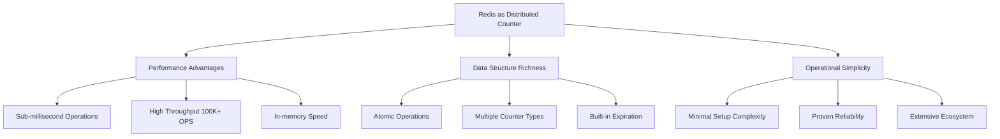

## 1. Architecture Advantages

### 1.1 Performance Characteristics

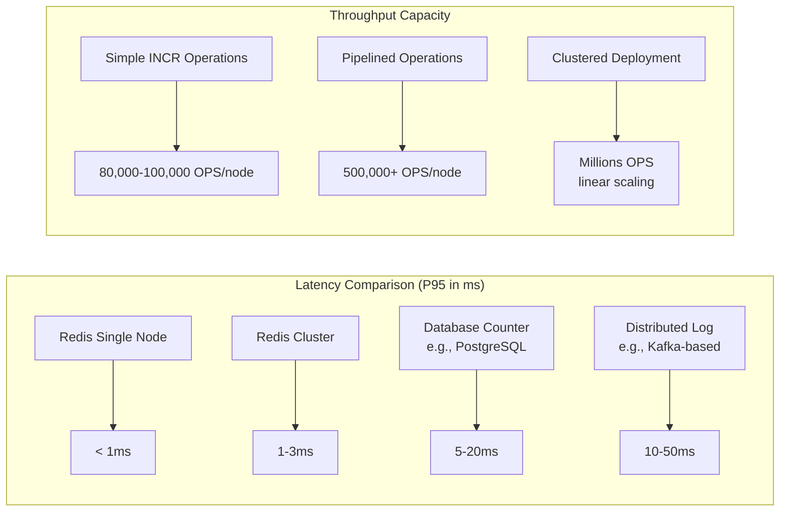

**Real-World Performance Metrics:**
- **Single operation latency**: 0.1-0.5ms for local Redis
- **Network-added latency**: 1-3ms for cross-AZ deployments
- **Throughput scaling**: Nearly linear with added nodes
- **Connection overhead**: Minimal (10-50KB per connection)

### 1.2 Data Model Strengths

| Data Structure | Counter Use Case | Atomic Operation | Memory Efficiency |
|----------------|------------------|------------------|-------------------|
| **String** | Simple counters | `INCR`, `INCRBY` | High (int encoded) |
| **Hash** | Multi-field counters | `HINCRBY` | Medium |
| **Sorted Set** | Leaderboards/ranking | `ZINCRBY` | Medium |
| **Bitmap** | Boolean/flag counters | `SETBIT`, `BITCOUNT` | Very High |
| **HyperLogLog** | Approximate unique counts | `PFADD`, `PFCOUNT` | Extremely High |

**Example: Efficient Multi-dimensional Counting**
```redis
# User session tracking across dimensions
HINCRBY user:12345:sessions today 1
HINCRBY user:12345:sessions browser:chrome 1
HINCRBY user:12345:sessions country:US 1
EXPIRE user:12345:sessions 86400
```

### 1.3 Operational Simplicity

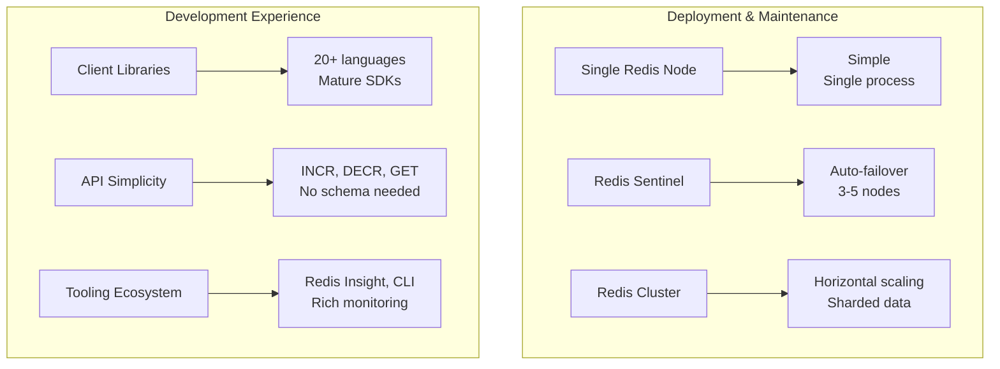

## 2. Critical Limitations & Risks

### 2.1 Durability and Data Loss Concerns

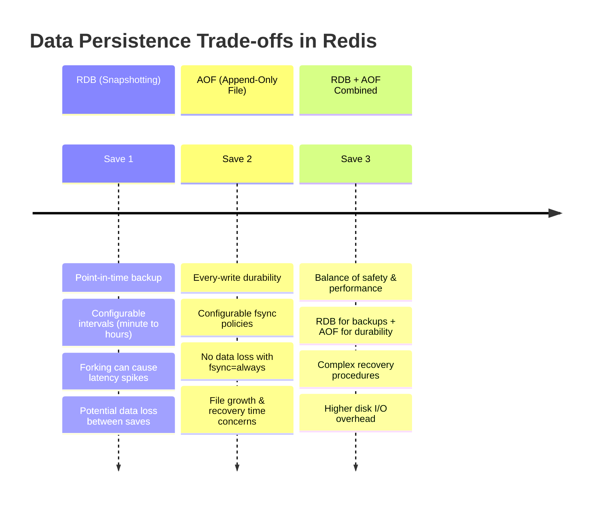

**Persistence Configuration Decisions:**
- **`appendfsync everysec`**: Balance of performance and safety (recommended)
- **`appendfsync always`**: Maximum durability, 10x slower writes
- **`appendfsync no`**: Best performance, OS-controlled flushing
- **`save 900 1`**: RDB snapshots, configurable trade-offs

### 2.2 Memory Constraints and Costs

**Cost Analysis for 100M Counter System:**

| Counter Type | Memory per Counter | Total Memory | Monthly Cost (AWS) | Notes |
|--------------|-------------------|--------------|-------------------|--------|
| **Simple Integer** | 16 bytes | 1.6 GB | ~$80/mo | Best case |
| **Hashed Counter** | 64 bytes | 6.4 GB | ~$320/mo | Multi-field |
| **With Metadata** | 128+ bytes | 12.8 GB+ | ~$640+/mo | TTL, labels |

**Memory Optimization Realities:**
- **Fragmentation**: Can add 30-50% overhead over time
- **TTL cleanup**: Lazy expiration causes "ghost memory"
- **Replication overhead**: 100% memory duplication for each replica
- **Memory pressure behavior**: `maxmemory-policy` choices all have trade-offs

### 2.3 Consistency in Distributed Scenarios

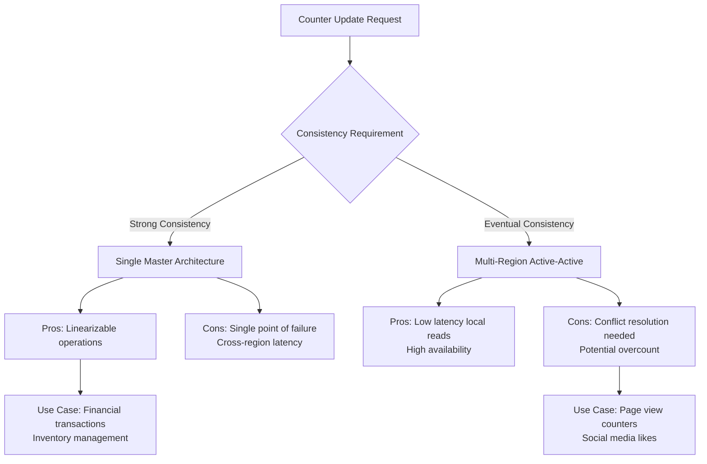

**Redis Cluster Limitations:**
- **Multi-key operations**: Limited to single slot (no atomic multi-key INCR)
- **Cross-slot transactions**: Not supported natively
- **Consistency during failover**: Possible small data loss (async replication)
- **Read-after-write consistency**: Not guaranteed across replicas

## 3. Key Trade-offs Analysis

### 3.1 The CAP Theorem Perspective

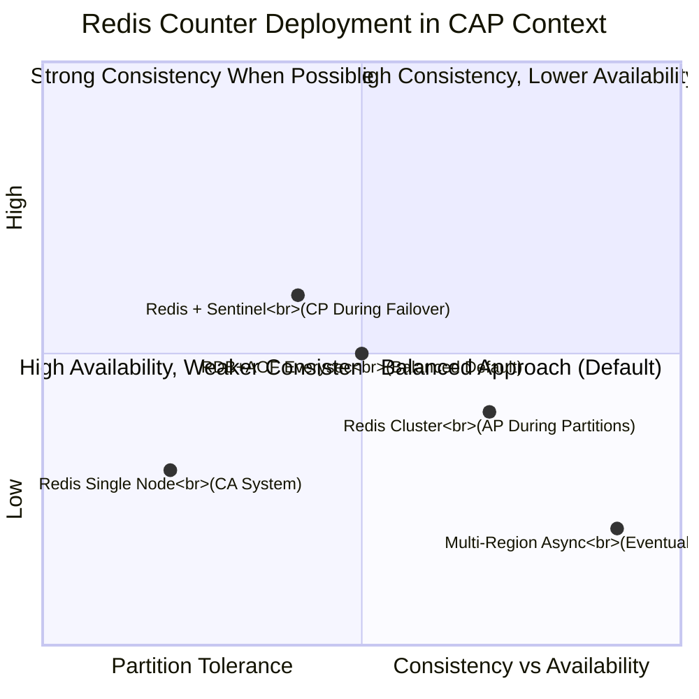

**Practical CAP Implications:**
- **Single Redis node**: CA system (no partition tolerance)
- **Redis Sentinel**: CP during failover (unavailable during election)
- **Redis Cluster**: AP during network partitions (consistency sacrificed)
- **Cross-datacenter**: Typically AP (eventual consistency)

### 3.2 Scalability vs. Complexity

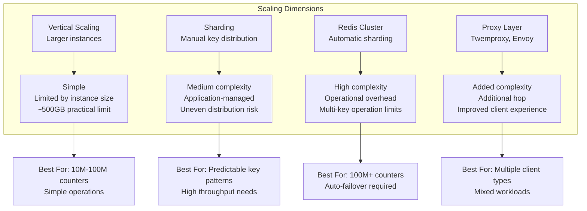

**Scaling Decision Framework:**
1. **<10M counters**: Single large instance often sufficient
2. **10M-100M counters**: Consider Redis Cluster with 3-6 shards
3. **100M+ counters**: Need careful shard key design + monitoring
4. **Global counters**: Consider specialized solutions (CRDT-based)

### 3.3 Cost Efficiency Analysis

**Total Cost of Ownership Comparison:**

| Cost Component | Redis In-Memory | Database (PostgreSQL) | Specialized Counter Service |
|----------------|----------------|----------------------|----------------------------|
| **Infrastructure** | High (RAM-intensive) | Medium (CPU/IO balanced) | Variable (often SaaS premium) |
| **Development Time** | Low (simple API) | Medium (schema design) | Low (managed service) |
| **Operations** | Medium (backup, scaling) | High (tuning, vacuuming) | Low (provider managed) |
| **Scaling Cost** | Linear with data size | Non-linear (index overhead) | Usage-based pricing |
| **Hidden Costs** | Memory fragmentation, replication lag | Connection pooling, vacuum overhead | Vendor lock-in, egress fees |

**When Redis Becomes Expensive:**
- Counters with long TTL (>30 days)
- High cardinality (millions of unique keys)
- Multi-region replication needs
- Strict durability requirements (fsync=always)

## 4. Alternative Architectures Comparison

### 4.1 When to Consider Alternatives

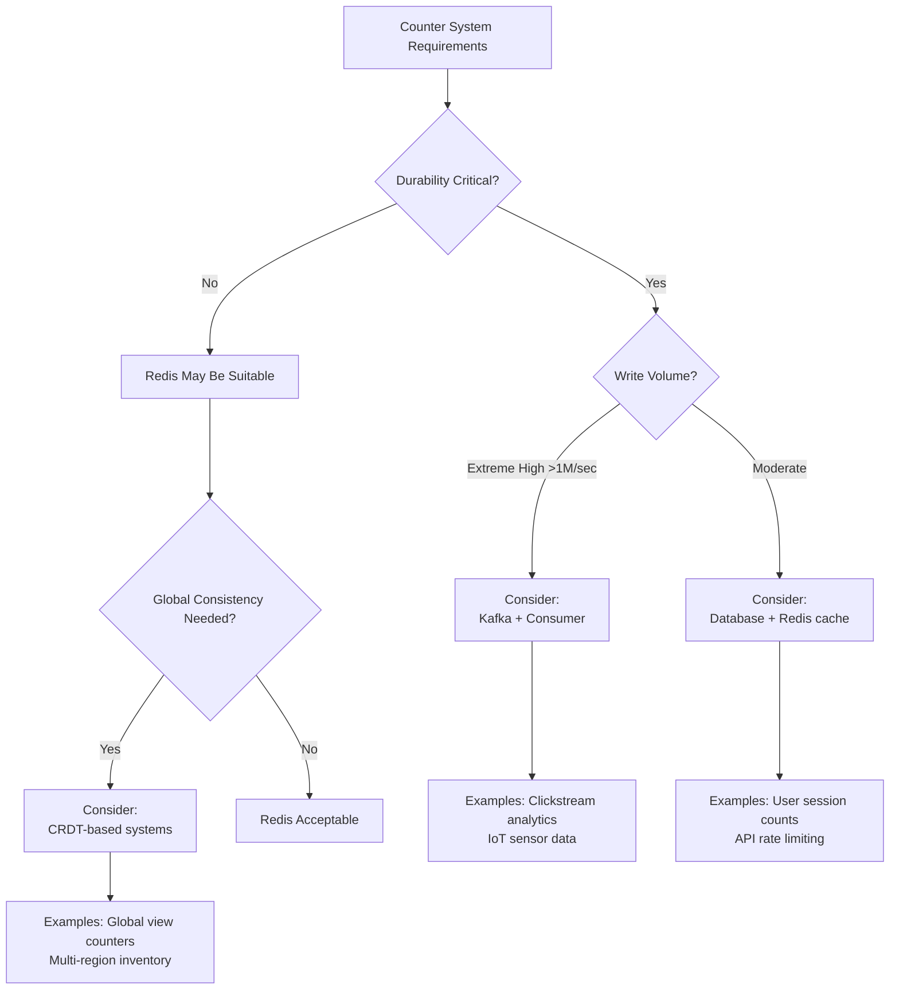

### 4.2 Hybrid Approach Benefits

**Redis as Cache Layer Pattern:**
```
┌─────────────┐     ┌─────────────┐     ┌─────────────┐
│   Clients   │────▶│    Redis    │◀───▶│  Database   │
│             │     │  (Counter   │     │ (Persistent │
│             │     │   Cache)    │     │    Store)   │
└─────────────┘     └─────────────┘     └─────────────┘
      │                    │                    │
      │              Fast reads/writes    Durability &
      │              (~1ms latency)       consistency
      │
      │              ┌─────────────┐
      └─────────────▶│   Batch     │
                     │  Processor  │
                     │  (Sync to   │
                     │  database)  │
                     └─────────────┘
```

**Hybrid Strategy Advantages:**
- **Best of both worlds**: Redis performance + database durability
- **Graceful degradation**: Database as fallback during Redis outages
- **Cost optimization**: Keep hot data in Redis, archive to database
- **Analytics ready**: Database enables complex queries on counter history

### 4.3 Emerging Alternatives

| Solution | Best For | Redis Comparison |
|----------|----------|------------------|
| **CRDT-based counters** | Multi-region consistency | Better for global counts, more complex |
| **Time-series databases** | Counter history/analytics | Better for temporal queries, less real-time |
| **Distributed logs** | Auditability & replay | Better durability, higher latency |
| **Specialized counters** | Extreme scale (>1B counters) | Better scaling, less general-purpose |

## 5. Decision Framework & Recommendations

### 5.1 When Redis is the Right Choice ✅

**Strong Green Lights:**
- **Temporary counters**: Sessions, rate limits, short-lived metrics
- **Performance-critical**: Real-time dashboards, leaderboards
- **Development velocity**: Prototyping, MVP development
- **Predictable key patterns**: Good shard distribution possible
- **Acceptable data loss**: <1 second loss tolerable

**Ideal Use Case Profile:**
```
┌─────────────────────────────────────────────────────┐
│          Redis Counter Sweet Spot                   │
├─────────────────────────────────────────────────────┤
│  • 10M-100M counters                               │
│  • <5ms latency requirement                        │
│  • TTL < 30 days for most counters                 │
│  • Regional deployment (not global)                │
│  • OPS team familiar with Redis                    │
│  • Budget for sufficient RAM                       │
└─────────────────────────────────────────────────────┘
```

### 5.2 When to Be Cautious ⚠️

**Yellow Flags Requiring Mitigation:**
- **Financial transactions**: Need stronger durability guarantees
- **Global counters**: Multi-region consistency challenges
- **Extreme scale**: >100M constantly growing counters
- **Long-term retention**: >90 days data lifetime
- **Regulatory compliance**: Strict audit trail requirements

**Mitigation Strategies:**
- **Hybrid approach**: Redis + database synchronization
- **Enhanced monitoring**: Proactive memory/performance alerts
- **Regular testing**: Failover and recovery procedures
- **Data tiering**: Move old counters to cheaper storage

### 5.3 When to Choose Alternatives 🛑

**Clear Red Flags:**
- **Cannot tolerate any data loss**: Financial settlement systems
- **Need ACID transactions**: Inventory systems with strict consistency
- **Extremely high cardinality**: Billions of unique counter keys
- **Limited RAM budget**: Cost-prohibitive for data size
- **Complex query needs**: Joins, historical analysis on counter data

## 6. Implementation Recommendations

### 6.1 Success Patterns

1. **Start Simple**: Single Redis instance, add complexity only when needed
2. **Design for Failure**: Assume Redis will fail, plan recovery procedures
3. **Monitor Aggressively**: Memory, latency, hit rate, replication status
4. **Implement Graceful Degradation**: Fallback to database or cached values
5. **Regularly Test Recovery**: Backup restoration, failover procedures

### 6.2 Key Metrics to Watch

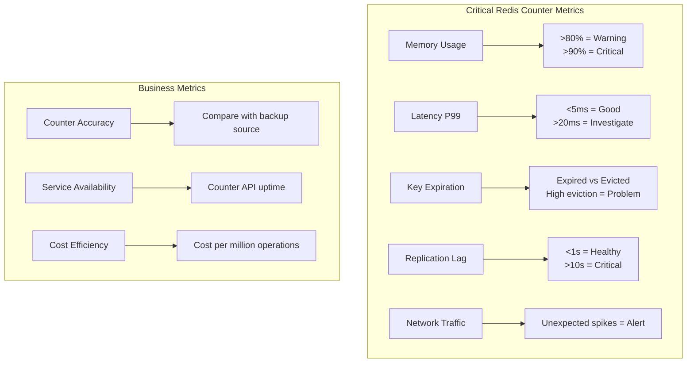

### 6.3 Team Readiness Assessment

| Capability | Required for Redis Counters | Assessment Questions |
|------------|----------------------------|---------------------|
| **Operational** | Redis administration, backup/restore | Can team handle failover at 3 AM? |
| **Monitoring** | Performance tuning, capacity planning | Are metrics and alerts in place? |
| **Development** | Client library expertise, connection pooling | Do devs understand pipeline vs transaction? |
| **Architecture** | Data modeling, sharding strategy | Is key distribution understood? |
| **Disaster Recovery** | Backup validation, recovery procedures | Has recovery been tested recently? |

## Conclusion: Balanced Perspective

Redis excels as a distributed counter system **for the right use cases**. Its unparalleled performance and simplicity make it an excellent choice for many applications, but these advantages come with trade-offs around durability, memory constraints, and distributed consistency.

**The decision boils down to:**
1. **Can you accept the durability model?** (async replication, potential data loss)
2. **Can you afford the memory?** (RAM is more expensive than disk)
3. **Do you need strong consistency?** (vs. eventual consistency)
4. **Is your team operationally ready?** (Redis requires active management)

For many applications—particularly those involving transient data, real-time requirements, or development velocity—Redis represents an excellent choice. For systems requiring absolute durability, complex transactions, or cost-effective long-term storage, alternative or hybrid approaches warrant serious consideration.

**Final Recommendation**: Start with Redis for its simplicity and performance, but implement the monitoring and fallback strategies that will let you sleep well at night, knowing you can detect and handle its limitations before they impact your users.


# Generated by ChatGPT

Below is a **concise but deep discussion-style document** (not a formal design doc) that focuses on **thinking, trade-offs, and architectural judgment** when using **Redis as a distributed counter system**.
It mixes **high-level concepts** with **just enough technical detail**, and uses **diagrams to anchor intuition**.

---

# Redis as a Distributed Counter System

## Pros, Cons, Benefits, and Trade-offs (Discussion)

---

## 1. What Problem Are We Really Solving?

At its core, a *distributed counter* answers one simple question:

> **“How do many machines safely change one number?”**

Examples:

* Count API requests
* Enforce rate limits
* Track events or metrics
* Maintain inventory or quotas

The challenge is not counting — it’s **coordination under concurrency**.

---

## 2. Why Redis Is Often Chosen

### High-Level View

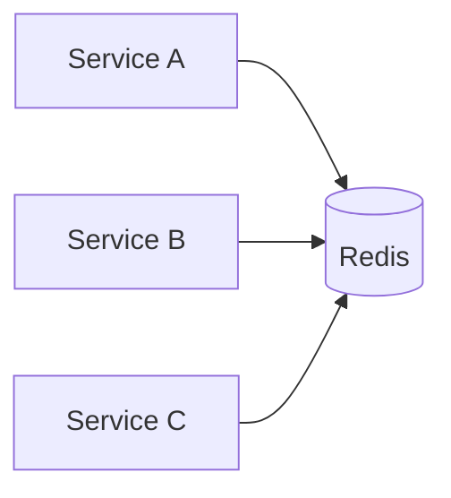

Redis becomes a **coordination point** that all services trust.

---

## 3. Key Benefits of Redis for Counters

### 3.1 Atomicity Comes “For Free”

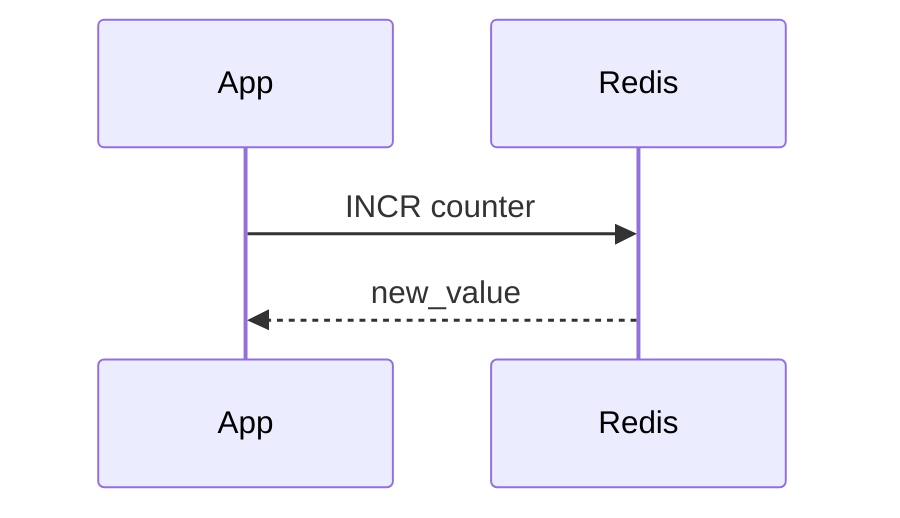

* Redis is single-threaded per shard
* `INCR` is atomic by default
* No locks, no CAS, no retries

**Benefit:**
✔ Simple mental model
✔ Hard to misuse

---

### 3.2 Extremely Low Latency


* In-memory
* No disk I/O on hot path
* Faster than databases or coordination services

**Benefit:**
✔ Works well for high-QPS counters (rate limiting, metrics)

---

### 3.3 Centralized Truth in a Distributed World

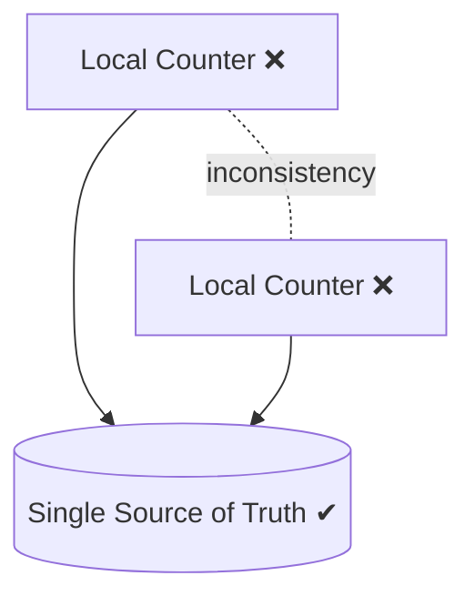

**Benefit:**
✔ Avoids drift
✔ Avoids reconciliation logic
✔ Easier reasoning

---

### 3.4 Built-in Expiry Enables Time-Based Counters

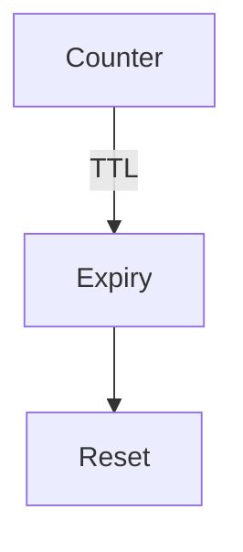

Examples:

* Per-minute request counts
* Daily metrics
* Sliding windows (via Lua)

**Benefit:**
✔ No cron jobs
✔ No cleanup code

---

## 4. Trade-offs You Accept (Knowingly or Not)

### 4.1 Redis Becomes a Central Dependency

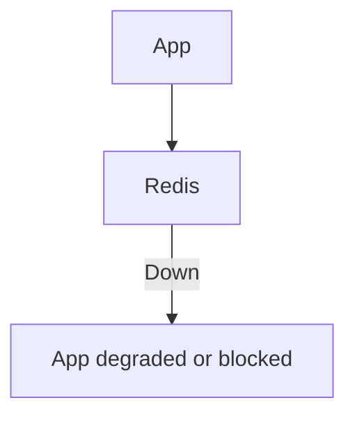

**Trade-off:**

* You gain simplicity
* You lose decentralization

Redis availability now directly affects your system.

---

### 4.2 Single-Threaded Nature Is a Double-Edged Sword


✔ Atomicity
❌ CPU bottleneck at extreme scale

**Implication:**

* Great for counters
* Dangerous if abused with heavy scripts or big keys

---

### 4.3 Memory-First Means Cost Sensitivity

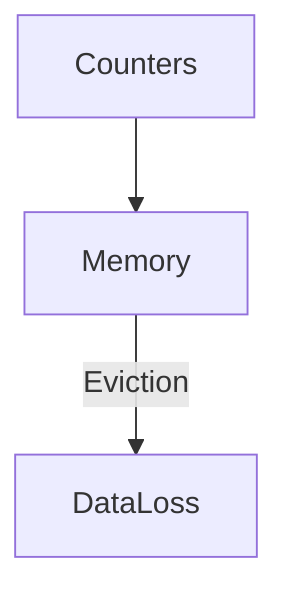

**Trade-off:**

* Speed vs cost
* Persistence vs simplicity

Counters must tolerate:

* Evictions
* Resets
* Restarts

---

### 4.4 Durability Is “Best Effort” (Unless Tuned)


Depending on config:

* RDB snapshots
* AOF (append-only)

**Trade-off:**
✔ Fast writes
❌ Possible loss of recent increments

---

## 5. Redis vs Other Mental Models

### 5.1 Redis vs Database Counters

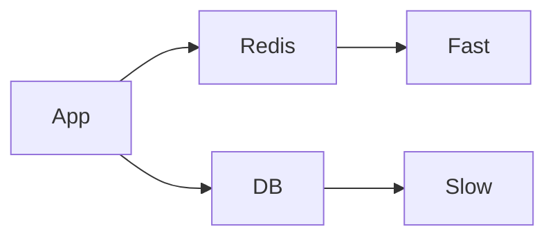

| Aspect     | Redis        | Database           |
| ---------- | ------------ | ------------------ |
| Speed      | ⭐⭐⭐⭐⭐        | ⭐⭐                 |
| Atomicity  | Built-in     | Needs transactions |
| Cost       | Memory-based | Disk-based         |
| Durability | Configurable | Strong             |

---

### 5.2 Redis vs Local Counters

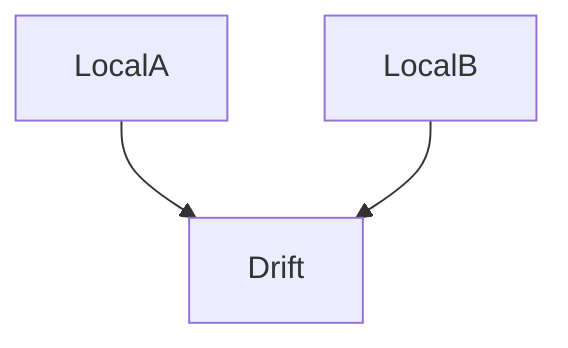

Local counters:

* Fast
* Wrong

Redis counters:

* Slightly slower
* Correct

---

### 5.3 Redis vs Streaming Systems (Kafka)

```mermaid
flowchart LR
    App --> Kafka --> Aggregation --> Counter
```

Kafka is:

* Append-only
* Eventually consistent

Redis is:

* Immediate
* Mutable

**Trade-off:**
Real-time accuracy vs replayability

---

## 6. Where Redis Counters Shine 🌟

```mermaid
flowchart TD
    UseCases --> RateLimit
    UseCases --> Metrics
    UseCases --> Quotas
    UseCases --> Inventory
```

Best fit:

* Rate limiting
* Quota enforcement
* Live metrics
* Feature usage counters

---

## 7. Where Redis Counters Are Risky ⚠️

```mermaid
flowchart TD
    Risky --> Money
    Risky --> Audits
    Risky --> ExactlyOnce
```

Poor fit:

* Financial ledgers
* Legal/audit logs
* Exactly-once semantics
* Long-term historical truth

---

## 8. Operational Complexity (Often Underestimated)

```mermaid
flowchart TD
    Redis --> Monitoring
    Redis --> Backup
    Redis --> Failover
```

You must care about:

* Memory pressure
* Evictions
* Failover behavior
* Client retries
* Lua safety

**Trade-off:**
Operational burden for runtime simplicity

---

## 9. The Philosophical Trade-off

```mermaid
flowchart LR
    Consistency --> Availability
```

Redis counters choose:

* **Strong atomic updates**
* **Temporary unavailability over inconsistency**

This is often the *right* trade-off for counters.

---

## 10. Mental Checklist Before Choosing Redis

Ask yourself:

* Can this counter reset safely?
* Is losing a few increments acceptable?
* Can the system pause if Redis is down?
* Do we need exact historical replay?

If most answers are “yes” → Redis is a strong candidate.

---

## 11. Final Thought

> Redis counters are not about counting — they are about **coordination**.

They trade:

* durability for speed
* decentralization for simplicity
* historical truth for real-time correctness

Used consciously, Redis is **one of the best distributed counter tools available**.

---

If you want, I can:

* Compare Redis counters with **etcd / Zookeeper**
* Discuss **exactly-once illusions**
* Show **real incident patterns**
* Turn this into an **architecture decision record (ADR)**
