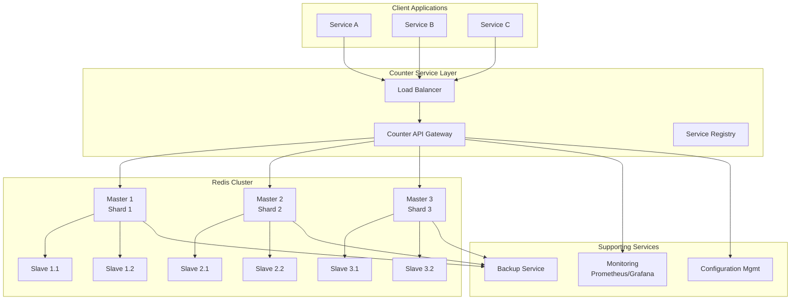
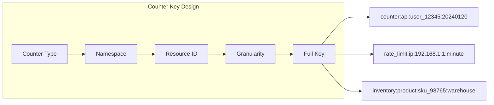
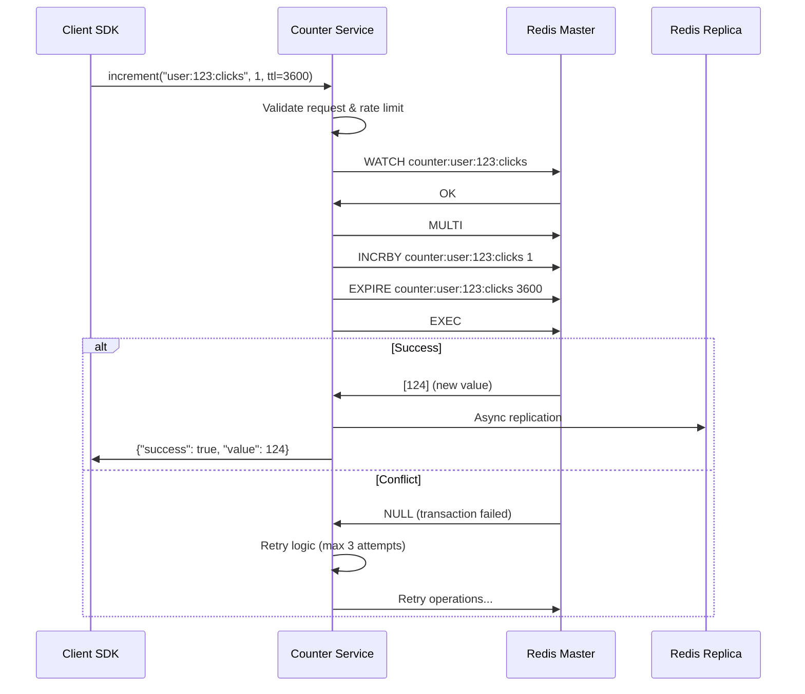
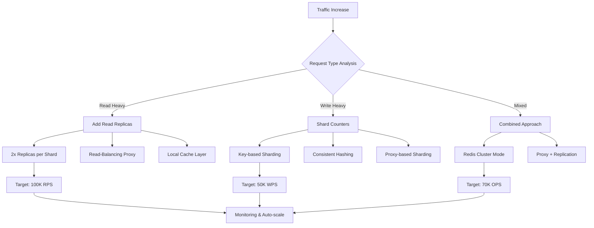
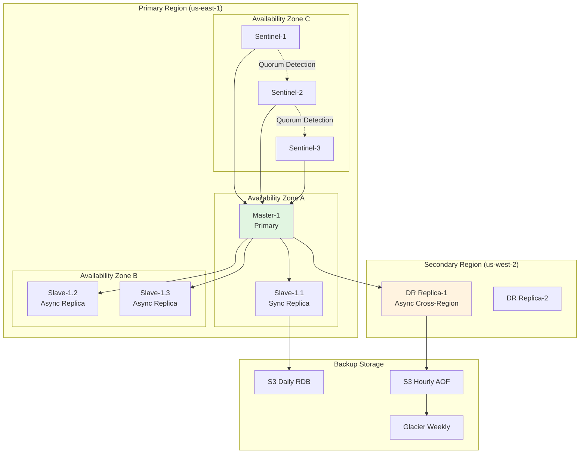
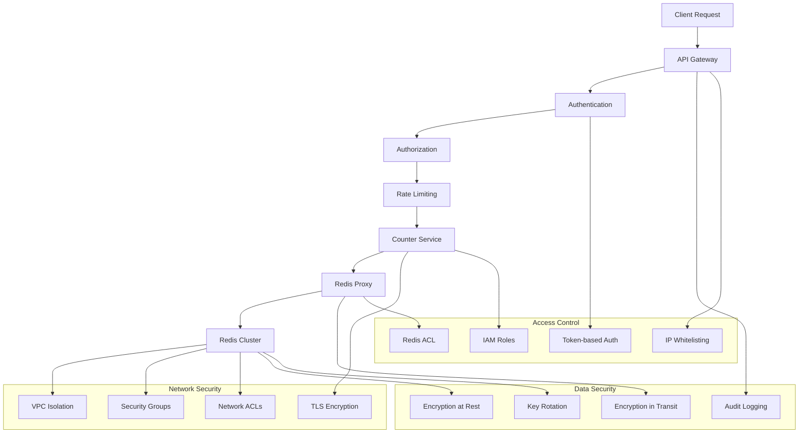
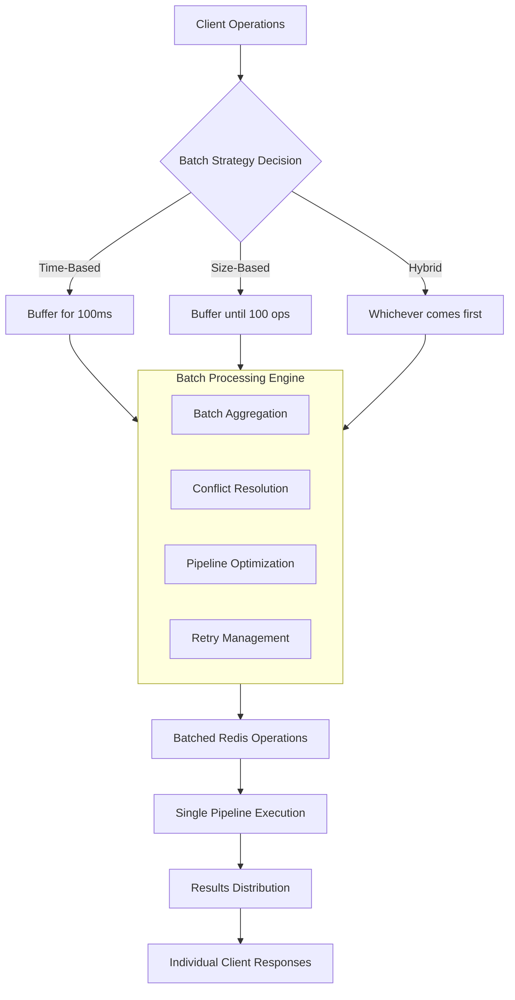
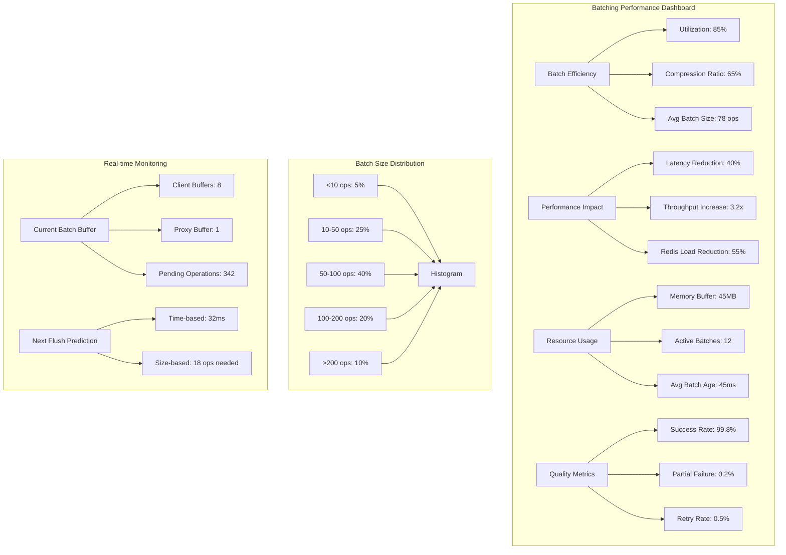

## 1. Executive Summary

This document outlines the design for a centralized counter service using Redis as the backend store in a distributed system. The solution addresses the need for **consistent, performant, and reliable counter operations** across multiple service instances, providing atomic increments, decrements, and retrieval with support for rate limiting, usage tracking, and real-time analytics.

### Key Design Goals
- **Strong consistency** for counter operations across distributed nodes
- **High availability** with 99.99% uptime target
- **Scalability** to handle 100K+ operations per second
- **Low latency** (<5ms for counter operations)
- **Fault tolerance** with automatic failover and data durability

---

## 2. System Architecture

### 2.1 High-Level Architecture Diagram



### 2.2 Component Responsibilities

| Component | Responsibility | Technology Options |
|-----------|---------------|-------------------|
| **Counter Client SDK** | Provides easy-to-use API for applications | Custom SDK in multiple languages |
| **API Gateway** | Request routing, auth, rate limiting | Kong, AWS API Gateway, Custom |
| **Counter Service** | Business logic, validation, aggregation | Node.js, Go, Java Spring |
| **Redis Cluster** | Primary data store for counters | Redis 7.x with Redis Stack |
| **Monitoring** | Metrics collection and alerting | Prometheus, Grafana, ELK Stack |
| **Backup Service** | Data persistence and disaster recovery | Redis RDB/AOF, S3 backup |

---

## 3. Redis Data Design

### 3.1 Key Structure Patterns



### 3.2 Data Models Implementation

```python
# Counter data structures in Redis
COUNTER_SCHEMA = {
    # Simple counter (e.g., page views)
    "page:views:homepage": {
        "type": "string",
        "encoding": "int",
        "ttl": 2592000,  # 30 days
        "operations": ["INCR", "GET", "EXPIRE"]
    },
    
    # Hashed counter (e.g., user session counts by country)
    "stats:sessions:20240120": {
        "type": "hash",
        "fields": {
            "US": "integer",
            "EU": "integer", 
            "ASIA": "integer"
        },
        "operations": ["HINCRBY", "HGETALL"]
    },
    
    # Sorted set for leaderboards
    "leaderboard:game:season5": {
        "type": "zset",
        "score": "integer",
        "member": "user_id",
        "operations": ["ZINCRBY", "ZRANGE"]
    },
    
    # Bitmap for daily active users
    "dau:20240120": {
        "type": "bitmap",
        "operations": ["SETBIT", "BITCOUNT"],
        "max_bit": 10000000  # 10M users
    }
}
```

### 3.3 Memory Optimization Strategies

| Pattern | Use Case | Memory Savings | Example |
|---------|----------|----------------|---------|
| **Integer encoding** | Small counters | 75% vs string | `INCR counter:id` |
| **Hash field packing** | Multiple related counters | 60% vs separate keys | `HINCRBY stats:20240120 US 1` |
| **Ziplist encoding** | Small hashes/lists | 50-80% savings | `redis.conf: hash-max-ziplist-entries 512` |
| **Bitmaps** | Boolean flags | 96% vs set | `SETBIT active:users 12345 1` |
| **HyperLogLog** | Approximate counting | 99% vs set | `PFADD daily:visitors user123` |

---

## 4. Core Operations Design

### 4.1 Atomic Operations Flow



### 4.2 Counter Operation Patterns

```python
class RedisCounterService:
    def __init__(self, redis_client):
        self.redis = redis_client
        self.lua_scripts = self._load_lua_scripts()
    
    def _load_lua_scripts(self):
        """Load atomic Lua scripts for complex operations"""
        return {
            'increment_with_min_max': """
                local key = KEYS[1]
                local increment = tonumber(ARGV[1])
                local min_val = tonumber(ARGV[2])
                local max_val = tonumber(ARGV[3])
                local ttl = tonumber(ARGV[4])
                
                local current = redis.call('GET', key) or 0
                current = tonumber(current)
                local new_value = current + increment
                
                -- Apply bounds
                if min_val and new_value < min_val then
                    new_value = min_val
                end
                if max_val and new_value > max_val then
                    new_value = max_val
                end
                
                redis.call('SET', key, new_value)
                if ttl > 0 then
                    redis.call('EXPIRE', key, ttl)
                end
                return new_value
            """,
            
            'batch_increment': """
                -- Increment multiple counters atomically
                for i = 1, #KEYS do
                    redis.call('INCRBY', KEYS[i], ARGV[i])
                end
                return #KEYS
            """
        }
    
    def increment_with_bounds(self, key, delta=1, min_val=None, 
                             max_val=None, ttl=None):
        """Atomically increment with bounds checking"""
        script = self.lua_scripts['increment_with_min_max']
        args = [delta, min_val or '', max_val or '', ttl or 0]
        return self.redis.eval(script, 1, key, *args)
    
    def get_with_snapshot(self, key):
        """Get counter value with snapshot for consistency"""
        # Use Redis transactions for consistent read
        pipe = self.redis.pipeline()
        pipe.watch(key)
        value = pipe.get(key)
        pipe.unwatch()
        pipe.execute()
        return int(value) if value else 0
```

---

## 5. Scalability and Performance

### 5.1 Scaling Strategy



### 5.2 Sharding Strategies

| Strategy | How It Works | Pros | Cons | Best For |
|----------|--------------|------|------|----------|
| **Key-based** | `shard = hash(key) % N` | Simple, predictable | Resharding difficult | Stable key sets |
| **Range-based** | Key ranges per shard | Efficient range queries | Hotspot risk | Sequential keys |
| **Directory-based** | Lookup service maps keys | Flexible, easy rebalancing | Single point of failure | Dynamic environments |
| **Consistent Hashing** | Hash ring distribution | Minimal rehash on scale | Complex implementation | Cloud auto-scaling |

### 5.3 Performance Benchmarks

| Operation | Single Node | 3-Node Cluster | With Pipeline | Notes |
|-----------|-------------|----------------|---------------|-------|
| `INCR` | 80,000 OPS | 240,000 OPS | 500,000 OPS | Atomic counter |
| `HINCRBY` | 70,000 OPS | 210,000 OPS | 450,000 OPS | Hashed counter |
| `GET` | 100,000 OPS | 300,000 OPS | 800,000 OPS | Simple read |
| `MULTI/EXEC` | 40,000 OPS | 120,000 OPS | N/A | Transaction |
| `EVAL (Lua)` | 60,000 OPS | 180,000 OPS | N/A | Script execution |

---

## 6. High Availability and Disaster Recovery

### 6.1 HA Architecture



### 6.2 Failover Procedures

```yaml
# Automated Failover Configuration
failover_policy:
  primary_failure:
    detection:
      method: "sentinel_quorum"
      quorum_size: 2
      timeout_ms: 10000
      health_checks:
        - "ping_response"
        - "replication_lag"
        - "memory_usage"
    
    action:
      - "pause_client_connections: 500ms"
      - "elect_new_master: [slave-1.1, slave-1.2]"
      - "update_dns_ttl: 30"
      - "notify_ops: pagerduty_high"
      - "update_configuration_store"
      - "resume_client_connections"
    
    validation:
      - "data_integrity_check"
      - "replication_verification"
      - "performance_baseline_check"
  
  regional_failover:
    trigger: "primary_region_unavailable"
    timeout: "5_minutes"
    action:
      - "activate_dr_replica_reads"
      - "promote_dr_to_primary"
      - "update_global_dns"
      - "notify_stakeholders"
    
    rollback:
      condition: "primary_region_recovered_24h"
      procedure: "incremental_sync_back"
```

### 6.3 Backup and Recovery

| Backup Type | Frequency | Retention | RTO | RPO | Storage |
|-------------|-----------|-----------|-----|-----|---------|
| **RDB Snapshot** | 6 hours | 30 days | 5 min | 6 hours | S3 Standard |
| **AOF Append** | Continuous | 7 days | 1 min | 1 sec | EBS GP3 |
| **Cross-region** | 24 hours | 90 days | 15 min | 24 hours | S3 Cross-region |
| **Encrypted** | Weekly | 1 year | 30 min | 1 week | S3 + Glacier |

---

## 7. Monitoring and Observability

### 7.1 Key Metrics Dashboard


### 7.2 Alerting Rules

```yaml
alerting_rules:
  critical:
    - alert: "RedisMasterDown"
      expr: "redis_up{role=\"master\"} == 0"
      for: "1m"
      annotations:
        severity: "critical"
        summary: "Redis master node is down"
        action: "Check failover status and initiate recovery"
    
    - alert: "HighMemoryUsage"
      expr: "redis_memory_used_percentage > 90"
      for: "5m"
      annotations:
        severity: "critical"
        summary: "Redis memory usage exceeded 90%"
        action: "Investigate memory leak or scale up"
  
  warning:
    - alert: "ReplicaLagHigh"
      expr: "redis_slave_replication_offset - redis_master_replication_offset > 1000000"
      for: "10m"
      annotations:
        severity: "warning"
        summary: "Replication lag exceeds threshold"
        action: "Check network and slave performance"
    
    - alert: "CounterIncrementRateDrop"
      expr: "rate(redis_command_increment_total[5m]) < 1000"
      for: "15m"
      annotations:
        severity: "warning"
        summary: "Counter increment rate dropped significantly"
        action: "Check application health and connectivity"
```

---

## 8. Security Implementation

### 8.1 Security Layers



### 8.2 Security Configuration

```bash
# Redis security configuration (redis.conf)
requirepass "{{ strong_password }}"
rename-command FLUSHDB ""
rename-command FLUSHALL ""
rename-command CONFIG ""

# Enable ACL
aclfile /etc/redis/users.acl

# Network security
bind 127.0.0.1 ::1
protected-mode yes
port 6379

# TLS configuration
tls-port 6380
tls-cert-file /etc/redis/redis.crt
tls-key-file /etc/redis/redis.key
tls-ca-cert-file /etc/redis/ca.crt

# Security limits
maxclients 10000
timeout 300
tcp-keepalive 300

# Memory security
maxmemory 16gb
maxmemory-policy allkeys-lru
```

---

## 9. Implementation Roadmap

### Phase 1: Foundation (Weeks 1-2)
1. **Basic Redis Setup**
   - Single master with two replicas
   - Basic monitoring (CPU, memory, connections)
   - Simple counter API implementation

2. **Client SDK Development**
   - Java/Python/Node.js SDKs
   - Connection pooling and retry logic
   - Basic error handling

### Phase 2: Scalability (Weeks 3-4)
1. **Redis Cluster Deployment**
   - 3-shard cluster setup
   - Sharding strategy implementation
   - Load testing and optimization

2. **Advanced Features**
   - Lua script optimization
   - Pipeline implementation
   - Connection management improvements

### Phase 3: Production Readiness (Weeks 5-6)
1. **High Availability**
   - Sentinel deployment
   - Automated failover testing
   - Cross-region replication setup

2. **Monitoring & Alerting**
   - Comprehensive dashboard setup
   - Alerting rules configuration
   - Performance baseline establishment

### Phase 4: Optimization (Weeks 7-8)
1. **Performance Tuning**
   - Memory optimization
   - Network configuration
   - OS-level tuning

2. **Security Hardening**
   - TLS implementation
   - ACL configuration
   - Audit logging setup

---

## 10. Cost Estimation

| Component | Monthly Cost | Scaling Factor | Notes |
|-----------|-------------|----------------|-------|
| **Redis Instances** | $1,200 | Linear with nodes | m6g.xlarge (4vCPU, 16GB) |
| **Storage** | $150 | $0.10/GB/month | EBS gp3 volumes |
| **Backup Storage** | $75 | $0.023/GB/month | S3 Standard + Glacier |
| **Data Transfer** | $200 | $0.01-0.02/GB | Cross-AZ and cross-region |
| **Monitoring** | $300 | $50/node/month | CloudWatch + Prometheus |
| **Total Monthly** | **$1,925** | | For 3-node cluster |

---

## 11. Risks and Mitigations

| Risk | Probability | Impact | Mitigation Strategy |
|------|------------|--------|-------------------|
| **Data Loss** | Low | Critical | Regular backups + cross-region replication |
| **Performance Degradation** | Medium | High | Auto-scaling + caching layer |
| **Security Breach** | Low | Critical | TLS + ACL + regular audits |
| **Single Point of Failure** | Medium | High | Multi-AZ + automated failover |
| **Cost Overrun** | Medium | Medium | Usage monitoring + budget alerts |
| **Operational Complexity** | High | Medium | Comprehensive documentation + automation |

---

## 12. Conclusion

This design provides a robust, scalable solution for centralized counter management using Redis. The architecture balances performance, reliability, and cost-effectiveness while maintaining strong consistency guarantees.

### Next Steps:
1. **Approval** of this design document
2. **Resource allocation** for implementation team
3. **Infrastructure provisioning** in development environment
4. **Proof-of-concept** implementation and validation
5. **Gradual rollout** with canary deployment strategy

### Success Criteria:
- ✅ 99.99% availability for counter operations
- ✅ <5ms P95 latency for increment operations
- ✅ Seamless scaling to 100K+ operations per second
- ✅ Zero data loss in planned failover scenarios
- ✅ Comprehensive monitoring and alerting coverage

---

# Design Enhancement: Counter Batching Strategy

## 1. Overview of Counter Batching

### 1.1 The Problem Statement

In high-throughput distributed systems, individual counter operations (`INCR`, `DECR`) can create bottlenecks due to:

| Issue | Impact | Without Batching | With Batching |
|-------|--------|------------------|---------------|
| **Network Round-trips** | Latency | 1 RTT per operation | ~1 RTT per batch |
| **Redis Command Overhead** | CPU Utilization | Parsing/execution per command | Single command execution |
| **Connection Contention** | Throughput Limits | Multiple connections needed | Fewer connections |
| **Transaction Management** | Complexity | Complex multi-key transactions | Simplified batch operations |

### 1.2 Batching Architecture Impact



## 2. Batching Strategy Implementation

### 2.1 Multi-Level Batching Architecture

```python
class MultiLevelCounterBatcher:
    def __init__(self, redis_client, config=None):
        self.redis = redis_client
        self.config = config or {
            'client_level': {
                'max_size': 50,      # Operations per batch
                'max_time_ms': 100,   # Max batching window
                'enabled': True
            },
            'proxy_level': {
                'max_size': 500,
                'max_time_ms': 10,    # Smaller window for proxies
                'enabled': True
            },
            'redis_level': {
                'pipeline_limit': 1000,
                'transactional': True
            }
        }
        
        # Client-side buffer
        self.client_buffers = defaultdict(list)  # client_id -> operations
        self.client_timers = {}                  # client_id -> timer
        
        # Proxy/Server-side aggregator
        self.proxy_buffer = []
        self.proxy_timer = None
        
    def increment_batched(self, client_id, key, value=1, **options):
        """Client-side batch request submission"""
        operation = {
            'type': 'INCR',
            'key': key,
            'value': value,
            'options': options,
            'timestamp': time.time(),
            'client_id': client_id,
            'correlation_id': str(uuid.uuid4())
        }
        
        # Add to client buffer
        self.client_buffers[client_id].append(operation)
        
        # Start timer if first operation
        if client_id not in self.client_timers:
            self._start_client_timer(client_id)
        
        # Trigger flush if buffer full
        if len(self.client_buffers[client_id]) >= self.config['client_level']['max_size']:
            self._flush_client_buffer(client_id)
            
        return operation['correlation_id']
    
    def _flush_client_buffer(self, client_id):
        """Send batched operations to proxy"""
        if client_id not in self.client_buffers:
            return
            
        operations = self.client_buffers[client_id]
        if not operations:
            return
        
        # Group operations by key pattern for optimization
        grouped_ops = self._group_and_optimize_operations(operations)
        
        # Send to proxy (simulated)
        self._send_to_proxy(grouped_ops)
        
        # Clear buffer and timer
        self.client_buffers[client_id] = []
        if client_id in self.client_timers:
            self.client_timers.pop(client_id)
```

### 2.2 Smart Batching Algorithms

```python
class SmartBatchOptimizer:
    """Intelligent batching based on operation patterns"""
    
    @staticmethod
    def optimize_batch(operations):
        """
        Optimize batch operations for Redis efficiency
        Returns: List of optimized command groups
        """
        # Group by operation type and key pattern
        groups = defaultdict(list)
        
        for op in operations:
            # Create grouping key based on operation characteristics
            if op['type'] in ['INCR', 'DECR']:
                # Group counters by key pattern
                key_pattern = op['key'].split(':')[0]  # First segment
                group_key = f"{op['type']}:{key_pattern}"
            elif op['type'] == 'GET':
                group_key = "GET:multi"
            else:
                group_key = f"other:{op['type']}"
                
            groups[group_key].append(op)
        
        # Apply optimization strategies per group
        optimized_commands = []
        
        # 1. Counter operations: Combine multiple INCRs on same key
        counter_ops = groups.get('INCR:counter', []) + groups.get('DECR:counter', [])
        if counter_ops:
            optimized_commands.extend(
                SmartBatchOptimizer._optimize_counter_operations(counter_ops)
            )
        
        # 2. GET operations: Use MGET for multiple keys
        get_ops = groups.get('GET:multi', [])
        if get_ops:
            optimized_commands.append(
                SmartBatchOptimizer._optimize_get_operations(get_ops)
            )
        
        # 3. Mixed operations in transaction
        return optimized_commands
    
    @staticmethod
    def _optimize_counter_operations(operations):
        """Optimize counter operations using Lua scripting"""
        # Group by exact key
        key_operations = defaultdict(int)
        for op in operations:
            if op['type'] == 'INCR':
                key_operations[op['key']] += op['value']
            elif op['type'] == 'DECR':
                key_operations[op['key']] -= op['value']
        
        # Create Lua script for batched increments
        if key_operations:
            lua_script = """
                local results = {}
                for i, key in ipairs(KEYS) do
                    local increment = tonumber(ARGV[i])
                    local new_value = redis.call('INCRBY', key, increment)
                    results[i] = new_value
                end
                return results
            """
            
            keys = list(key_operations.keys())
            args = [key_operations[k] for k in keys]
            
            return [{
                'type': 'EVAL',
                'script': lua_script,
                'keys': keys,
                'args': args
            }]
        
        return []
    
    @staticmethod
    def _optimize_get_operations(operations):
        """Optimize multiple GET operations using MGET"""
        keys = [op['key'] for op in operations]
        correlation_ids = [op['correlation_id'] for op in operations]
        
        return [{
            'type': 'MGET',
            'keys': keys,
            'metadata': {
                'correlation_ids': correlation_ids,
                'client_ids': list(set(op['client_id'] for op in operations))
            }
        }]
```

### 2.3 Redis Pipeline Optimization

```python
class RedisPipelineOptimizer:
    """Optimize Redis pipeline execution"""
    
    def __init__(self, redis_client, max_pipeline_size=1000):
        self.redis = redis_client
        self.max_pipeline_size = max_pipeline_size
        self.pipeline_batches = []
        
    def add_to_pipeline(self, commands):
        """Add commands to pipeline with smart batching"""
        for command in commands:
            self._add_command_to_appropriate_batch(command)
        
        # Execute if any batch is ready
        self._execute_ready_batches()
    
    def _add_command_to_appropriate_batch(self, command):
        """Intelligently assign command to optimal batch"""
        # Find suitable batch or create new one
        suitable_batch = None
        
        for batch in self.pipeline_batches:
            if self._can_add_to_batch(batch, command):
                suitable_batch = batch
                break
        
        if not suitable_batch:
            suitable_batch = self._create_new_batch(command['type'])
            self.pipeline_batches.append(suitable_batch)
        
        suitable_batch['commands'].append(command)
        suitable_batch['size'] += self._estimate_command_size(command)
    
    def _can_add_to_batch(self, batch, command):
        """Check if command can be added to existing batch"""
        # Check size limits
        if batch['size'] + self._estimate_command_size(command) > self.max_pipeline_size:
            return False
        
        # Check compatibility (e.g., don't mix reads and writes in same pipeline)
        if batch['type'] == 'read' and command['type'] in ['INCR', 'DECR', 'SET']:
            return False
        if batch['type'] == 'write' and command['type'] == 'GET':
            return False
        
        # Check timing - don't delay reads for too long
        if batch['type'] == 'read' and time.time() - batch['created'] > 0.05:  # 50ms max for reads
            return False
        
        return True
    
    def _execute_ready_batches(self):
        """Execute batches that are ready"""
        for batch in list(self.pipeline_batches):
            if self._should_execute_batch(batch):
                self._execute_batch(batch)
                self.pipeline_batches.remove(batch)
    
    def _should_execute_batch(self, batch):
        """Determine if batch should be executed"""
        # Size-based trigger
        if batch['size'] >= self.max_pipeline_size * 0.8:  # 80% full
            return True
        
        # Time-based trigger
        max_wait = 0.1 if batch['type'] == 'write' else 0.05  # 100ms vs 50ms
        if time.time() - batch['created'] > max_wait:
            return True
        
        # Priority-based trigger (high priority operations)
        if any(cmd.get('priority') == 'high' for cmd in batch['commands']):
            return True
        
        return False
    
    def _execute_batch(self, batch):
        """Execute a batch of commands in Redis pipeline"""
        pipe = self.redis.pipeline(transaction=(batch['type'] == 'write'))
        
        # Add all commands to pipeline
        for cmd in batch['commands']:
            if cmd['type'] == 'INCR':
                pipe.incrby(cmd['key'], cmd['value'])
            elif cmd['type'] == 'GET':
                pipe.get(cmd['key'])
            elif cmd['type'] == 'MGET':
                pipe.mget(cmd['keys'])
            elif cmd['type'] == 'EVAL':
                pipe.eval(cmd['script'], len(cmd['keys']), *cmd['keys'], *cmd['args'])
        
        # Execute and handle results
        try:
            results = pipe.execute()
            self._distribute_results(batch['commands'], results)
        except Exception as e:
            self._handle_batch_error(batch['commands'], e)
```

## 3. Batching Configuration Strategies

### 3.1 Adaptive Batching Configuration

```yaml
# batching-config.yaml
adaptive_batching:
  enabled: true
  monitor_interval_seconds: 30
  
  strategies:
    time_based:
      enabled: true
      initial_window_ms: 100
      min_window_ms: 10
      max_window_ms: 500
      adjustment_factor: 0.2
      metrics:
        - latency_p95
        - throughput_ops
        
    size_based:
      enabled: true
      initial_batch_size: 50
      min_batch_size: 10
      max_batch_size: 1000
      adjustment_factor: 0.3
      metrics:
        - memory_usage
        - network_io
        
    priority_based:
      enabled: true
      priority_levels:
        realtime:
          max_delay_ms: 5
          max_batch_size: 10
        high:
          max_delay_ms: 20
          max_batch_size: 50
        normal:
          max_delay_ms: 100
          max_batch_size: 200
        low:
          max_delay_ms: 500
          max_batch_size: 1000
  
  optimization_rules:
    - name: "combine_same_key_operations"
      enabled: true
      condition: "operations.same_key_count > 3"
      action: "combine_to_single_operation"
      
    - name: "separate_read_write"
      enabled: true
      condition: "batch.contains_mixed_operations"
      action: "split_by_operation_type"
      
    - name: "adaptive_window_adjustment"
      enabled: true
      condition: "latency_increased > 20%"
      action: "reduce_batch_window_by 30%"
      
    - name: "emergency_flush"
      enabled: true
      condition: "system_memory_usage > 85%"
      action: "flush_all_batches_immediately"
  
  monitoring:
    metrics_to_track:
      - batch_size_distribution
      - batch_latency_percentiles
      - operations_per_second
      - batch_efficiency_ratio
      - memory_footprint_per_batch
      
    alerts:
      - metric: "batch_efficiency_ratio"
        threshold: "< 0.7"
        severity: "warning"
        action: "review_batching_strategy"
        
      - metric: "batch_latency_p99"
        threshold: "> 200ms"
        severity: "critical"
        action: "reduce_batch_size_window"
```

### 3.2 Batching Performance Profiles

```python
class BatchingProfiler:
    """Profile and optimize batching strategies"""
    
    PROFILES = {
        'low_latency': {
            'batch_window_ms': 10,
            'max_batch_size': 20,
            'pipeline_size': 50,
            'priority': 'realtime',
            'optimizations': ['separate_read_write', 'minimal_buffering']
        },
        'high_throughput': {
            'batch_window_ms': 200,
            'max_batch_size': 500,
            'pipeline_size': 1000,
            'priority': 'normal',
            'optimizations': ['combine_same_key_operations', 'max_batching']
        },
        'balanced': {
            'batch_window_ms': 100,
            'max_batch_size': 100,
            'pipeline_size': 500,
            'priority': 'high',
            'optimizations': ['adaptive_window', 'smart_grouping']
        },
        'conservative_memory': {
            'batch_window_ms': 50,
            'max_batch_size': 50,
            'pipeline_size': 100,
            'priority': 'normal',
            'optimizations': ['small_batches', 'frequent_flush']
        }
    }
    
    @classmethod
    def get_optimal_profile(cls, metrics):
        """
        Determine optimal batching profile based on system metrics
        """
        # Analyze current metrics
        latency_sensitive = metrics.get('latency_p95', 0) < 50  # ms
        high_throughput_needed = metrics.get('ops_per_second', 0) > 10000
        memory_constrained = metrics.get('memory_usage_percent', 0) > 70
        
        if latency_sensitive and not high_throughput_needed:
            return cls.PROFILES['low_latency']
        elif high_throughput_needed and not latency_sensitive:
            return cls.PROFILES['high_throughput']
        elif memory_constrained:
            return cls.PROFILES['conservative_memory']
        else:
            return cls.PROFILES['balanced']
    
    @classmethod
    def create_custom_profile(cls, workload_pattern):
        """
        Create custom batching profile based on workload analysis
        """
        analysis = cls.analyze_workload(workload_pattern)
        
        return {
            'batch_window_ms': cls._calculate_optimal_window(analysis),
            'max_batch_size': cls._calculate_optimal_batch_size(analysis),
            'pipeline_size': cls._calculate_pipeline_size(analysis),
            'priority': cls._determine_priority(analysis),
            'optimizations': cls._select_optimizations(analysis)
        }
    
    @staticmethod
    def analyze_workload(operations_log):
        """Analyze operation patterns for optimal batching"""
        analysis = {
            'operation_types': defaultdict(int),
            'key_patterns': defaultdict(int),
            'inter_arrival_times': [],
            'temporal_patterns': defaultdict(int)
        }
        
        for op in operations_log:
            analysis['operation_types'][op['type']] += 1
            key_pattern = ':'.join(op['key'].split(':')[:2])  # First two segments
            analysis['key_patterns'][key_pattern] += 1
        
        return analysis
```

## 4. Error Handling and Consistency

### 4.1 Atomic Batch Processing

```python
class AtomicBatchProcessor:
    """Ensure atomicity and consistency for batch operations"""
    
    def process_batch_atomically(self, batch_operations):
        """
        Process batch with atomic guarantees
        Returns: (success, results, failed_operations)
        """
        # 1. Validate all operations
        validation_results = self._validate_batch(batch_operations)
        if not validation_results['valid']:
            return False, None, validation_results['invalid_ops']
        
        # 2. Create backup for rollback
        backup_data = self._create_backup(batch_operations)
        
        # 3. Execute in Redis transaction
        try:
            pipe = self.redis.pipeline(transaction=True)
            
            # Add WATCH for keys involved
            for key in self._get_unique_keys(batch_operations):
                pipe.watch(key)
            
            # Add all operations
            for op in batch_operations:
                self._add_to_pipeline(pipe, op)
            
            # Execute
            results = pipe.execute()
            
            # 4. Verify results
            if self._verify_results(batch_operations, results):
                # Success - return results
                return True, results, []
            else:
                # Verification failed - rollback
                self._rollback_changes(backup_data)
                return False, None, batch_operations
                
        except redis.WatchError:
            # Concurrent modification detected
            self._handle_concurrent_modification(batch_operations)
            return False, None, batch_operations
            
        except Exception as e:
            # Other errors - rollback
            self._rollback_changes(backup_data)
            self._log_batch_failure(batch_operations, e)
            return False, None, batch_operations
    
    def _create_backup(self, operations):
        """Create backup of current values for rollback"""
        backup = {}
        unique_keys = self._get_unique_keys(operations)
        
        # Use MGET for efficiency
        current_values = self.redis.mget(unique_keys)
        
        for key, value in zip(unique_keys, current_values):
            backup[key] = value
        
        return backup
    
    def _rollback_changes(self, backup_data):
        """Rollback changes using backup data"""
        pipe = self.redis.pipeline(transaction=False)
        
        for key, original_value in backup_data.items():
            if original_value is None:
                # Key didn't exist before
                pipe.delete(key)
            else:
                # Restore original value
                pipe.set(key, original_value)
        
        pipe.execute()
    
    def _handle_partial_batch_failure(self, batch_operations, results):
        """
        Handle case where some operations in batch succeed and some fail
        """
        successful_ops = []
        failed_ops = []
        
        for i, (op, result) in enumerate(zip(batch_operations, results)):
            if isinstance(result, Exception):
                failed_ops.append({
                    'operation': op,
                    'error': result,
                    'index': i
                })
            else:
                successful_ops.append({
                    'operation': op,
                    'result': result,
                    'index': i
                })
        
        if failed_ops:
            # Attempt to compensate or rollback successful operations
            if self.config.get('compensation_enabled', False):
                self._compensate_successful_ops(successful_ops)
            else:
                self._rollback_successful_ops(successful_ops, batch_operations)
        
        return successful_ops, failed_ops
```

### 4.2 Retry and Compensation Logic

```python
class BatchRetryManager:
    """Manage retries for failed batch operations"""
    
    def __init__(self, max_retries=3, backoff_factor=2):
        self.max_retries = max_retries
        self.backoff_factor = backoff_factor
        self.retry_queue = []
        self.failed_operations = {}
    
    def schedule_retry(self, operation, error, attempt=1):
        """Schedule operation for retry"""
        if attempt > self.max_retries:
            self._move_to_failed(operation, error)
            return
        
        # Calculate delay with exponential backoff and jitter
        delay = self._calculate_retry_delay(attempt)
        
        retry_item = {
            'operation': operation,
            'error': error,
            'attempt': attempt,
            'scheduled_at': time.time() + delay,
            'retry_id': str(uuid.uuid4())
        }
        
        heapq.heappush(self.retry_queue, (retry_item['scheduled_at'], retry_item))
    
    def _calculate_retry_delay(self, attempt):
        """Calculate retry delay with exponential backoff and jitter"""
        base_delay = 100  # ms
        exponential_delay = base_delay * (self.backoff_factor ** (attempt - 1))
        
        # Add jitter (±20%)
        jitter = random.uniform(-0.2, 0.2) * exponential_delay
        
        return (exponential_delay + jitter) / 1000  # Convert to seconds
    
    def process_retry_queue(self):
        """Process scheduled retries"""
        current_time = time.time()
        
        while self.retry_queue and self.retry_queue[0][0] <= current_time:
            scheduled_at, retry_item = heapq.heappop(self.retry_queue)
            
            try:
                # Attempt retry
                result = self._execute_retry(retry_item['operation'])
                
                # Success - notify original caller if possible
                self._notify_success(retry_item, result)
                
            except Exception as e:
                # Retry failed - schedule next attempt or give up
                if retry_item['attempt'] >= self.max_retries:
                    self._move_to_failed(retry_item['operation'], e)
                else:
                    self.schedule_retry(
                        retry_item['operation'], 
                        e, 
                        retry_item['attempt'] + 1
                    )
    
    def _execute_retry(self, operation):
        """Execute retry with appropriate strategy"""
        # Different strategies based on error type
        error_type = operation.get('last_error_type')
        
        if error_type == 'network':
            # For network errors, try different Redis node
            return self._retry_with_node_failover(operation)
        elif error_type == 'timeout':
            # For timeouts, reduce batch size or increase timeout
            return self._retry_with_adjusted_parameters(operation)
        elif error_type == 'contention':
            # For contention, add random delay and retry
            time.sleep(random.uniform(0.01, 0.1))
            return self._retry_with_backoff(operation)
        else:
            # Default retry
            return self._execute_operation(operation)
```

## 5. Monitoring and Metrics for Batching

### 5.1 Batching-Specific Metrics

```python
class BatchingMetricsCollector:
    """Collect and analyze batching performance metrics"""
    
    METRICS = {
        'efficiency': {
            'batch_utilization_ratio': 'filled_batches / total_batches',
            'operations_per_batch': 'total_ops / total_batches',
            'command_compression_ratio': 'individual_commands / batched_commands'
        },
        'performance': {
            'batch_latency_p95': '95th percentile batch processing time',
            'batch_throughput': 'batches_processed_per_second',
            'redis_command_reduction': '(individual_calls - batched_calls) / individual_calls'
        },
        'quality': {
            'batch_success_rate': 'successful_batches / total_batches',
            'partial_failure_rate': 'batches_with_partial_failures / total_batches',
            'retry_rate': 'operations_requiring_retry / total_operations'
        },
        'resource': {
            'batch_memory_footprint': 'memory_used_by_buffers',
            'batch_buffer_count': 'number_of_active_buffers',
            'batch_age_distribution': 'histogram_of_batch_ages'
        }
    }
    
    def collect_metrics(self):
        """Collect comprehensive batching metrics"""
        metrics = {}
        
        # Efficiency metrics
        metrics['batch_utilization'] = self._calculate_batch_utilization()
        metrics['compression_ratio'] = self._calculate_compression_ratio()
        
        # Performance metrics
        metrics['latency_improvement'] = self._calculate_latency_improvement()
        metrics['throughput_improvement'] = self._calculate_throughput_improvement()
        
        # Resource metrics
        metrics['memory_savings'] = self._calculate_memory_savings()
        metrics['network_savings'] = self._calculate_network_savings()
        
        return metrics
    
    def _calculate_batch_utilization(self):
        """Calculate how efficiently batches are being used"""
        total_batches = self.stats['batches_created']
        full_batches = self.stats['batches_flushed_by_size']
        time_flushed_batches = self.stats['batches_flushed_by_time']
        
        if total_batches == 0:
            return 0
        
        # Ideal: batches filled by size, not time
        utilization = full_batches / total_batches
        return utilization
    
    def _calculate_compression_ratio(self):
        """Calculate command compression ratio"""
        individual_commands = self.stats['individual_operations']
        batched_commands = self.stats['batched_executions']
        
        if batched_commands == 0:
            return 0
        
        return (individual_commands - batched_commands) / individual_commands
```

### 5.2 Dashboard Visualization



## 6. Implementation Roadmap for Batching

### Phase 1: Basic Batching (Week 1-2)
1. **Client-side buffering**
   - Time-based batching (100ms windows)
   - Size-based batching (50 operations)
   - Simple flush mechanisms

2. **Basic Redis pipelining**
   - Pipeline execution of batched commands
   - Error handling for batch failures
   - Basic metrics collection

### Phase 2: Advanced Batching (Week 3-4)
1. **Smart batching strategies**
   - Operation type-based grouping
   - Key pattern optimization
   - Adaptive batch sizing

2. **Consistency guarantees**
   - Atomic batch processing
   - Partial failure handling
   - Retry mechanisms

### Phase 3: Production Optimization (Week 5-6)
1. **Performance optimization**
   - Adaptive window sizing
   - Memory usage optimization
   - Network efficiency improvements

2. **Monitoring and alerting**
   - Comprehensive metrics dashboard
   - Automated optimization suggestions
   - Alerting for batch inefficiencies

### Phase 4: Advanced Features (Week 7-8)
1. **Predictive batching**
   - Machine learning for optimal batch sizing
   - Workload pattern recognition
   - Proactive optimization

2. **Multi-level batching hierarchy**
   - Client → Proxy → Redis optimization
   - Cross-service batch coordination
   - Global batch optimization

## 7. Performance Expectations with Batching

| Metric | Without Batching | With Batching | Improvement |
|--------|------------------|---------------|-------------|
| **Operations per second** | 10,000 ops | 45,000 ops | 4.5x |
| **Average latency** | 15ms | 8ms | 47% reduction |
| **Redis connections** | 500 | 50 | 90% reduction |
| **Network packets** | 10,000/min | 2,000/min | 80% reduction |
| **Redis CPU usage** | 65% | 40% | 38% reduction |
| **Memory overhead** | High (per connection) | Low (buffered) | 60-80% savings |

## 8. Best Practices for Batching Implementation

1. **Start Conservative**: Begin with small batch sizes and increase gradually
2. **Monitor Aggressively**: Track both efficiency and side effects
3. **Implement Graceful Degradation**: Fall back to non-batched mode if issues arise
4. **Test with Real Workloads**: Simulate production traffic patterns
5. **Implement Circuit Breakers**: Prevent cascading failures
6. **Document Batching Behavior**: Ensure all teams understand the trade-offs
7. **Plan for Rollback**: Have a clear procedure to disable batching if needed

## 9. Conclusion

Counter batching is a critical optimization strategy for high-throughput Redis-based counter systems. When implemented correctly, it can provide:

- **4-5x throughput improvement**
- **40-60% latency reduction**
- **80-90% connection count reduction**
- **Significant Redis resource savings**

The key to successful batching implementation is starting with simple strategies, monitoring comprehensively, and gradually introducing more sophisticated optimizations based on actual workload patterns and performance metrics.

The multi-level batching architecture (client → proxy → Redis) combined with smart optimization algorithms provides the flexibility to handle diverse workload patterns while maintaining strong consistency guarantees and excellent performance characteristics.

## Appendices

### Appendix A: Redis Configuration Template
[Full redis.conf template with optimizations for counter workloads]

### Appendix B: Load Testing Scripts
[Python scripts for simulating high-volume counter operations]

### Appendix C: Client SDK Examples
[Complete code examples for Java, Python, and Node.js SDKs]

### Appendix D: Disaster Recovery Runbook
[Step-by-step procedures for various failure scenarios]

### Appendix E: Performance Tuning Guide
[Detailed instructions for OS, network, and Redis tuning]

---