# Redis Architecture Deep Dive: Core Concepts from Zero to Hero

## Executive Summary
This document provides a comprehensive, structured understanding of Redis architecture and core concepts, distilled from in-depth technical discussions. It focuses on building accurate mental models of Redis' internal workings, persistence mechanisms, replication strategies, and clustering architecture.

## Table of Contents
1. [Redis Fundamentals](#1-redis-fundamentals)
2. [Persistence: RDB vs AOF](#2-persistence-rdb-vs-aof)
3. [Replication Architecture](#3-replication-architecture)
4. [High Availability with Sentinel](#4-high-availability-with-sentinel)
5. [Redis Cluster & Sharding](#5-redis-cluster--sharding)
6. [Data Movement & Consistency](#6-data-movement--consistency)

---

## 1. Redis Fundamentals

### 1.1 What is Redis?

**Redis** (REmote DIctionary Server) is an open-source, **in-memory data structure store** that can be used as a database, cache, message broker, and streaming engine. It provides sub-millisecond response times by storing all data in RAM.

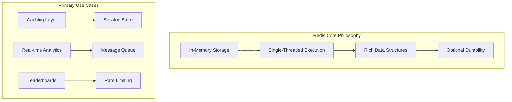

### 1.2 Single-Threaded Advantage

Redis uses a **single-threaded event loop** model which provides atomic operations without locks:

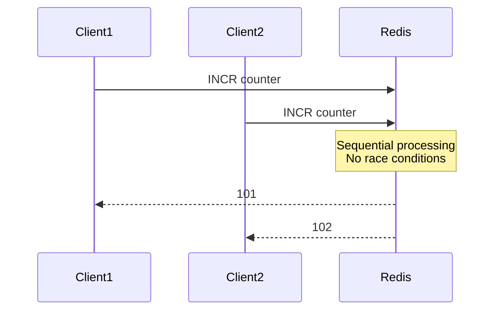

**Key Benefits:**
- No lock contention or synchronization overhead
- Predictable latency patterns
- Naturally atomic operations like `INCR`

### 1.3 Data Model

Redis is **not a table store** but rather a **huge hash map in memory** with rich data types:

| Data Structure | Conceptual Model | Primary Use Cases |
|---------------|-----------------|-------------------|
| **String** | Basic value/counter | Page views, rate limiting |
| **Hash** | Object/entity storage | User profiles, configurations |
| **List** | Queue/stack | Message queues, activity feeds |
| **Set** | Unique collection | Tags, friends lists |
| **Sorted Set** | Ranking system | Leaderboards, time-series |
| **Stream** | Append-only log | Event sourcing, message streams |

---

## 2. Persistence: RDB vs AOF

### 2.1 RDB (Redis Database File) - Snapshotting

**RDB is a point-in-time binary snapshot** of Redis memory, not a runtime state or memory block.

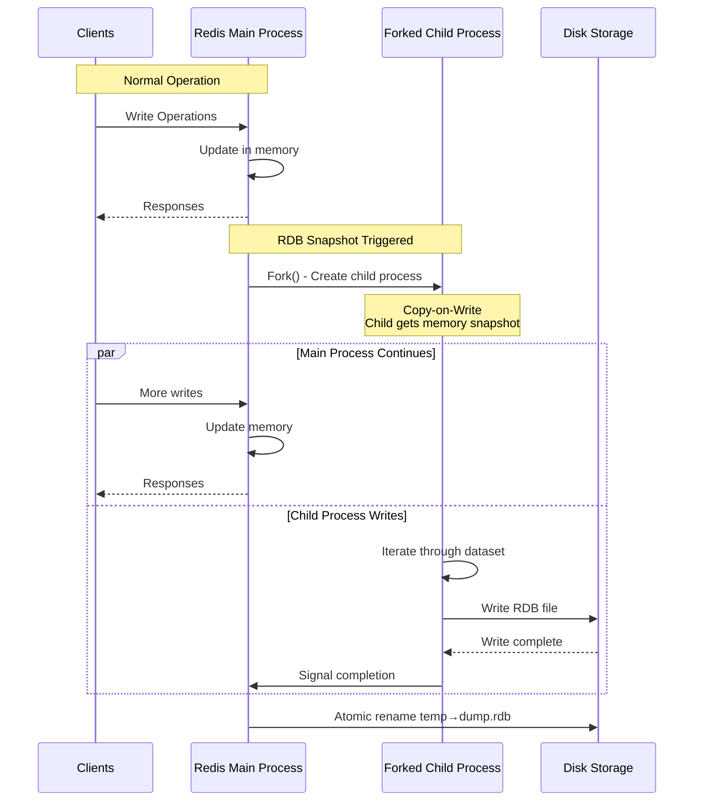

**Key RDB Characteristics:**
- **File format**: Binary representation of memory at snapshot time
- **Creation**: Forked child process writes to disk (copy-on-write)
- **Use cases**: Fast restarts, backups, replication bootstrap
- **Risk**: Potential data loss between snapshots

### 2.2 AOF (Append Only File) - Write-Ahead Log

**AOF logs every write operation** received by the server for durability:

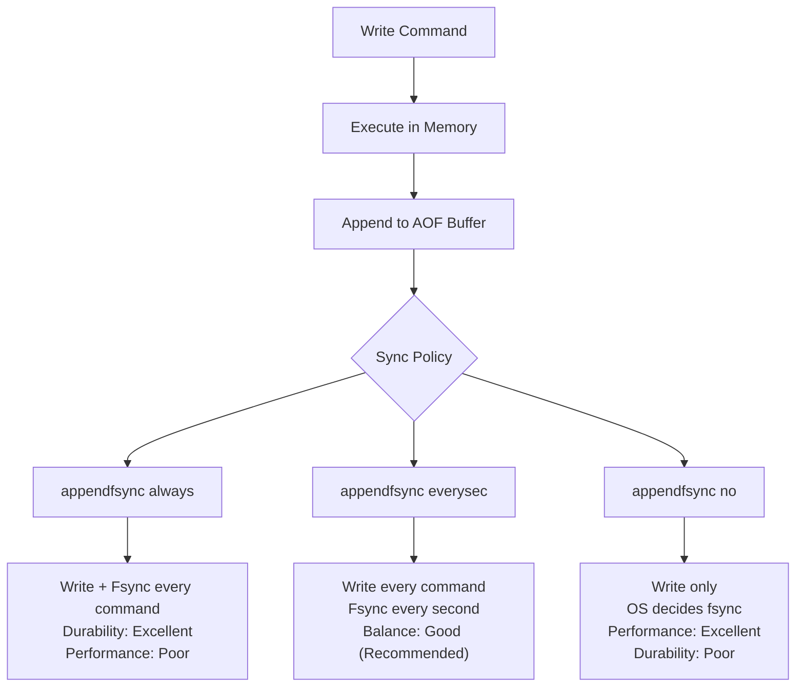

### 2.3 RDB + AOF Hybrid Approach

**Memory is the source of truth** - both RDB and AOF are derived artifacts:

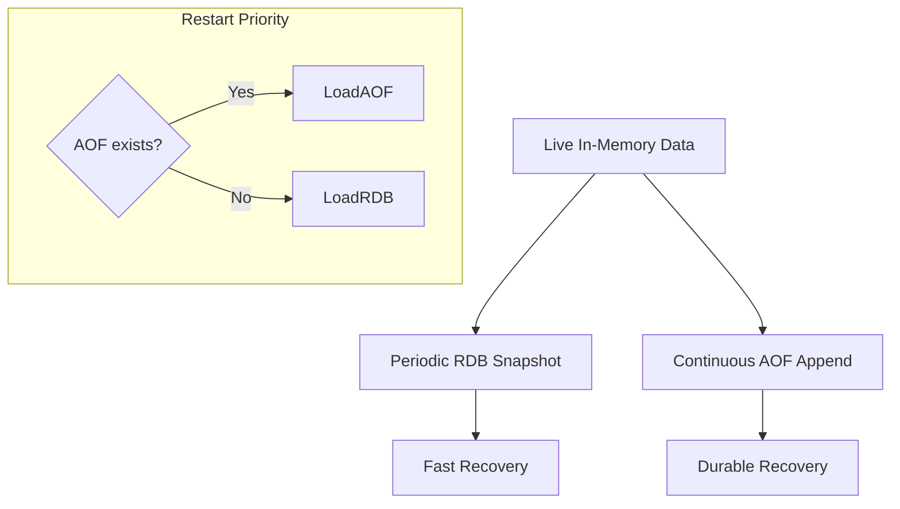

**Production Recommendation**: Enable both RDB (for speed) and AOF (for durability) with `appendfsync everysec`.

---

## 3. Replication Architecture

### 3.1 Master-Replica Model

**Each Redis instance has one role**: master OR replica, typically deployed one instance per node for isolation.

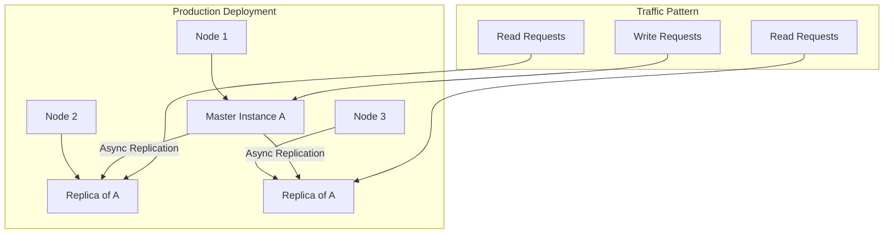

### 3.2 Replication Process

**No separate sync daemon** - replication is handled by Redis processes themselves:

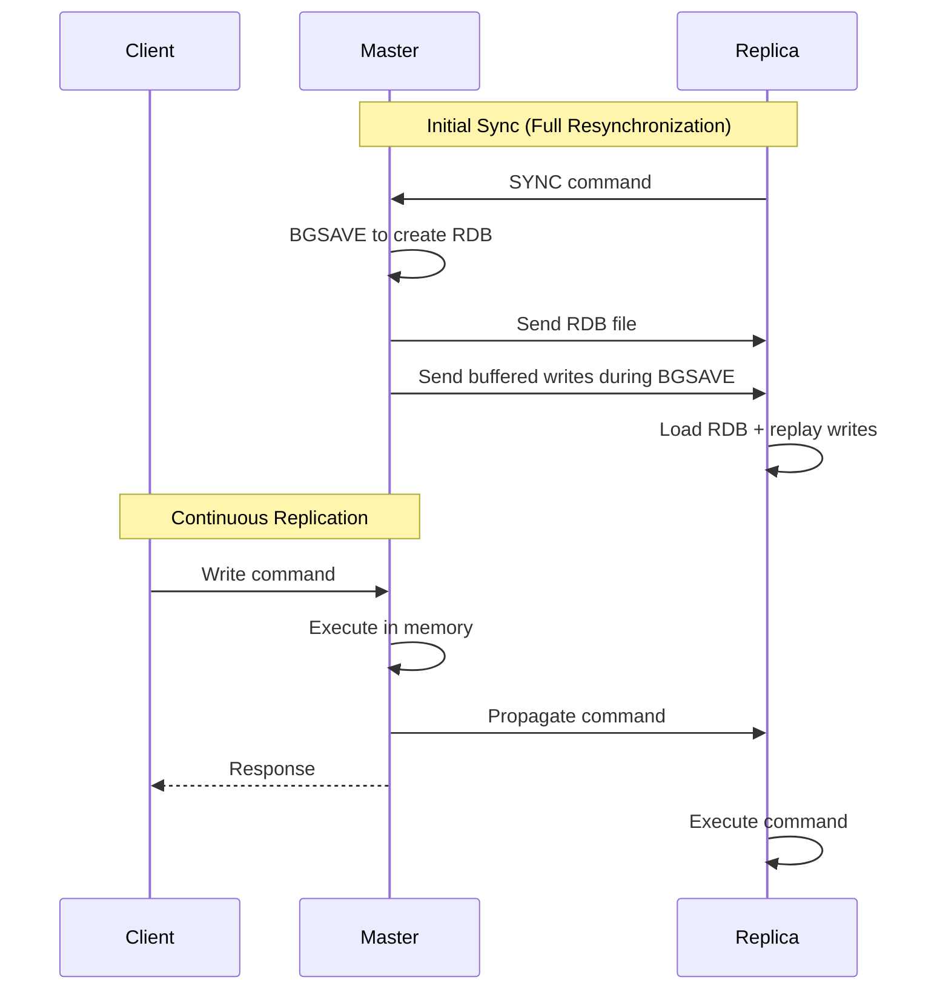

**Replication Buffer & Backlog:**
- **Replication buffer**: Commands not yet acknowledged by replicas
- **Replication backlog**: Circular buffer for reconnecting replicas
- **Key metrics**: `master_repl_offset` vs `replica_offset` for lag calculation

---

## 4. High Availability with Sentinel

### 4.1 Sentinel Architecture

**Redis Sentinel is a separate process** that monitors Redis instances and provides automatic failover:

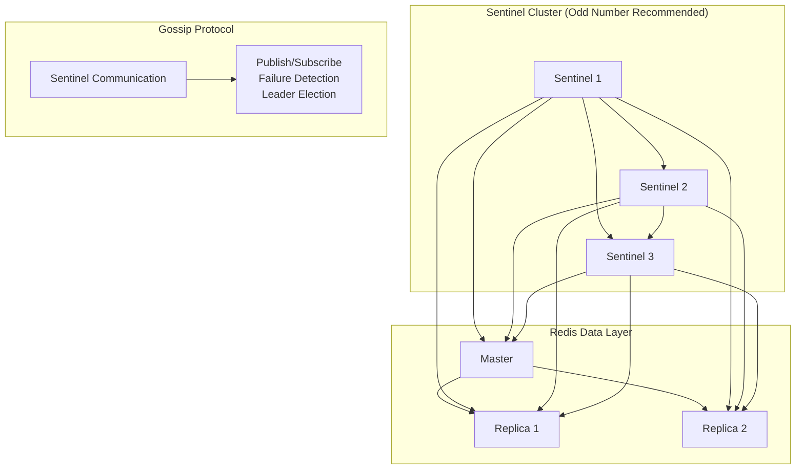

### 4.2 Why Odd Number of Sentinels?

**Quorum and fault tolerance** prevent split-brain scenarios:

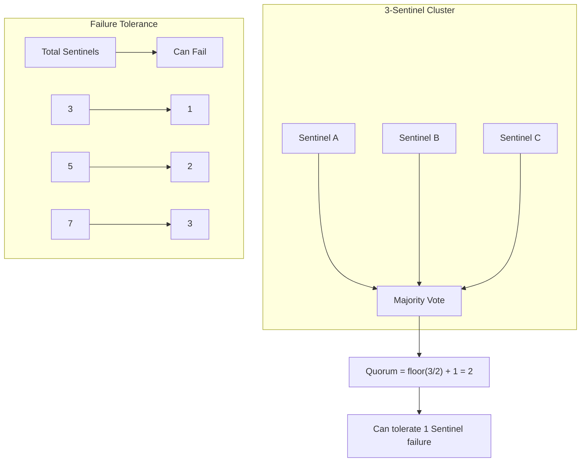

### 4.3 Failover Process

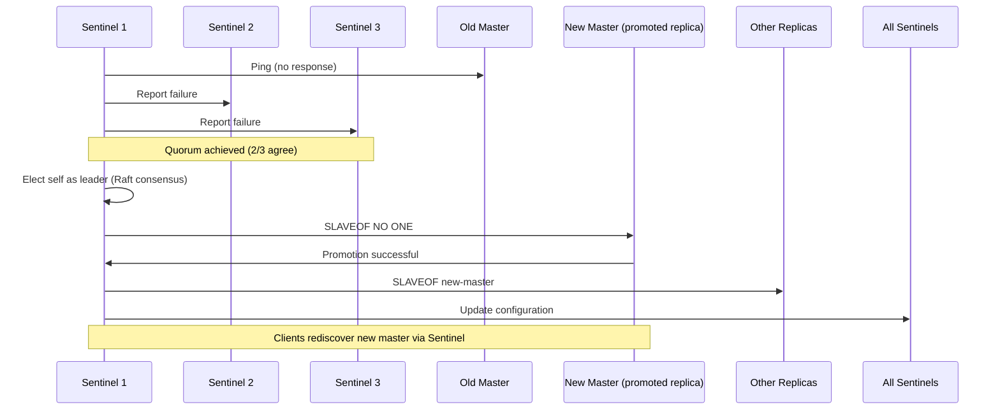

---

## 5. Redis Cluster & Sharding

### 5.1 Cluster Architecture Fundamentals

**Redis Cluster has multiple masters**, each responsible for a subset of hash slots:

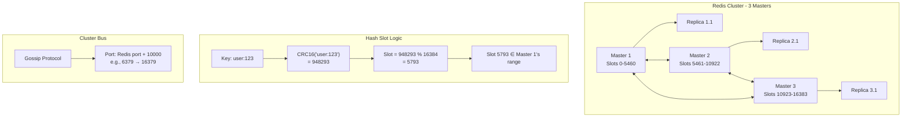

### 5.2 Key Concepts Clarified

**Slots are logical, not physical** - they exist only as routing metadata:

| Concept | Definition | Physical Existence |
|---------|------------|-------------------|
| **Slot** | Logical hash bucket (0-16383) | No - only metadata |
| **Shard** | Master + its assigned slots | Yes - Redis instance |
| **Key-Value Pair** | Actual data | Yes - in RAM/RDB |
| **Cluster Metadata** | Slot → node mapping | Yes - in `nodes.conf` |

### 5.3 Slot Assignment & Migration

**Slots are explicitly assigned**, not auto-calculated by modulo:

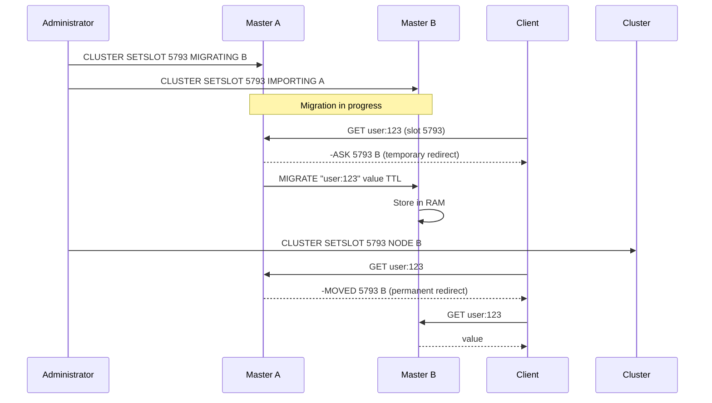

### 5.4 Adding New Masters

**Redis does NOT auto-rebalance** when adding new masters:

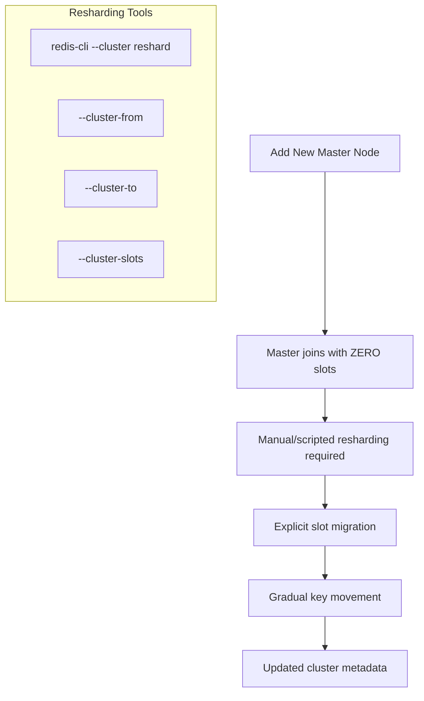

**Why no auto-rebalance?** Avoids massive uncontrolled data movement and potential service disruption.

---

## 6. Data Movement & Consistency

### 6.1 Migration and Persistence Interaction

**Slot migration moves key-value pairs in memory**, not RDB files:

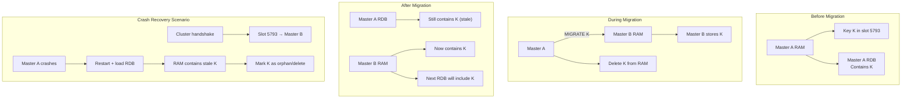

### 6.2 Critical Principles

1. **Key → Slot mapping is immutable**: `CRC16(key) % 16384` always yields same slot
2. **Slot → Node mapping is mutable**: Changed during migration
3. **RDB is local snapshot**: Never shared or merged between nodes
4. **Cluster metadata overrides RDB**: On restart, ownership checked against cluster state

### 6.3 Hash Tags for Co-location

**Force keys to same slot** using `{}` syntax for multi-key operations:

```text
# These hash to same slot (hash input = "123")
user:{123}:profile
user:{123}:orders
user:{123}:settings

# Enables:
MGET user:{123}:profile user:{123}:orders
MULTI/EXEC transactions
Lua scripts accessing multiple keys
```

### 6.4 Memory Management

**Redis must keep all active data in RAM** with explicit strategies for limits:

| Strategy | Mechanism | Use Case |
|----------|-----------|----------|
| **Eviction Policies** | `maxmemory-policy` (LRU, random, etc.) | Caching scenarios |
| **Horizontal Scaling** | Add more masters + reshard | Growing datasets |
| **Redis on Flash** | SSD-backed (Enterprise) | Large cold data |

**Never**: Automatic disk swapping or silent data eviction without configured policy.

---

## Summary: Redis Mental Model

### Core Architecture Truths

1. **Single-threaded with forked persistence**: Main thread handles commands, child processes for RDB/AOF
2. **RAM as source of truth**: Persistence is for recovery, not runtime operation
3. **Logical slot partitioning**: 16384 slots provide stable indirection layer
4. **Decentralized clustering**: No central controller, nodes coordinate via gossip
5. **Explicit data movement**: No automatic rebalancing, all migrations are operator-controlled

### Production Implications

- **Design keys carefully**: Natural distribution avoids hotspots
- **Use hash tags judiciously**: Only when multi-key operations required
- **Monitor slot distribution**: Ensure even load across masters
- **Plan resharding carefully**: Gradual migration during low traffic
- **Always have replicas**: Protect against data loss during migration windows

### Final Unified Model

```
Application → Key → CRC16 → Slot (0-16383) → Cluster Metadata → Master Node → RAM → RDB/AOF
                                     ↑
                              Replicas (sync)
```

This model ensures **predictable performance**, **linear scalability**, and **operational control** while maintaining Redis' signature sub-millisecond response times.