# Redis: From Zero to Hero - The Complete Guide

## 📘 Introduction to Redis

**Redis** (REmote DIctionary Server) is an open-source, in-memory data structure store that can be used as a database, cache, message broker, and streaming engine. Created by Salvatore Sanfilippo in 2009, Redis supports various data structures and provides high performance with sub-millisecond response times.

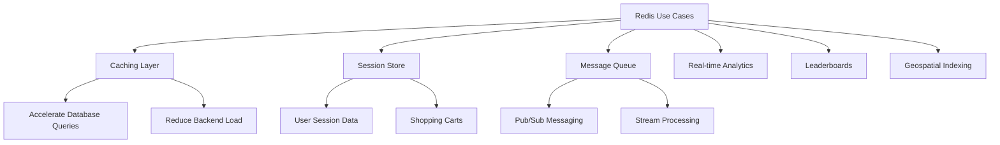

## 1. Redis Architecture Fundamentals

### 1.1 Single-Threaded Event Loop Architecture

Redis uses a **single-threaded event loop** model that processes commands sequentially. This design eliminates thread synchronization overhead and ensures atomic operations.

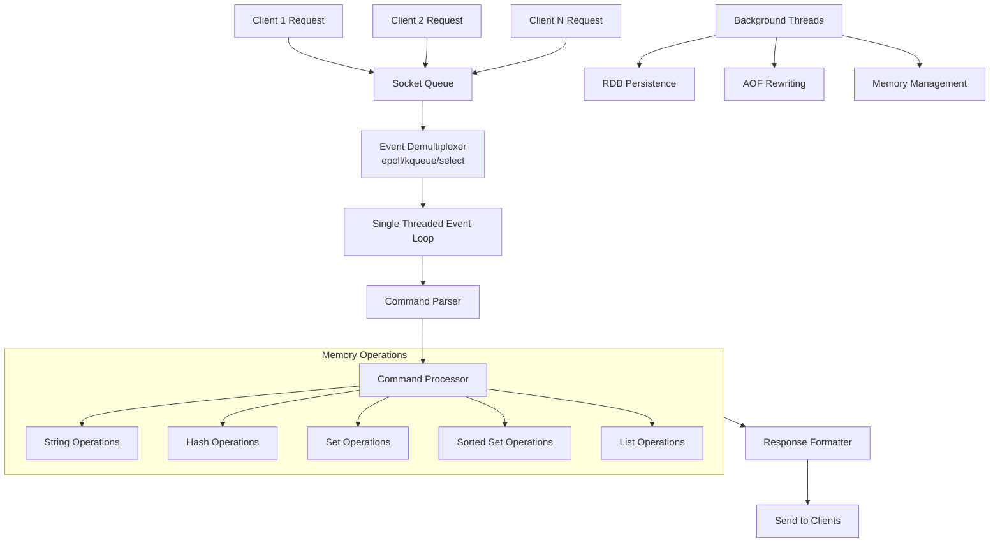

**Key Architectural Insights:**
- **Single-threaded core**: All commands execute in sequence
- **Non-blocking I/O**: Uses multiplexing for network operations
- **Background threads**: Handle persistence, UNLINK operations
- **Atomic operations**: Guaranteed by single-threaded execution

### 1.2 Memory Structure and Storage

Redis stores all data in **RAM** but can persist to disk. Understanding memory allocation is crucial for performance tuning.

```
┌─────────────────────────────────────────────────────────────┐
│                    Redis Memory Layout                       │
├─────────────────────────────────────────────────────────────┤
│  ┌───────────────────────────────────────────────────────┐  │
│  │                     Redis Object                      │  │
│  │  ┌─────────────┐  ┌──────────────────────────────┐   │  │
│  │  │   type:4    │  │    encoding:4                │   │  │
│  │  │   lru:24    │  │    refcount:4                │   │  │
│  │  │   *ptr      │  │    *ptr (to SDS or others)   │   │  │
│  │  └─────────────┘  └──────────────────────────────┘   │  │
│  └───────────────────────────────────────────────────────┘  │
│                                                              │
│  ┌───────────────────────────────────────────────────────┐  │
│  │                 Simple Dynamic String                 │  │
│  │  ┌─────────────┬─────────────┬─────────────┬───────┐  │  │
│  │  │    len      │   alloc     │   flags     │  buf  │  │  │
│  │  │  (4 bytes)  │  (4 bytes)  │  (1 byte)   │       │  │  │
│  │  └─────────────┴─────────────┴─────────────┴───────┘  │  │
│  └───────────────────────────────────────────────────────┘  │
│                                                              │
│  ┌───────────────────────────────────────────────────────┐  │
│  │                  Hash Table Structure                 │  │
│  │  ┌─────────────┐  ┌─────────────┐  ┌─────────────┐   │  │
│  │  │   dict      │  │   ht[0]     │  │   ht[1]     │   │  │
│  │  │  ┌───────┐  │  │  ┌───────┐  │  │  ┌───────┐  │   │  │
│  │  │  │size   │  │  │  │table  │──┼───▶│entry   │  │   │  │
│  │  │  │used   │  │  │  │sizemask│  │  │  │key    │  │   │  │
│  │  │  └───────┘  │  │  └───────┘  │  │  │value  │  │   │  │
│  │  │             │  │             │  │  │next   │  │   │  │
│  │  └─────────────┘  └─────────────┘  └─────────────┘   │  │
│  └───────────────────────────────────────────────────────┘  │
└─────────────────────────────────────────────────────────────┘
```

**Memory Optimization Techniques:**
- **Encoding optimization**: Small integers stored directly in pointer
- **String optimizations**: EMBSTR encoding for small strings (<44 bytes)
- **Hash optimization**: ziplist encoding for small hashes
- **Memory defragmentation**: `ACTIVE_DEFRAG` enabled in config

## 2. Core Data Structures Deep Dive

### 2.1 Strings - Beyond Simple Key-Value

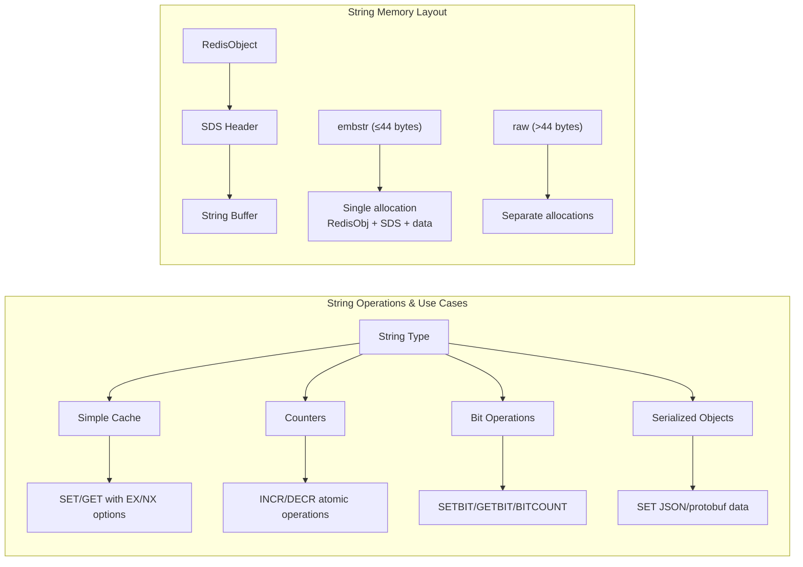

**Advanced String Operations:**
```redis
# Atomic counter with expiration
SET user:1000:visits 0 EX 3600 NX
INCR user:1000:visits

# Bit operations for feature flags
SETBIT features:user:1000 0 1  # Feature A enabled
SETBIT features:user:1000 3 1  # Feature D enabled
BITCOUNT features:user:1000    # Count enabled features

# String range operations
SET log "error: database connection failed"
GETRANGE log 0 4  # Returns "error"
APPEND log " at 10:30AM"
```

### 2.2 Hashes - Memory Efficient Objects

Hashes store field-value pairs and are perfect for representing objects.

```mermaid
flowchart TD
    A[Hash Key] --> B{Size Check}
    
    B -->|Small Hash<br/>(≤512 entries, ≤64 bytes/value)| C[Ziplist Encoding]
    B -->|Large Hash| D[Hash Table Encoding]
    
    subgraph C[Ziplist Structure]
        C1["zlbytes (4B)"] --> C2["zltail (4B)"]
        C2 --> C3["zllen (2B)"]
        C3 --> C4["entry1: field_len + field"]
        C4 --> C5["entry1: value_len + value"]
        C5 --> C6["..."]
        C6 --> C7["zlend (1B: 255)"]
    end
    
    subgraph D[Hash Table Structure]
        D1[Dict Structure] --> D2[Hash Table 0]
        D1 --> D3[Hash Table 1<br/>(rehashing)]
        
        D2 --> D4[Array of DictEntry pointers]
        D4 --> D5["DictEntry: key, value, next"]
        D5 --> D6[Collision Chain]
    end
    
    C --> E[Memory Efficient<br/>but O(n) access]
    D --> F[Fast O(1) access<br/>more memory overhead]
```

**Hash Configuration and Optimization:**
```redis
# Redis config for hash optimization
hash-max-ziplist-entries 512
hash-max-ziplist-value 64

# Hash operations in practice
HSET user:1000 name "John" age 30 email "john@example.com"
HINCRBY user:1000 age 1  # Birthday!
HGETALL user:1000
HSCAN user:1000 0  # Iterate large hashes efficiently
```

### 2.3 Lists, Sets, and Sorted Sets

**Lists**: Linked lists optimized with quicklist (ziplists linked together)

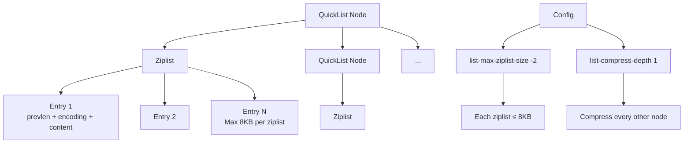

**Sets and Sorted Sets Comparison:**

| Feature | Set | Sorted Set |
|---------|-----|------------|
| **Storage** | Hash table or intset | Skip list + hash table |
| **Ordering** | Unordered | Ordered by score |
| **Operations** | `SADD`, `SINTER`, `SUNION` | `ZADD`, `ZRANGE`, `ZSCORE` |
| **Use Cases** | Tags, friends, unique items | Leaderboards, time series |
| **Memory** | More efficient for integers | Additional score storage |

**Sorted Set Internal Structure (Skip List + Hash Table):**
```
┌─────────────────────────────────────────────────────────────────┐
│                      Sorted Set Architecture                     │
├─────────────────────────────────────────────────────────────────┤
│  ┌─────────────────┐        ┌─────────────────┐                │
│  │    Hash Table   │        │   Skip List     │                │
│  │  key→score ptr  │◀──────▶│  score→key ptr  │                │
│  └─────────────────┘        └─────────────────┘                │
│         │                            │                          │
│         ▼                            ▼                          │
│  ┌─────────────┐            ┌─────────────────┐                │
│  │  "player1"  │            │  Level 3: ──────┼─────▶ ...      │
│  │  score: 100 │            │  Level 2: ──────┼─────▶ ...      │
│  │     │       │            │  Level 1: ──────┼─────▶ ...      │
│  └─────────────┘            │  Level 0: 100 → "player1"        │
│         │                   └─────────────────┘                │
│  ┌─────────────┐                    │                          │
│  │  "player2"  │            ┌─────────────────┐                │
│  │  score: 200 │            │  Level 2: ──────┼─────▶ ...      │
│  └─────────────┘            │  Level 1: ──────┼─────▶ ...      │
│                             │  Level 0: 200 → "player2"        │
│                             └─────────────────┘                │
└─────────────────────────────────────────────────────────────────┘
```

## 3. Persistence Mechanisms

### 3.1 RDB (Redis Database File)

RDB creates point-in-time snapshots of your dataset.

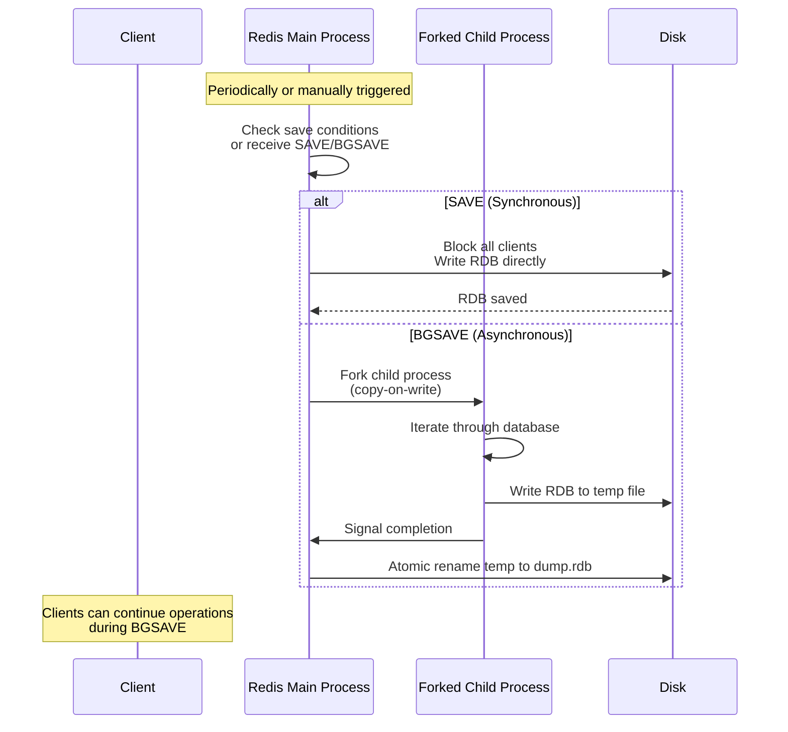

**RDB Configuration:**
```redis
# Save conditions: save <seconds> <changes>
save 900 1    # After 15 min if ≥1 key changed
save 300 10   # After 5 min if ≥10 keys changed
save 60 10000 # After 1 min if ≥10000 keys changed

# Advanced RDB settings
rdbcompression yes           # Compress RDB files
rdbchecksum yes             # Add checksum
dbfilename dump.rdb         # Filename
dir /var/lib/redis          # Directory
stop-writes-on-bgsave-error yes
```

### 3.2 AOF (Append Only File)

AOF logs every write operation received by the server.

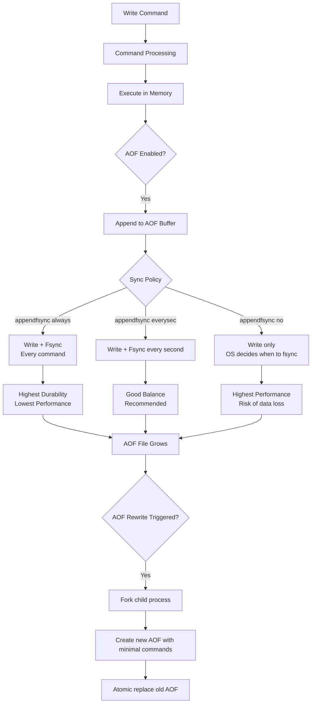

**AOF Rewriting Process:**
```
┌─────────────────────────────────────────────────────────────┐
│                    AOF Rewriting Process                     │
├─────────────────────────────────────────────────────────────┤
│                                                              │
│  ┌─────────────────┐     ┌─────────────────┐               │
│  │   Main Process  │     │  Child Process  │               │
│  │                 │     │                 │               │
│  │  ┌───────────┐  │     │  ┌───────────┐  │               │
│  │  │ AOF Buffer │  │     │  │   Memory  │  │               │
│  │  │ (New cmds) │──┼─────┼─▶│  Snapshot │  │               │
│  │  └───────────┘  │     │  └───────────┘  │               │
│  │                 │     │        │         │               │
│  │  ┌───────────┐  │     │        ▼         │               │
│  │  │  Old AOF  │──┼─────┼─▶ Write new AOF  │               │
│  │  └───────────┘  │     │    (optimized)   │               │
│  │                 │     │        │         │               │
│  │        │        │     │        ▼         │               │
│  │        ▼        │     │  Temp AOF File   │               │
│  │  Continue      │     │        │         │               │
│  │  operations    │     │        ▼         │               │
│  │                │     │  Signal parent   │               │
│  └────────┬───────┘     └────────┬─────────┘               │
│           │                       │                         │
│           └───────────┬───────────┘                         │
│                       ▼                                     │
│              Atomic file replace                           │
│                       │                                     │
│                       ▼                                     │
│              ┌───────────────┐                             │
│              │ New AOF Active │                             │
│              └───────────────┘                             │
└─────────────────────────────────────────────────────────────┘
```

### 3.3 RDB vs AOF Comparison

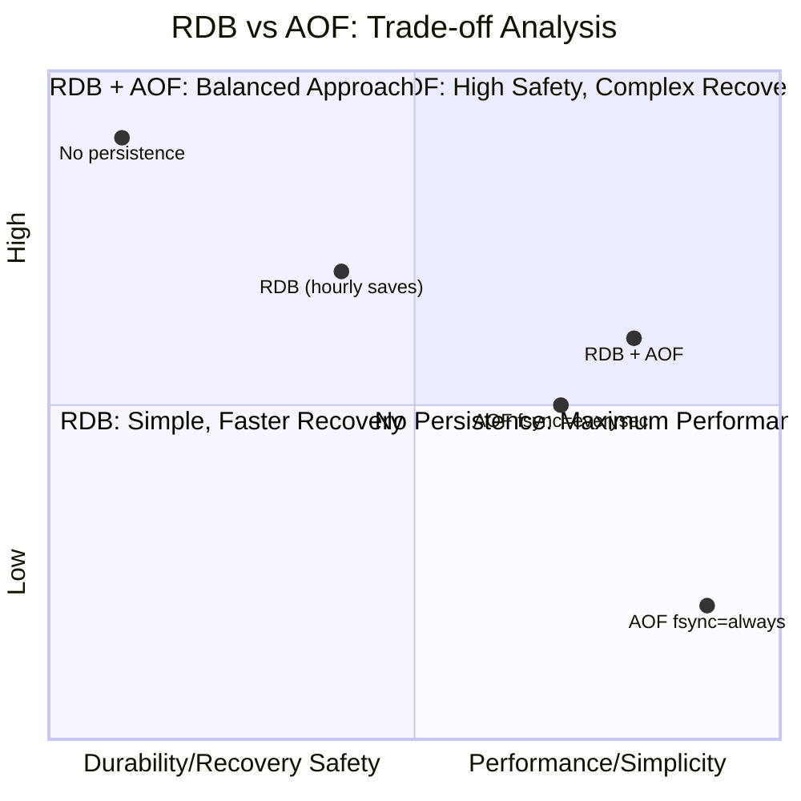

**Hybrid Approach Recommendation:**
```redis
# Enable both RDB and AOF for best results
save 900 1
save 300 10
save 60 10000

appendonly yes
appendfilename "appendonly.aof"
appendfsync everysec

# Auto-rewrite AOF when it grows too much
auto-aof-rewrite-percentage 100
auto-aof-rewrite-min-size 64mb

# Load AOF if available, fall back to RDB
aof-load-truncated yes
```

## 4. Redis Replication

### 4.1 Master-Replica Architecture

Redis replication is asynchronous, with a single master and multiple replicas.

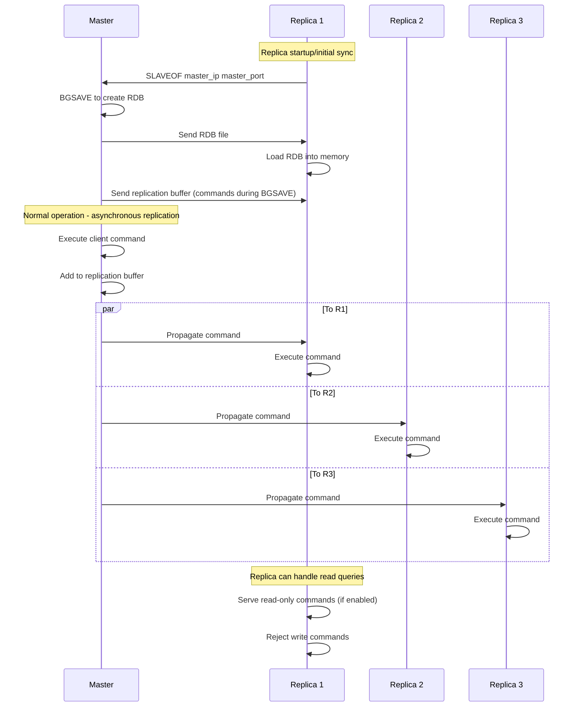

### 4.2 Replication Internals and Configuration

**Replication Buffer and Backlog:**
```
┌─────────────────────────────────────────────────────────┐
│                 Master Replication State                 │
├─────────────────────────────────────────────────────────┤
│  ┌─────────────────────────────────────────────────┐   │
│  │              Replication Backlog                │   │
│  │  ┌───┬───┬───┬───┬───┬───┬───┬───┬───┬───┐    │   │
│  │  │ C │ C │ C │ C │ C │ C │ C │ C │ C │ C │    │   │
│  │  │ m │ m │ m │ m │ m │ m │ m │ m │ m │ m │    │   │
│  │  │ d │ d │ d │ d │ d │ d │ d │ d │ d │ d │    │   │
│  │  │ 1 │ 2 │ 3 │ 4 │ 5 │ 6 │ 7 │ 8 │ 9 │10 │    │   │
│  │  └───┴───┴───┴───┴───┴───┴───┴───┴───┴───┘    │   │
│  │    ↑                               ↑           │   │
│  │    │                               │           │   │
│  │  master_repl_offset               buffer end   │   │
│  └─────────────────────────────────────────────────┘   │
│                                                        │
│  ┌─────────────────────────────────────────────────┐   │
│  │              Connected Replicas                 │   │
│  │  ┌─────────┐  ┌─────────┐  ┌─────────┐        │   │
│  │  │ Replica │  │ Replica │  │ Replica │        │   │
│  │  │    1    │  │    2    │  │    3    │        │   │
│  │  ├─────────┤  ├─────────┤  ├─────────┤        │   │
│  │  │offset:7 │  │offset:5 │  │offset:9 │        │   │
│  │  │lag:0s   │  │lag:2s   │  │lag:0s   │        │   │
│  │  └─────────┘  └─────────┘  └─────────┘        │   │
│  └─────────────────────────────────────────────────┘   │
└─────────────────────────────────────────────────────────┘
```

**Key Configuration Parameters:**
```redis
# Master configuration
repl-backlog-size 1mb           # Size of replication backlog
repl-backlog-ttl 3600           # Time to keep backlog after no replicas
repl-diskless-sync yes          # Diskless replication for faster sync
repl-diskless-sync-delay 5      # Delay to start diskless sync

# Replica configuration
replica-read-only yes           # Replicas accept only reads
repl-ping-replica-period 10     # Ping interval (seconds)
repl-timeout 60                 # Replication timeout
min-replicas-to-write 1         # Require at least N replicas
min-replicas-max-lag 10         # Maximum lag allowed
```

### 4.3 Replication Failover and Sentinel

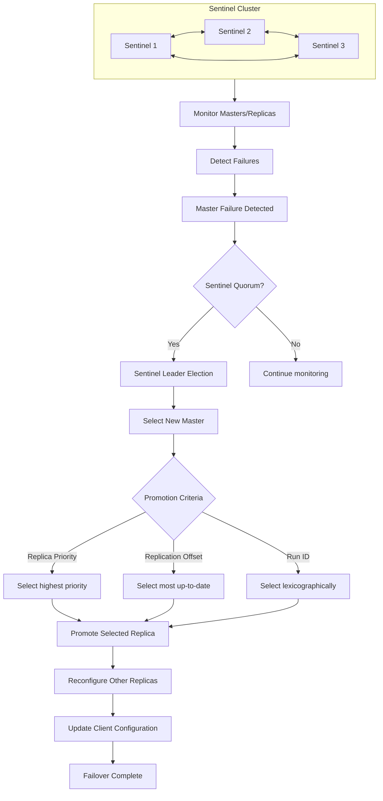

## 5. Redis Cluster - Distributed Redis

### 5.1 Cluster Architecture and Sharding

Redis Cluster uses automatic sharding across multiple nodes with a hash slot model (16384 slots).

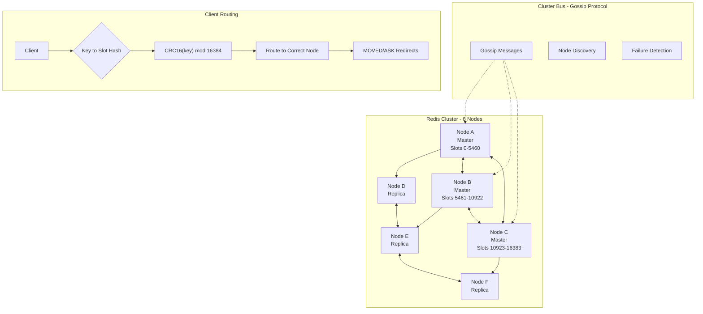

**Hash Slot Allocation Example:**
```python
import crc16

def key_to_slot(key):
    # Only hash the part between { and } if present
    if '{' in key and '}' in key:
        start = key.find('{') + 1
        end = key.find('}')
        if end != -1 and end > start:
            key = key[start:end]
    
    # Calculate CRC16 and mod 16384
    return crc16.crc16xmodem(key.encode()) % 16384

# Examples
print(key_to_slot("user:1000"))           # Regular key
print(key_to_slot("{orders}:pending"))    # Hash tag - all go to same slot
print(key_to_slot("{orders}:completed"))  # Same slot as above
```

### 5.2 Cluster Node Communication

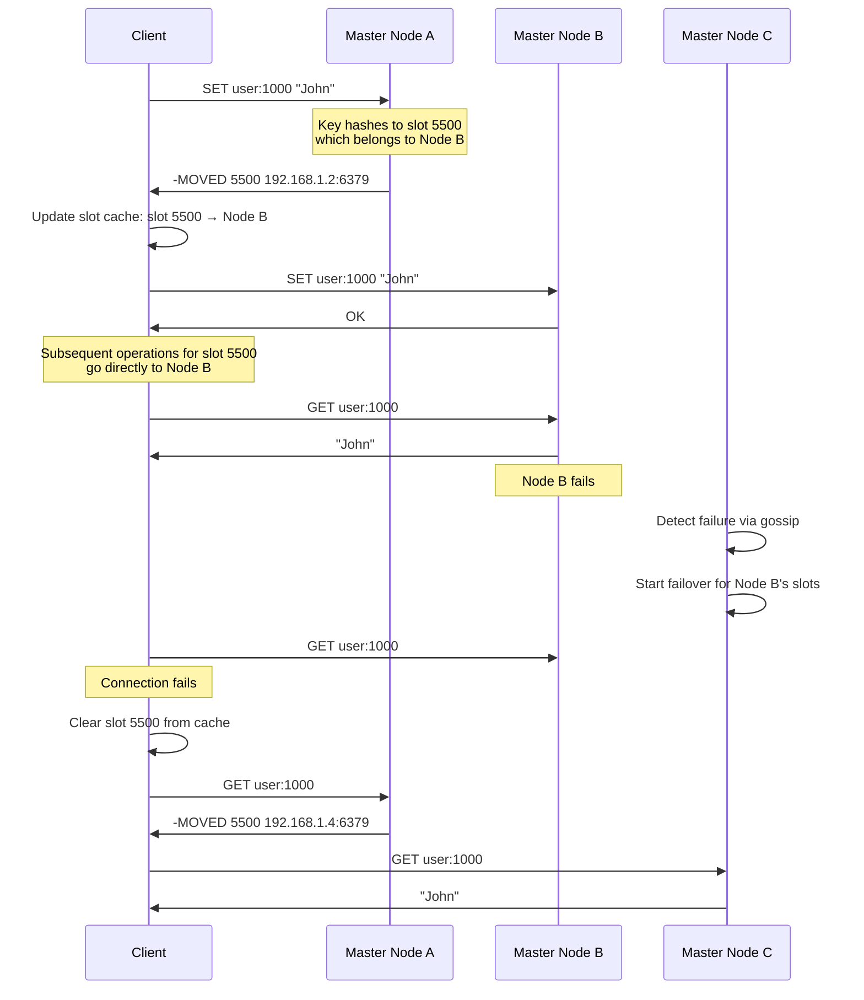

**Cluster Configuration:**
```redis
# Cluster node configuration
cluster-enabled yes
cluster-config-file nodes.conf
cluster-node-timeout 15000
cluster-replica-validity-factor 10
cluster-migration-barrier 1
cluster-require-full-coverage yes

# Create cluster (from command line)
redis-cli --cluster create \
  192.168.1.1:6379 192.168.1.2:6379 192.168.1.3:6379 \
  192.168.1.4:6379 192.168.1.5:6379 192.168.1.6:6379 \
  --cluster-replicas 1
```

### 5.3 Cluster Failure Detection and Recovery

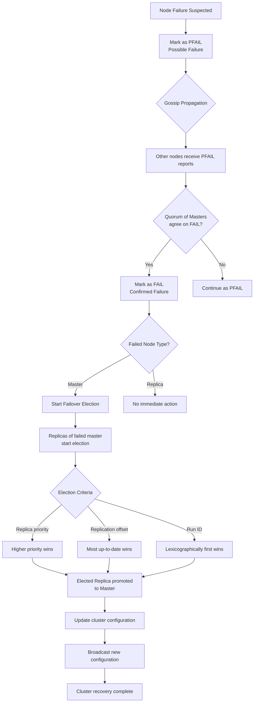

## 6. Advanced Features and Modules

### 6.1 Redis Streams

Streams are an append-only log data structure for messaging and event sourcing.

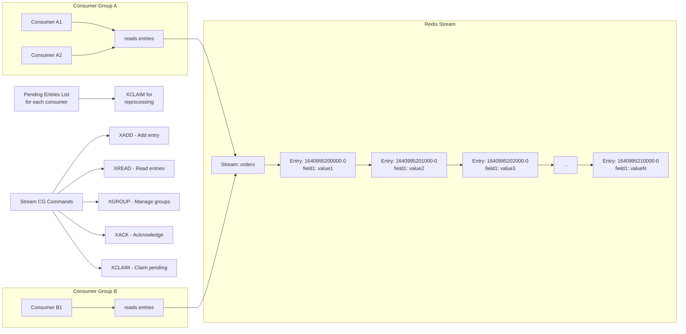

**Stream Operations Example:**
```redis
# Add entry to stream
XADD orders * user_id 1000 product_id 123 quantity 2

# Create consumer group
XGROUP CREATE orders order-processors $ MKSTREAM

# Read as consumer
XREADGROUP GROUP order-processors consumer1 COUNT 10 STREAMS orders >

# Acknowledge processing
XACK orders order-processors 1640995200000-0

# Check pending messages
XPENDING orders order-processors

# Claim stuck messages
XCLAIM orders order-processors consumer2 3600000 1640995200000-0
```

### 6.2 RedisJSON and RedisSearch

**RedisJSON** adds native JSON support, and **RedisSearch** provides full-text search capabilities.

```mermaid
graph TB
    subgraph "Redis with Modules"
        A[Redis Core] --> B[RedisJSON Module]
        A --> C[RedisSearch Module]
        A --> D[RedisGraph Module]
        A --> E[RedisTimeSeries Module]
        A --> F[RedisBloom Module]
    end
    
    B --> G["JSON data types<br/>JSON.GET, JSON.SET<br/>JSON.INDEX with Search"]
    C --> H["Secondary indexes<br/>Full-text search<br/>Faceted search<br/>Aggregations"]
    
    G --> I["Store and query<br/>JSON documents natively"]
    H --> J["Search across<br/>all data types"]
    
    I --> K[Example: Product Catalog]
    J --> L[Example: E-commerce Search]
    
    K --> M["JSON.SET product:1 $ '{<br/>  \"name\": \"Laptop\",<br/>  \"price\": 999,<br/>  \"tags\": [\"electronics\"]<br/>}'"]
    L --> N["FT.CREATE idx:products ON JSON SCHEMA<br/>  $.name AS name TEXT<br/>  $.price AS price NUMERIC"]
    
    M --> O["JSON.GET product:1 $.name"]
    N --> P["FT.SEARCH idx:products \"gaming laptop\"<br/>  RETURN 2 name price"]
```

### 6.3 Redis Modules Ecosystem

| Module | Purpose | Key Features |
|--------|---------|--------------|
| **RedisJSON** | JSON document store | JSONPath queries, atomic updates |
| **RedisSearch** | Full-text search | Indexing, stemming, Chinese support |
| **RedisGraph** | Graph database | Cypher queries, graph algorithms |
| **RedisTimeSeries** | Time-series data | Downsampling, aggregation, retention |
| **RedisBloom** | Probabilistic data | Bloom filters, Cuckoo filters, Count-Min Sketch |
| **RedisAI** | Tensor serving | Model execution, DAG execution |
| **RedisGears** | Serverless engine | Data processing, ETL pipelines |

## 7. Performance Optimization

### 7.1 Memory Optimization Techniques

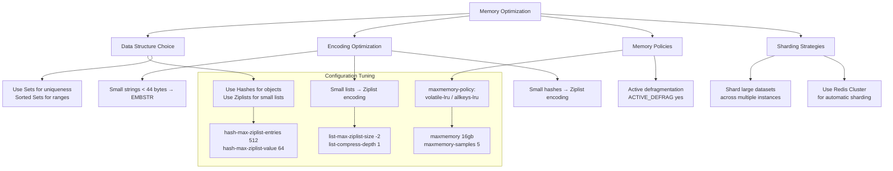

### 7.2 Latency Reduction Strategies

**Identifying and Reducing Latency Sources:**

| Latency Source | Detection | Solution |
|----------------|-----------|----------|
| **Slow commands** | `SLOWLOG` | Optimize commands, use pipelines |
| **Network latency** | `redis-cli --latency` | Use persistent connections, pipelining |
| **Memory swapping** | `redis-cli INFO memory` | Increase memory, optimize data |
| **Fork latency** | Monitor during BGSAVE | Use diskless replication |
| **AOF fsync** |


## 7.2 Command Optimization and Best Practices

### **Memory-Optimized Data Structure Selection**

```mermaid
graph TB
    A[Data Storage Requirement] --> B{Data Characteristics}
    
    B --> C["Small data?<br/>(<100 items)"]
    B --> D["Need range queries?"]
    B --> E["Need uniqueness?"]
    B --> F["Need scoring/ranking?"]
    B --> G["Bit-level operations?"]
    
    C --> H[Consider ziplist encoding]
    D --> I[Use Sorted Sets]
    E --> J[Use Sets]
    F --> I
    G --> K[Use Bitmaps]
    
    H --> L["Configure:<br/>hash-max-ziplist-entries 512<br/>hash-max-ziplist-value 64"]
    I --> M["ZSET: Skip list + Hash table<br/>O(log N) operations"]
    J --> N["SET: Hash table or Intset<br/>O(1) operations"]
    K --> O["Bitmap: String of bits<br/>Extremely memory efficient"]
    
    subgraph "Memory Optimization Strategies"
        P[Small integers] --> Q[Use intset encoding for sets]
        R[Boolean flags] --> S[Use bitmaps (0.125 bytes per flag)"]
        T[Small collections] --> U[Use ziplist encoding]
        V[Large strings] --> W[Consider compression before storage]
    end
```

**Memory Optimization Commands:**
```redis
# Check memory usage of a key
MEMORY USAGE user:session:12345

# Get detailed memory stats
INFO MEMORY

# Find big keys (production caution)
redis-cli --bigkeys

# Sample memory usage pattern
MEMORY STATS

# Memory doctor recommendations
MEMORY DOCTOR
```

### **Pipeline vs Transaction vs Lua Script**

| Feature | Pipeline (Pipelining) | Transaction (MULTI/EXEC) | Lua Script |
|---------|---------------------|-------------------------|------------|
| **Atomicity** | No | Yes (all or nothing) | Yes |
| **Network Round-trips** | 1 for all commands | 1 for MULTI, 1 for EXEC, 1 for each command | 1 for script load/execution |
| **Isolation** | No | Yes (serialized) | Yes |
| **Performance** | Highest | Medium | High (in-memory execution) |
| **Error Handling** | Individual command failures | All fail on EXEC error | All-or-nothing |
| **Use Case** | Bulk operations without atomicity | Bank transfers, inventory updates | Complex atomic operations |

**Performance Comparison:**
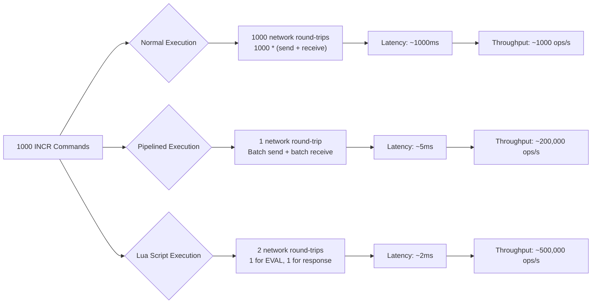

**Implementation Examples:**
```python
import redis
import time

class RedisOptimizationExamples:
    def __init__(self):
        self.r = redis.Redis(host='localhost', port=6379, decode_responses=True)
    
    def pipeline_example(self):
        """Pipeline example for bulk operations"""
        pipe = self.r.pipeline()
        
        start_time = time.time()
        
        # Queue 1000 commands
        for i in range(1000):
            pipe.set(f"key:{i}", f"value:{i}")
        
        # Execute all at once
        pipe.execute()
        
        elapsed = time.time() - start_time
        print(f"Pipeline: {elapsed:.4f} seconds")
    
    def transaction_example(self):
        """Transaction example for atomic operations"""
        try:
            # Start transaction
            pipe = self.r.pipeline()
            
            # Watch key for changes
            pipe.watch("account:1000:balance", "account:2000:balance")
            
            # Get current balances
            balance1 = int(pipe.get("account:1000:balance") or 0)
            balance2 = int(pipe.get("account:2000:balance") or 0)
            
            # Check if transfer is possible
            if balance1 >= 100:
                # Start transaction
                pipe.multi()
                pipe.decrby("account:1000:balance", 100)
                pipe.incrby("account:2000:balance", 100)
                
                # Execute
                results = pipe.execute()
                print(f"Transaction successful: {results}")
            else:
                pipe.unwatch()
                print("Insufficient funds")
                
        except redis.WatchError:
            print("Transaction failed due to concurrent modification")
    
    def lua_script_example(self):
        """Lua script for complex atomic operations"""
        script = """
        local current = redis.call('GET', KEYS[1])
        local increment = tonumber(ARGV[1])
        local max_value = tonumber(ARGV[2])
        
        if not current then
            current = 0
        else
            current = tonumber(current)
        end
        
        local new_value = current + increment
        
        if new_value > max_value then
            return {err = "Exceeded maximum value"}
        end
        
        redis.call('SET', KEYS[1], new_value)
        return new_value
        """
        
        # Load and execute script
        script_hash = self.r.script_load(script)
        result = self.r.evalsha(script_hash, 1, "counter:limited", 5, 100)
        print(f"Lua script result: {result}")

# Usage
optimizer = RedisOptimizationExamples()
optimizer.pipeline_example()
optimizer.transaction_example()
optimizer.lua_script_example()
```

### 7.3 Connection Pooling and Client Configuration

**Optimal Client Configuration:**
```python
import redis
from redis.connection import ConnectionPool

class OptimizedRedisClient:
    def __init__(self):
        # Connection pool configuration
        self.pool = ConnectionPool(
            host='localhost',
            port=6379,
            db=0,
            max_connections=50,           # Maximum connections in pool
            socket_connect_timeout=5,     # Connection timeout
            socket_keepalive=True,        # Keep connections alive
            socket_keepalive_options={
                socket.TCP_KEEPIDLE: 60,  # Start checking after 60s idle
                socket.TCP_KEEPINTVL: 30, # Check every 30s
                socket.TCP_KEEPCNT: 3     # Fail after 3 failed checks
            },
            retry_on_timeout=True,        # Retry on timeout
            health_check_interval=30,     # Health check every 30s
            decode_responses=True         # Decode responses to strings
        )
        
        # Create client with connection pool
        self.client = redis.Redis(connection_pool=self.pool)
    
    def connection_metrics(self):
        """Monitor connection pool metrics"""
        pool_info = self.pool.connection_kwargs
        print(f"Connection Pool Info:")
        print(f"  Max connections: {self.pool.max_connections}")
        print(f"  Current connections: {len(self.pool._connections)}")
        print(f"  Available connections: {self.pool._available_connections}")
```

## 8. Redis Security Deep Dive

### 8.1 Comprehensive Security Architecture

```mermaid
graph TB
    subgraph "Network Security"
        A[External Access] --> B[VPC/Private Network]
        B --> C[Security Groups]
        C --> D[Redis Instance]
        
        E[VPN/SSH Tunnel] --> F[Jump Host]
        F --> B
        
        G[Public Access] --> H[SSL/TLS Termination]
        H --> I[API Gateway]
        I --> B
    end
    
    subgraph "Authentication & Authorization"
        J[Client] --> K{Authentication Method}
        
        K --> L[Password Auth]
        K --> M[Client Certificates]
        K --> N[IAM Authentication (AWS)]
        
        O[Redis ACL] --> P[User Definitions]
        P --> Q["user default on ~* +@all -@dangerous"]
        P --> R["user appuser on ~app:* +@read +@write"]
        P --> S["user readonly on ~cache:* +@read"]
        
        T[Command Filtering] --> U["Disable dangerous commands"]
        U --> V["CONFIG, FLUSHDB, FLUSHALL, KEYS"]
    end
    
    subgraph "Encryption & Data Protection"
        W[Data in Transit] --> X[TLS 1.2/1.3]
        X --> Y["SSL certificates<br/>Perfect Forward Secrecy"]
        
        Z[Data at Rest] --> AA["RDB/AOF Encryption<br/>or Disk-level encryption"]
        
        AB[Sensitive Data] --> AC[Field-level Encryption]
        AC --> AD["Application-layer encryption<br/>before storing in Redis"]
    end
    
    subgraph "Monitoring & Auditing"
        AE[Audit Log] --> AF["redisAuditLog yes<br/>redisAuditLogFile /var/log/redis/audit.log"]
        
        AG[Command Logging] --> AH["MONITOR command<br/>(debugging only)"]
        
        AI[Intrusion Detection] --> AJ["Failed login attempts<br/>Suspicious command patterns"]
    end
```

### 8.2 ACL (Access Control List) Implementation

**Redis ACL Configuration:**
```redis
# Redis 6.0+ ACL Configuration
# Enable ACL
aclfile /etc/redis/users.acl

# Define users in ACL file
user default off nopass ~* +@all -@dangerous
user admin on >adminpassword ~* +@all
user webapp on >apppassword ~cache:* ~session:* ~queue:* +@read +@write -@admin
user readonly on >readonlypassword ~cache:* +@read
user replica on >replicapassword +psync +replconf +ping

# Categories of commands
# +@admin    - Administrative commands
# +@read     - Read-only commands
# +@write    - Write commands
# +@fast     - Fast commands (O(1) or O(log N))
# +@slow     - Slow commands
# +@dangerous - Dangerous commands (FLUSHALL, CONFIG, etc.)

# Command rules
user analytics on >analyticspass ~analytics:* +@read +geo* +bit* -@write

# Key patterns
user service1 on >service1pass ~service1:* +@all
user service2 on >service2pass ~service2:* +@all
```

**ACL Management Commands:**
```redis
# View ACL rules
ACL LIST
ACL GETUSER username

# Create/modify users
ACL SETUSER webapp on >newpassword ~app:* +@read +@write
ACL SETUSER webapp ~session:* ~cache:*
ACL SETUSER webapp -@dangerous

# Save ACL to file
ACL SAVE

# Dry run to test permissions
ACL DRYRUN webapp get user:123
ACL DRYRUN webapp flushall

# Import/Export ACL
ACL GENPASS  # Generate secure password
ACL CAT      # List command categories
ACL LOG      # View security log
```

### 8.3 TLS/SSL Configuration

**Redis TLS Configuration:**
```redis
# redis-tls.conf
port 0
tls-port 6379
tls-cert-file /etc/redis/redis.crt
tls-key-file /etc/redis/redis.key
tls-ca-cert-file /etc/redis/ca.crt

# TLS Protocol versions
tls-protocols "TLSv1.2 TLSv1.3"

# Cipher suites
tls-ciphers "EECDH+AESGCM:EDH+AESGCM"
tls-ciphersuites "TLS_CHACHA20_POLY1305_SHA256"

# Authentication modes
tls-auth-clients yes        # Require client certificates
tls-auth-clients optional   # Optional client certificates

# Replication with TLS
tls-replication yes
tls-cluster yes
```

**Client TLS Connection:**
```python
import redis
import ssl

# Create SSL context
ssl_context = ssl.create_default_context(
    ssl.Purpose.SERVER_AUTH,
    cafile='/path/to/ca.crt'
)
ssl_context.load_cert_chain(
    certfile='/path/to/client.crt',
    keyfile='/path/to/client.key'
)
ssl_context.check_hostname = False  # For self-signed certs
ssl_context.verify_mode = ssl.CERT_REQUIRED

# Connect with TLS
client = redis.Redis(
    host='redis.example.com',
    port=6379,
    ssl=True,
    ssl_cert_reqs='required',
    ssl_ca_certs='/path/to/ca.crt',
    ssl_certfile='/path/to/client.crt',
    ssl_keyfile='/path/to/client.key'
)

# Alternative: Using SSL context
client = redis.Redis(
    host='redis.example.com',
    port=6379,
    ssl=True,
    ssl_context=ssl_context
)
```

## 9. Advanced Redis Features

### 9.1 Redis Streams Deep Dive

**Stream Architecture and Internals:**

```mermaid
graph TB
    subgraph "Redis Stream Structure"
        A[Stream Key] --> B[Stream Header]
        B --> C[Radix Tree (rax)"]
        
        C --> D[Entry 1: 1640995200000-0]
        D --> E["fields: {user: 'john', action: 'login'}"]
        
        C --> F[Entry 2: 1640995201000-0]
        F --> G["fields: {user: 'jane', action: 'purchase'}"]
        
        C --> H[Entry N: 1640995210000-0]
        H --> I["fields: {user: 'bob', action: 'logout'}"]
    end
    
    subgraph "Consumer Group Architecture"
        J[Consumer Group: "order-processors"] --> K[Stream: "orders"]
        
        J --> L[Consumer 1: "worker-1"]
        J --> M[Consumer 2: "worker-2"]
        J --> N[Consumer 3: "worker-3"]
        
        L --> O[Pending Entries List]
        M --> O
        N --> O
        
        O --> P["Entry: 1640995200000-0 -> worker-1<br/>Entry: 1640995201000-0 -> worker-2<br/>Entry: 1640995202000-0 -> worker-1"]
        
        Q[Last Delivered ID] --> R["> : Next entry<br/>0-0: From beginning<br/>$: Latest"]
    end
    
    subgraph "Stream Internals"
        S[Radix Tree Node] --> T["Key: timestamp-sequence<br/>Value: listpack"]
        
        U[listpack structure] --> V["Total bytes | num elements | element1 | element2 | ... | END"]
        
        W[Memory Optimization] --> X["Small entries: listpack<br/>Large entries: separate allocations"]
    end
```

**Complete Streams Implementation:**
```python
class RedisStreamsProcessor:
    """Advanced Redis Streams implementation"""
    
    def __init__(self, redis_client):
        self.redis = redis_client
    
    def create_stream_system(self):
        """Create complete stream-based event system"""
        
        # Create stream with initial data
        self.redis.xadd('orders:events', {
            'type': 'system_start',
            'timestamp': str(int(time.time() * 1000)),
            'message': 'Order processing system initialized'
        })
        
        # Create consumer groups
        self.redis.xgroup_create(
            'orders:events', 'email-processors', id='0',
            mkstream=True
        )
        self.redis.xgroup_create(
            'orders:events', 'analytics-processors', id='0',
            mkstream=True
        )
        
        # Add sample orders
        for i in range(5):
            order_id = f"ORD{1000 + i}"
            self.redis.xadd('orders:events', {
                'order_id': order_id,
                'customer_id': f"CUST{2000 + i}",
                'amount': str(100 + (i * 50)),
                'status': 'pending',
                'timestamp': str(int(time.time() * 1000))
            })
    
    def process_with_consumer_groups(self):
        """Process streams with consumer groups"""
        
        # Consumer 1: Process for email notifications
        email_entries = self.redis.xreadgroup(
            'email-processors', 'consumer-1',
            {'orders:events': '>'},
            count=2,
            block=5000
        )
        
        for stream, entries in email_entries:
            for entry_id, data in entries:
                print(f"Email Consumer: Processing {entry_id}")
                print(f"  Order: {data[b'order_id']}, Customer: {data[b'customer_id']}")
                
                # Send email
                self.send_order_email(data)
                
                # Acknowledge processing
                self.redis.xack('orders:events', 'email-processors', entry_id)
        
        # Consumer 2: Process for analytics
        analytics_entries = self.redis.xreadgroup(
            'analytics-processors', 'consumer-1',
            {'orders:events': '>'},
            count=2,
            block=5000
        )
        
        for stream, entries in analytics_entries:
            for entry_id, data in entries:
                print(f"Analytics Consumer: Processing {entry_id}")
                
                # Update analytics
                self.update_analytics(data)
                
                # Acknowledge processing
                self.redis.xack('orders:events', 'analytics-processors', entry_id)
    
    def handle_pending_messages(self):
        """Handle stuck/unacknowledged messages"""
        
        # Check for pending messages
        pending = self.redis.xpending('orders:events', 'email-processors')
        
        if pending['pending'] > 0:
            print(f"Found {pending['pending']} pending messages")
            
            # Claim messages idle for more than 5 minutes
            claimed = self.redis.xclaim(
                'orders:events', 'email-processors', 'consumer-2',
                min_idle_time=300000,  # 5 minutes in milliseconds
                message_ids=['1640995200000-0']  # Specific IDs or empty for any
            )
            
            for entry_id, data in claimed:
                print(f"Claimed message {entry_id} for reprocessing")
                self.process_message_with_retry(data, entry_id)
    
    def stream_aggregation_example(self):
        """Example of stream aggregation patterns"""
        
        # Add orders with different statuses
        statuses = ['pending', 'processing', 'shipped', 'delivered', 'cancelled']
        
        for status in statuses:
            for i in range(3):
                self.redis.xadd('orders:stream', {
                    'order_id': f"ORD{1000 + i}",
                    'status': status,
                    'amount': str(50 + (i * 25)),
                    'timestamp': str(int(time.time() * 1000))
                })
        
        # Aggregate by status using consumer groups
        self.redis.xgroup_create('orders:stream', 'status-aggregator', id='0')
        
        # Process and aggregate
        entries = self.redis.xreadgroup(
            'status-aggregator', 'aggregator-1',
            {'orders:stream': '>'},
            count=10
        )
        
        aggregates = {}
        for stream, stream_entries in entries:
            for entry_id, data in stream_entries:
                status = data[b'status'].decode()
                amount = float(data[b'amount'].decode())
                
                if status not in aggregates:
                    aggregates[status] = {
                        'count': 0,
                        'total_amount': 0,
                        'average_amount': 0
                    }
                
                aggregates[status]['count'] += 1
                aggregates[status]['total_amount'] += amount
                aggregates[status]['average_amount'] = (
                    aggregates[status]['total_amount'] / aggregates[status]['count']
                )
                
                # Acknowledge
                self.redis.xack('orders:stream', 'status-aggregator', entry_id)
        
        # Store aggregates in Redis
        for status, stats in aggregates.items():
            self.redis.hset(f'order:aggregates:{status}', mapping=stats)
        
        return aggregates

# Usage
stream_processor = RedisStreamsProcessor(redis_client)
stream_processor.create_stream_system()
stream_processor.process_with_consumer_groups()
aggregates = stream_processor.stream_aggregation_example()
print(f"Aggregates: {aggregates}")
```

### 9.2 Redis Modules: RedisJSON and RediSearch

**RedisJSON (JSON Document Store):**
```python
import redis
from redis.commands.json.path import Path

class RedisJSONExamples:
    """RedisJSON examples for JSON document storage"""
    
    def __init__(self):
        # Connect to Redis with RedisJSON module
        self.r = redis.Redis(host='localhost', port=6379, decode_responses=True)
    
    def basic_json_operations(self):
        """Basic RedisJSON operations"""
        
        # Store JSON document
        user_data = {
            "name": "John Doe",
            "email": "john@example.com",
            "age": 30,
            "address": {
                "street": "123 Main St",
                "city": "New York",
                "zip": "10001"
            },
            "tags": ["customer", "premium", "active"]
        }
        
        # Set JSON document
        self.r.json().set('user:1000', Path.root_path(), user_data)
        
        # Get entire document
        user = self.r.json().get('user:1000')
        print(f"User: {user}")
        
        # Get specific fields
        name = self.r.json().get('user:1000', '.name')
        age = self.r.json().get('user:1000', '.age')
        city = self.r.json().get('user:1000', '.address.city')
        print(f"Name: {name}, Age: {age}, City: {city}")
        
        # Update specific fields
        self.r.json().set('user:1000', '.age', 31)
        self.r.json().set('user:1000', '.address.zip', '10002')
        
        # Array operations
        self.r.json().arrappend('user:1000', '.tags', 'verified')
        tags = self.r.json().get('user:1000', '.tags')
        print(f"Tags: {tags}")
        
        # Increment numeric field
        self.r.json().numincrby('user:1000', '.age', 1)
        
        # Delete field
        self.r.json().delete('user:1000', '.tags[0]')
    
    def json_indexing_with_redisearch(self):
        """JSON indexing with RediSearch"""
        
        # Create index on JSON documents
        schema = (
            TextField("$.name", as_name="name"),
            TextField("$.email", as_name="email"),
            NumericField("$.age", as_name="age"),
            TagField("$.tags[*]", as_name="tags"),
            GeoField("$.address.location", as_name="location")
        )
        
        # Create index (requires FT.CREATE)
        # self.r.ft().create_index(schema, definition=IndexDefinition(
        #     prefix=["user:"],
        #     index_type=IndexType.JSON
        # ))
        
        # Search JSON documents
        # results = self.r.ft().search("@tags:{premium}")
        # print(f"Premium users: {results}")
```

**RediSearch (Full-Text Search):**
```python
class RediSearchExamples:
    """RediSearch examples for full-text search"""
    
    def __init__(self):
        self.r = redis.Redis(host='localhost', port=6379, decode_responses=True)
    
    def create_search_index(self):
        """Create RediSearch index"""
        
        # Define schema for products
        schema = (
            TextField("name", weight=5.0),
            TextField("description"),
            TagField("category"),
            NumericField("price"),
            NumericField("stock"),
            TextField("brand"),
            GeoField("location")
        )
        
        # Create index
        try:
            self.r.ft().create_index(
                schema,
                definition=IndexDefinition(
                    prefix=["product:"]
                )
            )
            print("Index created successfully")
        except Exception as e:
            print(f"Index may already exist: {e}")
    
    def index_documents(self):
        """Index documents for search"""
        
        products = [
            {
                "id": "product:1001",
                "name": "Wireless Bluetooth Headphones",
                "description": "Noise cancelling over-ear headphones with 30hr battery",
                "category": "electronics,audio",
                "price": 199.99,
                "stock": 45,
                "brand": "AudioTech"
            },
            {
                "id": "product:1002",
                "name": "Smart Watch Series 5",
                "description": "Fitness tracker with heart rate monitor and GPS",
                "category": "electronics,wearables",
                "price": 299.99,
                "stock": 23,
                "brand": "TechWear"
            },
            {
                "id": "product:1003",
                "name": "Mechanical Gaming Keyboard",
                "description": "RGB backlit keyboard with cherry MX switches",
                "category": "electronics,gaming",
                "price": 149.99,
                "stock": 67,
                "brand": "GameGear"
            }
        ]
        
        # Index each product
        for product in products:
            doc_id = product.pop("id")
            self.r.hset(doc_id, mapping=product)
    
    def search_examples(self):
        """Various search examples"""
        
        # Simple full-text search
        results = self.r.ft().search("wireless headphones")
        print(f"Search results: {results.total} found")
        
        # Search with filters
        results = self.r.ft().search(
            "gaming",
            filter=NumericFilter("price", 100, 200)
        )
        
        # Search by category
        results = self.r.ft().search("@category:{electronics}")
        
        # Search with sorting
        results = self.r.ft().search(
            "*",
            sort_by=SortBy("price", asc=False)
        )
        
        # Aggregation queries
        req = AggregationRequest("*").group_by(
            "@category",
            reducers.count().alias("count"),
            reducers.sum("@price").alias("total_value"),
            reducers.avg("@price").alias("avg_price")
        ).sort_by(Desc("@count"))
        
        result = self.r.ft().aggregate(req)
        
        # Faceted search
        req = AggregationRequest("*").load(
            "@category", "@brand"
        ).group_by(
            "@category",
            reducers.count().alias("category_count")
        ).group_by(
            "@brand",
            reducers.count().alias("brand_count")
        )
        
        return results
```

### 9.3 RedisTimeSeries and RedisBloom

**RedisTimeSeries for Time-Series Data:**
```python
import redis
from redistimeseries.client import Client as RedisTimeSeries

class TimeSeriesExamples:
    """RedisTimeSeries examples for time-series data"""
    
    def __init__(self):
        self.rts = RedisTimeSeries(host='localhost', port=6379)
    
    def basic_timeseries_operations(self):
        """Basic time-series operations"""
        
        # Create time series
        self.rts.create(
            "temperature:nyc",
            retention_msecs=365*24*60*60*1000,  # 1 year
            labels={"city": "nyc", "metric": "temperature"}
        )
        
        # Add data points
        timestamp = int(time.time() * 1000)  # Current time in milliseconds
        
        self.rts.add("temperature:nyc", timestamp, 72.5)
        self.rts.add("temperature:nyc", timestamp + 60000, 73.1)  # 1 minute later
        self.rts.add("temperature:nyc", timestamp + 120000, 74.2)  # 2 minutes later
        
        # Query data
        # Range query
        data = self.rts.range(
            "temperature:nyc",
            timestamp - 3600000,  # 1 hour ago
            timestamp + 300000     # 5 minutes from now
        )
        
        # Get latest value
        latest = self.rts.get("temperature:nyc")
        
        # Aggregated queries
        hourly_avg = self.rts.range(
            "temperature:nyc",
            timestamp - 24*3600000,  # 24 hours ago
            timestamp,
            bucket_size_msec=3600000,  # 1 hour buckets
            aggregation_type='avg'
        )
    
    def multi_series_operations(self):
        """Multiple time-series operations"""
        
        # Create multiple series
        metrics = ["cpu", "memory", "disk", "network"]
        
        for metric in metrics:
            self.rts.create(
                f"server:web01:{metric}",
                labels={"server": "web01", "metric": metric}
            )
        
        # Add data to all metrics
        current_time = int(time.time() * 1000)
        
        metrics_data = {
            "cpu": 45.2,
            "memory": 78.5,
            "disk": 32.1,
            "network": 120.4
        }
        
        for metric, value in metrics_data.items():
            self.rts.add(f"server:web01:{metric}", current_time, value)
        
        # Query by labels
        all_server_metrics = self.rts.mrange(
            filters=["server=web01"],
            from_time=current_time - 3600000,
            to_time=current_time
        )
        
        # Multi-get
        specific_metrics = self.rts.mget(
            filters=["metric=(cpu,memory)"],
            with_labels=True
        )
    
    def advanced_features(self):
        """Advanced time-series features"""
        
        # Create rules for downsampling
        self.rts.create(
            "temperature:nyc:1min",
            retention_msecs=7*24*3600000  # 7 days
        )
        
        # Create aggregation rule
        self.rts.createrule(
            "temperature:nyc",
            "temperature:nyc:1min",
            aggregation_type="avg",
            bucket_size_msec=60000  # 1 minute
        )
        
        # Incremental compaction
        self.rts.create(
            "temperature:nyc:1hour",
            retention_msecs=365*24*3600000  # 1 year
        )
        
        self.rts.createrule(
            "temperature:nyc:1min",
            "temperature:nyc:1hour",
            aggregation_type="avg",
            bucket_size_msec=3600000  # 1 hour
        )
```

**RedisBloom for Probabilistic Data Structures:**
```python
class RedisBloomExamples:
    """RedisBloom examples for probabilistic data structures"""
    
    def __init__(self):
        self.r = redis.Redis(host='localhost', port=6379, decode_responses=True)
    
    def bloom_filter_example(self):
        """Bloom Filter for membership testing"""
        
        # Create Bloom filter
        self.r.execute_command(
            'BF.RESERVE', 'users:bloom', '0.01', '1000000'
        )
        
        # Add items
        users = ['user:1001', 'user:1002', 'user:1003', 'user:1004']
        for user in users:
            self.r.execute_command('BF.ADD', 'users:bloom', user)
        
        # Check membership
        exists = self.r.execute_command('BF.EXISTS', 'users:bloom', 'user:1001')
        print(f"User 1001 exists: {exists}")
        
        # Check non-existing (false positives possible)
        exists = self.r.execute_command('BF.EXISTS', 'users:bloom', 'user:9999')
        print(f"User 9999 exists: {exists}")
        
        # Add multiple items
        new_users = ['user:1005', 'user:1006']
        self.r.execute_command('BF.MADD', 'users:bloom', *new_users)
        
        # Check multiple items
        results = self.r.execute_command(
            'BF.MEXISTS', 'users:bloom', 'user:1001', 'user:9999', 'user:1005'
        )
        print(f"Multiple checks: {results}")
    
    def cuckoo_filter_example(self):
        """Cuckoo Filter (more efficient than Bloom)"""
        
        # Create Cuckoo filter
        self.r.execute_command(
            'CF.RESERVE', 'urls:filter', '1000000'
        )
        
        # Add URLs
        urls = [
            'https://example.com/page1',
            'https://example.com/page2',
            'https://example.com/page3'
        ]
        
        for url in urls:
            self.r.execute_command('CF.ADD', 'urls:filter', url)
        
        # Check and add if not exists (like set)
        added = self.r.execute_command(
            'CF.ADDNX', 'urls:filter', 'https://example.com/page4'
        )
        print(f"Added new URL: {added}")
    
    def count_min_sketch_example(self):
        """Count-Min Sketch for frequency counting"""
        
        # Create sketch
        self.r.execute_command(
            'CMS.INITBYPROB', 'page:views', '0.001', '0.01'
        )
        
        # Increment counts
        pages = ['home', 'about', 'contact', 'home', 'home', 'about']
        for page in pages:
            self.r.execute_command('CMS.INCRBY', 'page:views', page, '1')
        
        # Query counts
        home_views = self.r.execute_command('CMS.QUERY', 'page:views', 'home')
        about_views = self.r.execute_command('CMS.QUERY', 'page:views', 'about')
        
        print(f"Home views: {home_views}")
        print(f"About views: {about_views}")
        
        # Merge sketches (for distributed counting)
        self.r.execute_command(
            'CMS.INITBYPROB', 'page:views:shard2', '0.001', '0.01'
        )
        self.r.execute_command(
            'CMS.MERGE', 'page:views:total', '2', 'page:views', 'page:views:shard2'
        )
    
    def top_k_example(self):
        """Top-K for finding most frequent items"""
        
        # Create Top-K
        self.r.execute_command('TOPK.RESERVE', 'trending:hashtags', '10', '50', '5', '0.9')
        
        # Add items
        hashtags = [
            '#redis', '#python', '#docker', '#kubernetes',
            '#redis', '#python', '#redis', '#docker',
            '#javascript', '#python', '#redis'
        ]
        
        for hashtag in hashtags:
            self.r.execute_command('TOPK.ADD', 'trending:hashtags', hashtag)
        
        # Get top items
        top_items = self.r.execute_command('TOPK.LIST', 'trending:hashtags')
        print(f"Top hashtags: {top_items}")
        
        # Check if item is in top-K
        in_top = self.r.execute_command('TOPK.QUERY', 'trending:hashtags', '#redis')
        print(f"#redis in top: {in_top}")
```

## 10. Production Deployment and Operations

### 10.1 Configuration Best Practices

**Production Redis Configuration Template:**
```redis
# redis-production.conf

# NETWORK
bind 127.0.0.1 ::1                    # Only localhost and IPv6 loopback
protected-mode yes                    # Enhanced security
port 6379
tcp-backlog 511
timeout 0                            # Never timeout connections
tcp-keepalive 300                    # Send TCP keepalives

# GENERAL
daemonize yes                        # Run as daemon
supervised systemd                   # Use systemd supervision
pidfile /var/run/redis/redis-server.pid
loglevel notice
logfile /var/log/redis/redis-server.log
databases 16
always-show-logo no

# SNAPSHOTTING
save 900 1                           # 15min if 1+ key changed
save 300 10                          # 5min if 10+ keys changed
save 60 10000                        # 1min if 10000+ keys changed
stop-writes-on-bgsave-error yes
rdbcompression yes
rdbchecksum yes
dbfilename dump.rdb
dir /var/lib/redis

# REPLICATION
replica-serve-stale-data yes
replica-read-only yes
repl-diskless-sync yes
repl-diskless-sync-delay 5
repl-backlog-size 128mb
repl-backlog-ttl 3600
replica-priority 100
min-replicas-to-write 1
min-replicas-max-lag 10

# SECURITY
requirepass "{{ strong_password }}"
rename-command CONFIG "{{ random_string }}"
rename-command FLUSHDB ""
rename-command FLUSHALL ""
rename-command SHUTDOWN ""
rename-command DEBUG ""

# CLIENTS
maxclients 10000

# MEMORY MANAGEMENT
maxmemory 16gb
maxmemory-policy allkeys-lru
maxmemory-samples 10
lazyfree-lazy-eviction yes
lazyfree-lazy-expire yes
lazyfree-lazy-server-del yes
replica-lazy-flush yes

# APPEND ONLY MODE
appendonly yes
appendfilename "appendonly.aof"
appendfsync everysec
no-appendfsync-on-rewrite no
auto-aof-rewrite-percentage 100
auto-aof-rewrite-min-size 64mb
aof-load-truncated yes
aof-use-rdb-preamble yes

# LUA SCRIPTING
lua-time-limit 5000

# REDIS CLUSTER
cluster-enabled yes
cluster-config-file nodes.conf
cluster-node-timeout 15000
cluster-replica-validity-factor 10
cluster-migration-barrier 1
cluster-require-full-coverage yes

# SLOW LOG
slowlog-log-slower-than 10000       # 10ms
slowlog-max-len 1024

# LATENCY MONITOR
latency-monitor-threshold 100        # Monitor ops > 100ms

# EVENT NOTIFICATION
notify-keyspace-events ""

# ADVANCED CONFIG
hash-max-ziplist-entries 512
hash-max-ziplist-value 64
list-max-ziplist-size -2
list-compress-depth 0
set-max-intset-entries 512
zset-max-ziplist-entries 128
zset-max-ziplist-value 64
hll-sparse-max-bytes 3000
stream-node-max-bytes 4096
stream-node-max-entries 100
activerehashing yes
client-output-buffer-limit normal 0 0 0
client-output-buffer-limit replica 256mb 64mb 60
client-output-buffer-limit pubsub 32mb 8mb 60
hz 10
dynamic-hz yes
aof-rewrite-incremental-fsync yes
rdb-save-incremental-fsync yes
jemalloc-bg-thread yes
```

### 10.2 Monitoring and Alerting

**Comprehensive Monitoring Dashboard:**

```mermaid
graph TB
    subgraph "Core Metrics"
        A1[Memory Usage] --> A2["Used memory: 12.4GB/16GB (78%)<br/>Peak memory: 14.2GB<br/>Fragmentation ratio: 1.23"]
        
        B1[Operations] --> B2["Ops/sec: 45,230<br/>Hits/sec: 42,100<br/>Misses/sec: 3,130<br/>Hit rate: 93.1%"]
        
        C1[Latency] --> C2["P50: 0.8ms<br/>P95: 2.1ms<br/>P99: 5.4ms<br/>P999: 12.3ms"]
        
        D1[Connections] --> D2["Connected clients: 245<br/>Blocked clients: 0<br/>Rejected connections: 0"]
    end
    
    subgraph "Replication Health"
        E1[Master] --> E2["Role: master<br/>Connected slaves: 2<br/>Repl backlog: 42MB/128MB"]
        
        F1[Replica Lag] --> F2["Replica 1: 0.4s lag<br/>Replica 2: 1.2s lag<br/>Replica 3: OFFLINE"]
        
        G1[Replication Buffer] --> G2["Size: 84MB<br/>First byte offset: 9876543210<br/>Current offset: 9876587654"]
    end
    
    subgraph "Persistence"
        H1[RDB] --> H2["Last save: 5min ago<br/>Save in progress: No<br/>Last bgsave status: OK"]
        
        I1[AOF] --> I2["Size: 4.2GB<br/>Buffer size: 32MB<br/>Rewrite in progress: No"]
        
        J1[Fork Performance] --> J2["Last fork duration: 420ms<br/>Fork rate: 0.1/sec"]
    end
    
    subgraph "Cluster Health"
        K1[Cluster State] --> K2["OK<br/>16384 slots covered<br/>0 failing nodes"]
        
        L1[Node Distribution] --> L2["Node 1: 5461 slots (OK)<br/>Node 2: 5461 slots (OK)<br/>Node 3: 5462 slots (OK)"]
        
        M1[Key Distribution] --> M2["Keys per node:<br/>Node 1: 4.2M<br/>Node 2: 4.1M<br/>Node 3: 4.3M"]
    end
    
    subgraph "Alert Thresholds"
        N1[Critical] --> N2["Memory > 90%<br/>Replica lag > 10s<br/>Node down > 5min"]
        
        O1[Warning] --> O2["Memory > 80%<br/>Hit rate < 90%<br/>Latency P99 > 10ms"]
        
        P1[Info] --> P2["RDB save > 2s<br/>AOF rewrite > 30s<br/>Connections > 80%"]
    end
```

**Alerting Rules Configuration:**
```yaml
# prometheus-alerts.yml
groups:
  - name: redis_alerts
    rules:
      - alert: RedisDown
        expr: redis_up == 0
        for: 1m
        labels:
          severity: critical
        annotations:
          summary: "Redis instance is down"
          description: "Redis instance {{ $labels.instance }} is not responding"
          
      - alert: RedisOutOfMemory
        expr: redis_memory_used_bytes / redis_memory_max_bytes > 0.9
        for: 5m
        labels:
          severity: critical
        annotations:
          summary: "Redis memory usage is high"
          description: "Redis instance {{ $labels.instance }} memory usage is {{ $value | humanizePercentage }}"
          
      - alert: RedisHighLatency
        expr: histogram_quantile(0.99, rate(redis_commands_duration_seconds_bucket[5m])) > 0.01
        for: 10m
        labels:
          severity: warning
        annotations:
          summary: "Redis command latency is high"
          description: "P99 latency on {{ $labels.instance }} is {{ $value | humanizeDuration }}"
          
      - alert: RedisReplicaLag
        expr: redis_master_repl_offset - redis_slave_repl_offset > 10000000
        for: 5m
        labels:
          severity: warning
        annotations:
          summary: "Redis replica lag is high"
          description: "Replica {{ $labels.instance }} is lagging by {{ $value }} bytes"
          
      - alert: RedisKeyspaceMissRate
        expr: rate(redis_keyspace_misses_total[5m]) / rate(redis_keyspace_hits_total[5m] + redis_keyspace_misses_total[5m]) > 0.2
        for: 15m
        labels:
          severity: warning
        annotations:
          summary: "Redis cache hit rate is low"
          description: "Cache hit rate on {{ $labels.instance }} is {{ $value | humanizePercentage }}"
```

### 10.3 Backup and Disaster Recovery

**Comprehensive Backup Strategy:**

```mermaid
flowchart TD
    A[Backup Strategy] --> B[Snapshot Backup]
    A --> C[Continuous Backup]
    A --> D[Point-in-Time Recovery]
    
    B --> E[RDB Snapshots]
    C --> F[AOF Append-only]
    D --> G[RDB + AOF Combination]
    
    E --> H["Schedule: Hourly, Daily, Weekly<br/>Retention: 30 days<br/>Storage: S3/Glacier"]
    F --> I["Sync: Every second<br/>Retention: 7 days<br/>Storage: EBS/SSD"]
    G --> J["Recovery Point: Any second<br/>RTO: < 15min<br/>RPO: < 1min"]
    
    H --> K[Automated Backup Script]
    I --> L[AOF Rewrite Management]
    J --> M[Recovery Testing]
    
    subgraph K[Backup Automation]
        N["1. BGSAVE to start RDB creation"]
        N --> O["2. Wait for completion<br/>(check LASTSAVE)"]
        O --> P["3. Copy RDB to backup location"]
        P --> Q["4. Verify checksum<br/>(redis-check-rdb)"]
        Q --> R["5. Encrypt and upload to cloud"]
        R --> S["6. Update backup catalog"]
    end
    
    subgraph M[Recovery Procedure]
        T["Disaster Detection"] --> U["Failover to replica"]
        U --> V["Restore from backup"]
        V --> W["Validate data integrity"]
        W --> X["Promote to master"]
        X --> Y["Reconfigure clients"]
    end
    
    S --> Z[Monitoring & Alerting]
    Y --> Z
    
    Z --> AA["Backup Success Rate: 99.9%<br/>Recovery Test: Weekly<br/>DR Drill: Quarterly"]
```

**Automated Backup Script:**
```bash
#!/bin/bash
# redis-backup.sh

set -euo pipefail

# Configuration
REDIS_HOST="localhost"
REDIS_PORT=6379
REDIS_PASSWORD=$(cat /etc/redis/password)
BACKUP_DIR="/backup/redis"
S3_BUCKET="redis-backups"
RETENTION_DAYS=30
ENCRYPTION_KEY="/etc/redis/backup.key"

# Create backup directory
mkdir -p "$BACKUP_DIR"

# Generate timestamp
TIMESTAMP=$(date +%Y%m%d_%H%M%S)
BACKUP_FILE="redis_backup_${TIMESTAMP}.rdb"

# Start RDB backup
echo "[$(date)] Starting Redis backup..."
redis-cli -h "$REDIS_HOST" -p "$REDIS_PORT" -a "$REDIS_PASSWORD" --rdb "$BACKUP_DIR/dump.rdb"

# Wait for backup to complete
sleep 2

# Verify RDB file
echo "[$(date)] Verifying RDB file..."
redis-check-rdb "$BACKUP_DIR/dump.rdb"

# Rename with timestamp
mv "$BACKUP_DIR/dump.rdb" "$BACKUP_DIR/$BACKUP_FILE"

# Compress backup
echo "[$(date)] Compressing backup..."
gzip "$BACKUP_DIR/$BACKUP_FILE"

# Encrypt backup
echo "[$(date)] Encrypting backup..."
openssl enc -aes-256-cbc -salt -in "$BACKUP_DIR/${BACKUP_FILE}.gz" \
  -out "$BACKUP_DIR/${BACKUP_FILE}.gz.enc" -pass file:"$ENCRYPTION_KEY"

# Upload to S3
echo "[$(date)] Uploading to S3..."
aws s3 cp "$BACKUP_DIR/${BACKUP_FILE}.gz.enc" "s3://${S3_BUCKET}/${TIMESTAMP}/"

# Cleanup local files
rm -f "$BACKUP_DIR/${BACKUP_FILE}.gz" "$BACKUP_DIR/${BACKUP_FILE}.gz.enc"

# Cleanup old backups
echo "[$(date)] Cleaning up old backups..."
find "$BACKUP_DIR" -name "redis_backup_*.gz.enc" -mtime +$RETENTION_DAYS -delete

# Verify backup in S3
echo "[$(date)] Verifying S3 backup..."
aws s3 ls "s3://${S3_BUCKET}/${TIMESTAMP}/" | grep "${BACKUP_FILE}.gz.enc"

# Update backup catalog
echo "[$(date)] Updating backup catalog..."
cat <<EOF >> "$BACKUP_DIR/backup_catalog.log"
$TIMESTAMP,$BACKUP_FILE.gz.enc,OK,$(date +%s)
EOF

echo "[$(date)] Backup completed successfully!"
```

## 11. Performance Benchmarking and Tuning

### 11.1 Comprehensive Benchmarking Suite

```python
import time
import statistics
import redis
from concurrent.futures import ThreadPoolExecutor

class RedisBenchmark:
    """Comprehensive Redis benchmarking tool"""
    
    def __init__(self, host='localhost', port=6379):
        self.client = redis.Redis(host=host, port=port, decode_responses=True)
        self.results = {}
    
    def benchmark_operations(self, operation_count=10000):
        """Benchmark different Redis operations"""
        
        benchmarks = {
            'SET': self._benchmark_set,
            'GET': self._benchmark_get,
            'INCR': self._benchmark_incr,
            'HSET': self._benchmark_hset,
            'SADD': self._benchmark_sadd,
            'LPUSH': self._benchmark_lpush,
            'ZADD': self._benchmark_zadd
        }
        
        for operation, benchmark_func in benchmarks.items():
            print(f"\nBenchmarking {operation}...")
            results = benchmark_func(operation_count)
            self.results[operation] = results
            self._print_results(operation, results)
    
    def _benchmark_set(self, count):
        """Benchmark SET operations"""
        latencies = []
        
        for i in range(count):
            start = time.perf_counter_ns()
            self.client.set(f"benchmark:key:{i}", f"value:{i}")
            end = time.perf_counter_ns()
            latencies.append((end - start) / 1_000_000)  # Convert to ms
        
        return self._calculate_stats(latencies)
    
    def _benchmark_get(self, count):
        """Benchmark GET operations"""
        # First set some data
        for i in range(count):
            self.client.set(f"benchmark:key:{i}", f"value:{i}")
        
        latencies = []
        for i in range(count):
            start = time.perf_counter_ns()
            self.client.get(f"benchmark:key:{i}")
            end = time.perf_counter_ns()
            latencies.append((end - start) / 1_000_000)
        
        return self._calculate_stats(latencies)
    
    def _benchmark_pipeline(self, count, batch_size=100):
        """Benchmark pipeline operations"""
        latencies = []
        
        for batch_start in range(0, count, batch_size):
            pipe = self.client.pipeline()
            
            for i in range(batch_start, min(batch_start + batch_size, count)):
                pipe.set(f"pipeline:key:{i}", f"value:{i}")
            
            start = time.perf_counter_ns()
            pipe.execute()
            end = time.perf_counter_ns()
            
            latency_per_op = ((end - start) / 1_000_000) / batch_size
            latencies.append(latency_per_op)
        
        return self._calculate_stats(latencies)
    
    def _benchmark_concurrent(self, operation_count=10000, thread_count=10):
        """Benchmark concurrent operations"""
        def worker(worker_id, operations_per_worker):
            latencies = []
            for i in range(operations_per_worker):
                key = f"concurrent:{worker_id}:{i}"
                start = time.perf_counter_ns()
                self.client.set(key, f"value:{i}")
                end = time.perf_counter_ns()
                latencies.append((end - start) / 1_000_000)
            return latencies
        
        operations_per_worker = operation_count // thread_count
        all_latencies = []
        
        with ThreadPoolExecutor(max_workers=thread_count) as executor:
            futures = []
            for i in range(thread_count):
                future = executor.submit(worker, i, operations_per_worker)
                futures.append(future)
            
            for future in futures:
                all_latencies.extend(future.result())
        
        return self._calculate_stats(all_latencies)
    
    def _calculate_stats(self, latencies):
        """Calculate statistics from latency data"""
        return {
            'count': len(latencies),
            'mean': statistics.mean(latencies),
            'median': statistics.median(latencies),
            'p95': self._percentile(latencies, 95),
            'p99': self._percentile(latencies, 99),
            'p999': self._percentile(latencies, 99.9),
            'min': min(latencies),
            'max': max(latencies),
            'stddev': statistics.stdev(latencies) if len(latencies) > 1 else 0
        }
    
    def _percentile(self, data, percentile):
        """Calculate percentile"""
        if not data:
            return 0
        sorted_data = sorted(data)
        index = (percentile / 100) * (len(sorted_data) - 1)
        
        if index.is_integer():
            return sorted_data[int(index)]
        else:
            lower = sorted_data[int(index)]
            upper = sorted_data[int(index) + 1]
            fraction = index - int(index)
            return lower + fraction * (upper - lower)
    
    def _print_results(self, operation, results):
        """Print benchmark results"""
        print(f"  Operations: {results['count']:,}")
        print(f"  Mean latency: {results['mean']:.3f} ms")
        print(f"  Median latency: {results['median']:.3f} ms")
        print(f"  P95 latency: {results['p95']:.3f} ms")
        print(f"  P99 latency: {results['p99']:.3f} ms")
        print(f"  P999 latency: {results['p999']:.3f} ms")
        print(f"  Min/Max: {results['min']:.3f}/{results['max']:.3f} ms")
        print(f"  Std Dev: {results['stddev']:.3f} ms")
        
        if results['mean'] > 0:
            ops_per_second = 1000 / results['mean']  # Convert ms to seconds
            print(f"  Estimated throughput: {ops_per_second:,.0f} ops/sec")

# Run benchmarks
benchmark = RedisBenchmark()
benchmark.benchmark_operations(10000)
pipeline_results = benchmark._benchmark_pipeline(10000)
print("\nPipeline Benchmark:")
benchmark._print_results('Pipeline', pipeline_results)
concurrent_results = benchmark._benchmark_concurrent(10000, 10)
print("\nConcurrent Benchmark:")
benchmark._print_results('Concurrent', concurrent_results)
```

### 11.2 Tuning Guide for Different Workloads

**Workload-Specific Tuning Recommendations:**

| Workload Type | Characteristics | Key Tuning Parameters | Configuration Example |
|---------------|-----------------|----------------------|----------------------|
| **Caching** | High read ratio, low latency requirements | `maxmemory-policy`, `hz`, `maxclients` | `maxmemory-policy allkeys-lru`, `hz 100` |
| **Session Store** | High write ratio, short TTL | `maxmemory-policy`, `activerehashing` | `maxmemory-policy volatile-lru`, `activerehashing yes` |
| **Message Queue** | High throughput, stream processing | `list-max-ziplist-size`, `stream-node-max-entries` | `list-max-ziplist-size -2`, `stream-node-max-entries 500` |
| **Leaderboard** | Sorted set operations, range queries | `zset-max-ziplist-entries`, `hz` | `zset-max-ziplist-entries 128`, `hz 50` |
| **Real-time Analytics** | High write volume, time-series data | `save` configuration, `appendfsync` | `save ""`, `appendfsync everysec` |
| **Geospatial** | Radius queries, location data | `hash-max-ziplist-entries`, `activerehashing` | `hash-max-ziplist-entries 512`, `activerehashing yes` |

## 12. Learning Path and Resources

### 12.1 Redis Learning Path

```mermaid
graph LR
    A[Beginner] --> B[Intermediate]
    B --> C[Advanced]
    C --> D[Expert]
    
    subgraph A[Beginner Level]
        A1[Basic Commands<br/>SET, GET, DEL]
        A2[Data Types<br/>Strings, Lists, Hashes]
        A3[Simple Use Cases<br/>Caching, Session Store]
        A4[Redis CLI Basics]
    end
    
    subgraph B[Intermediate Level]
        B1[Advanced Data Types<br/>Sets, Sorted Sets, Bitmaps]
        B2[Pub/Sub & Transactions]
        B3[Persistence<br/>RDB & AOF]
        B4[Replication<br/>Master-Slave Setup]
        B5[Performance Basics]
    end
    
    subgraph C[Advanced Level]
        C1[Redis Cluster<br/>Sharding & Auto-failover]
        C2[High Availability<br/>Sentinel]
        C3[Lua Scripting]
        C4[Memory Optimization]
        C5[Monitoring & Metrics]
    end
    
    subgraph D[Expert Level]
        D1[Redis Modules<br/>RedisJSON, RediSearch, etc.]
        D2[Stream Processing]
        D3[Advanced Tuning<br/>Kernel parameters]
        D4[Disaster Recovery<br/>Backup strategies]
        D5[Security Hardening<br/>TLS, ACL, RBAC]
    end
    
    A1 --> B1
    A2 --> B2
    A3 --> B3
    A4 --> B4
    B1 --> C1
    B2 --> C2
    B3 --> C3
    B4 --> C4
    C1 --> D1
    C2 --> D2
    C3 --> D3
    C4 --> D4
```

### 12.2 Essential Resources

**Official Documentation:**
- [Redis Documentation](https://redis.io/documentation) - Complete official docs
- [Redis Commands](https://redis.io/commands) - Command reference
- [Redis University](https://university.redis.com/) - Free courses

**Books:**
- "Redis in Action" by Josiah L. Carlson
- "Mastering Redis" by Jeremy Nelson
- "The Little Redis Book" by Karl Seguin

**Tools and Utilities:**
- [Redis Insight](https://redis.com/redis-enterprise/redis-insight/) - GUI for Redis
- [redis-cli](https://redis.io/topics/rediscli) - Command line interface
- [redis-benchmark](https://redis.io/topics/benchmarks) - Performance testing
- [redis-check-rdb/aof](https://redis.io/topics/persistence) - Backup verification

**Community:**
- [Redis GitHub](https://github.com/redis/redis) - Source code and issues
- [Redis Stack Overflow](https://stackoverflow.com/questions/tagged/redis) - Q&A
- [Redis Discord](https://discord.gg/redis) - Community chat

## Conclusion

Redis is a versatile, high-performance data store that powers many of the world's most demanding applications. From simple caching to complex stream processing, Redis offers a rich set of features that continue to evolve.

**Key Takeaways:**

1. **Choose the right data structure** for your use case - it significantly impacts performance
2. **Understand persistence trade-offs** between RDB and AOF based on your requirements
3. **Plan for scaling** with replication, clustering, and sharding strategies
4. **Monitor everything** - latency, memory, throughput, and replication health
5. **Secure your deployment** with ACL, TLS, and proper network configuration
6. **Test your disaster recovery** - regular backups and recovery drills are essential

**The Redis Ecosystem Continues to Grow:**
- **Redis Stack**: Bundles Redis with RedisJSON, RediSearch, RedisGraph, and RedisTimeSeries
- **RedisAI**: Machine learning model serving
- **RedisGears**: Serverless programming engine for data processing
- **RedisBloom**: Probabilistic data structures for big data applications

Remember that Redis is not just a cache - it's a **multi-model database** that can serve as primary data store for many applications when used correctly. Continuously monitor, test, and optimize your Redis deployment to ensure it meets your application's performance and reliability requirements.

---

*This comprehensive guide covers Redis from basic concepts to advanced production deployment. Redis continues to evolve, so always refer to the latest documentation and best practices for your specific use case and version.*