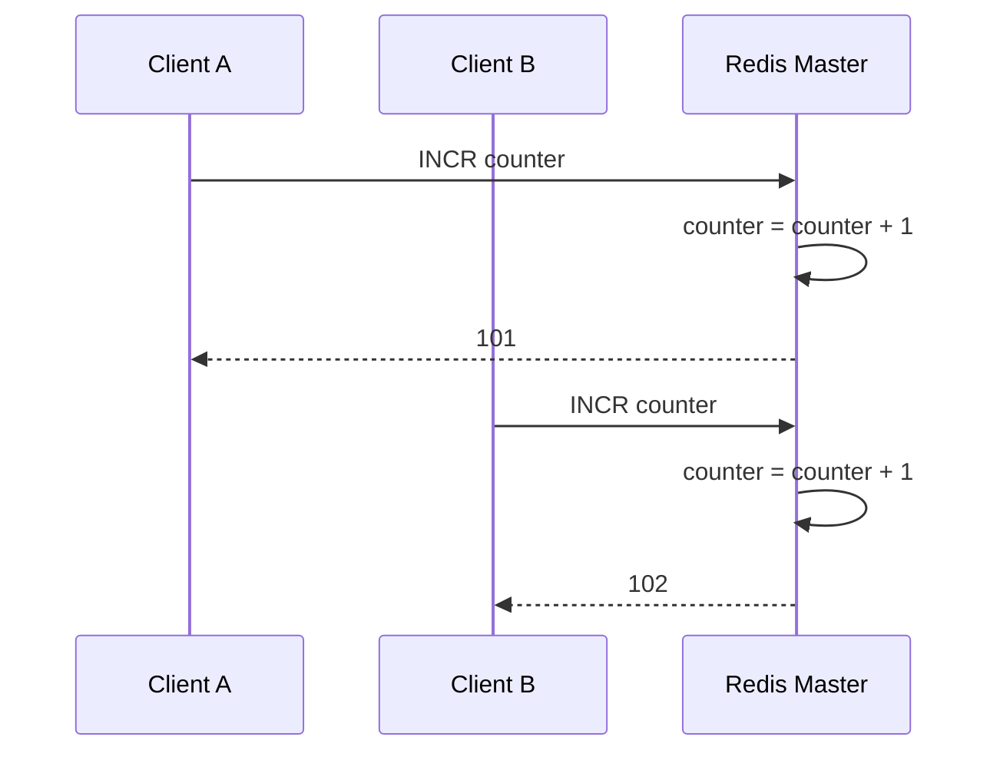
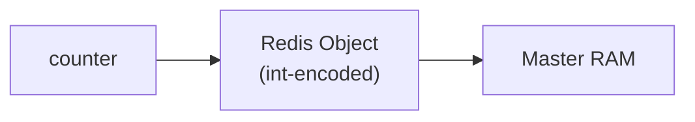
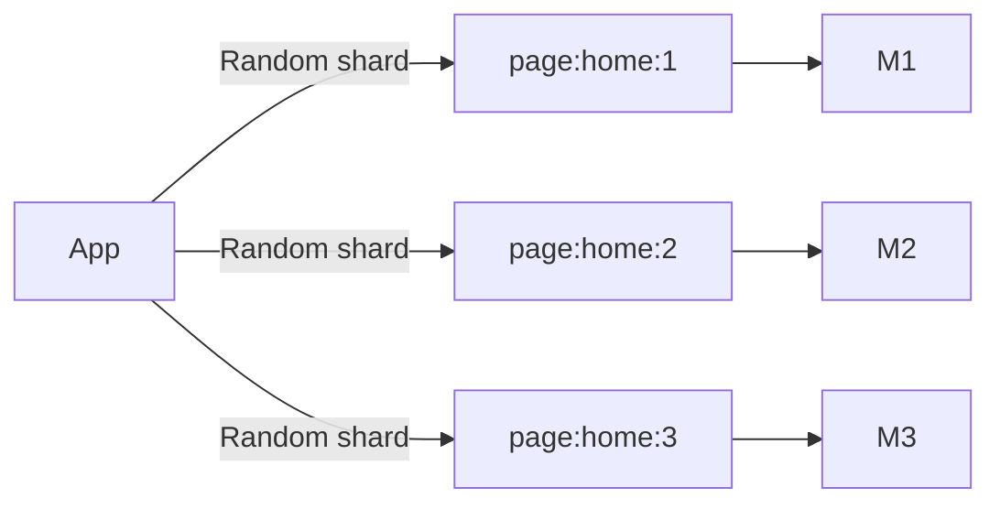
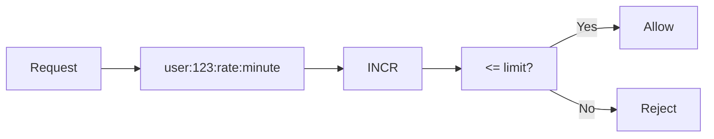
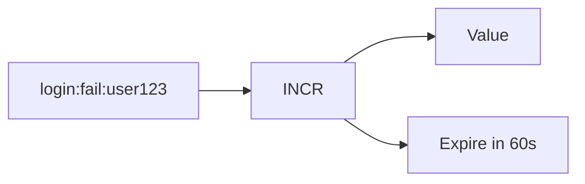
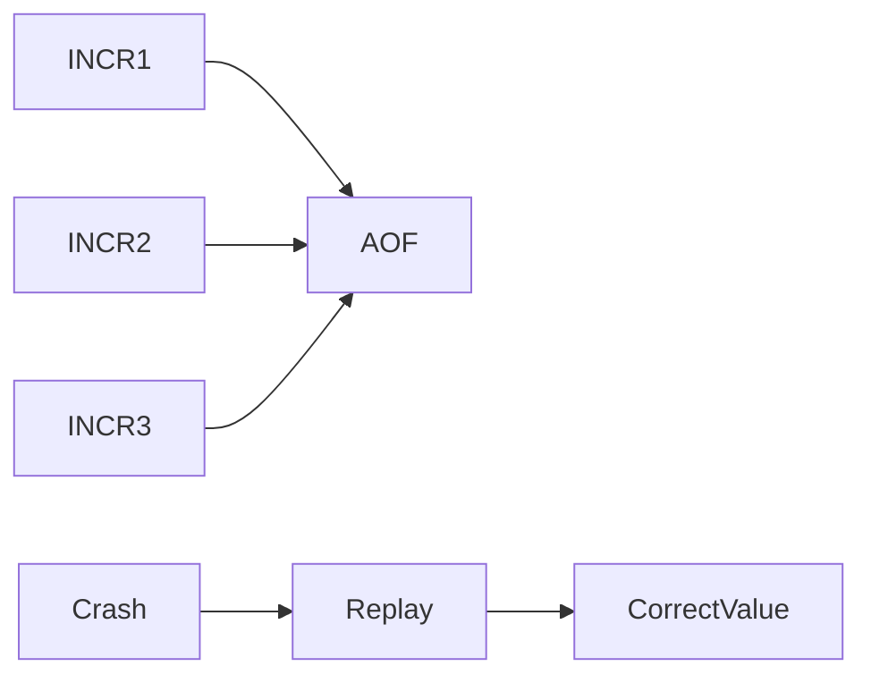
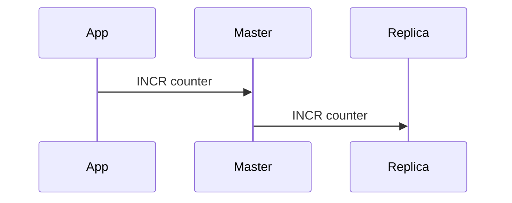
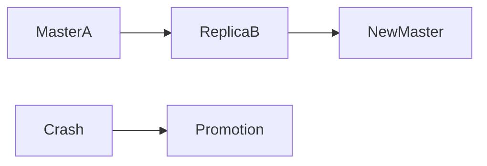
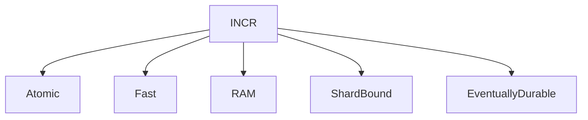

# Redis `INCR`: From Atomic Counter to Distributed System Primitive

## 1. What Is `INCR` — Really?

At the surface:

> `INCR key` increments the integer value stored at `key` by 1.

But conceptually:

> **`INCR` is Redis’s atomic, single-threaded, in-memory state transition primitive.**

It is not just a command — it is a **contract**:

* Atomic
* Linearizable (within a shard)
* Fast (O(1))
* Durable only through persistence configuration

---

## 2. The Core Property: Atomicity by Design

Redis achieves atomicity **without locks**.

### Why?

Redis executes commands:

* In a **single-threaded event loop**
* One command at a time per master

### Mental model



No race conditions.
No CAS.
No mutexes.

📌 **Atomicity is a consequence of Redis architecture, not a feature bolted on.**

---

## 3. `INCR` at the Memory Level

Redis stores values as **encoded objects**.

### Counter lifecycle



Key properties:

* Stored as **integer encoding**, not string
* Conversion happens automatically if needed
* O(1) mutation

---

## 4. What Happens on First `INCR`?

If the key does not exist:

> Redis implicitly creates it with value `0`, then increments.


This is **critical** for idempotent system design.

---

## 5. `INCR` vs `INCRBY` vs `DECR`

All share the same atomic model:

```text
INCR     → +1
INCRBY   → +N
DECR     → -1
```

They differ only in **delta**, not semantics.

---

## 6. `INCR` in a Redis Cluster (Slots Matter)

### Slot routing


### Important constraint

> **All operations on a key must hit the same master.**

That’s why:

* Counters scale **by key**
* Not by total throughput automatically

---

## 7. One Counter = One Slot = One Master


This implies:

* A **single hot counter can become a bottleneck**
* Sharding requires **key design**, not Redis magic

---

## 8. Real-World Use Case #1: Page View Counters

### Naive design

```text
INCR page:home
```

### Problem

* All traffic hits one master
* Hotspot risk

### Better design (sharded counters)



Later:

* Aggregate offline or periodically

📌 **INCR is atomic, aggregation is eventual.**

---

## 9. Real-World Use Case #2: Distributed Rate Limiting

### Conceptual flow



### Why INCR is perfect here

* Atomic increment
* No locks
* TTL-based expiration

---

## 10. TTL + INCR = Time-Window Counters



Key idea:

* Redis counter lifecycle = **window lifecycle**

---

## 11. Real-World Use Case #3: ID Generation

### Monotonic IDs (per shard)


⚠️ Limitations:

* Not globally monotonic in cluster
* Not gap-free (crashes, rollbacks)

---

## 12. Persistence and `INCR`

### With RDB


📌 Counters may roll back to last snapshot.

---

### With AOF



AOF provides:

* Stronger durability
* Higher IO cost

---

## 13. Replication Semantics of `INCR`



Replicas:

* Replay commands
* Do NOT compute independently

---

## 14. Failover and Counters

### What happens during failover?



Possible effects:

* Lost increments (depending on replication lag)
* Duplicate increments (rare, edge cases)

📌 **Redis counters are at-least-once durable, not exactly-once.**

---

## 15. `INCR` Is NOT a Transaction Log

Do NOT use Redis counters when you need:

* Auditable correctness
* Exactly-once guarantees
* Financial-grade accuracy

Use:

* Databases
* Event logs
* Kafka-style append-only systems

---

## 16. Best Practices Summary

### Design best practices

| Principle                     | Why                            |
| ----------------------------- | ------------------------------ |
| Shard hot counters            | Avoid single-master bottleneck |
| Combine INCR + TTL            | Natural windowing              |
| Accept eventual aggregation   | Scale horizontally             |
| Use AOF for critical counters | Better durability              |
| Avoid cross-slot counters     | Not atomic                     |

---

### Anti-patterns

❌ Global counters without sharding
❌ Using INCR for money
❌ Assuming strong durability by default
❌ Expecting ordering across masters

---

## 17. Mental Model to Keep Forever

```text
INCR =
Atomic
In-memory
Single-shard
Best-effort durable
Extremely fast
```

Or visually:



---

## 18. Final Thought

> **Redis `INCR` is not just a counter.
> It is a building block for distributed coordination —
> as long as you respect its boundaries.**

If you want next, I can:

* Compare `INCR` vs Kafka counters
* Design a **10M QPS rate limiter**
* Explain **Lua + INCR atomic workflows**
* Dive into **Redis Time Series vs INCR**

Just tell me where you want to go next.
