# Redis Architecture Deep Dive: Core Concepts & Relationships

## Executive Summary

This document provides a comprehensive explanation of Redis' core architectural concepts and their interrelationships. We'll explore persistence mechanisms, data distribution strategies, and high-availability patterns through detailed conceptual diagrams and clear explanations.

## 1. Persistence Layer: RDB vs AOF

### 1.1 RDB (Redis Database File) - The Snapshot

**RDB is a point-in-time binary snapshot** of Redis' entire in-memory dataset at a specific moment.

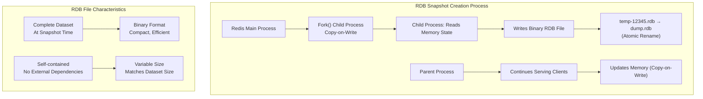

**Key RDB Insights:**

1. **Complete, not incremental**: Each RDB contains the full dataset at snapshot time
2. **Variable file size**: Yes, RDB size varies with dataset size - it can increase OR decrease
3. **No incremental writing**: Each RDB is written from scratch
4. **Copy-on-Write mechanism**: Forked child process reads while parent continues operations

**RDB Size Dynamics:**
```
Scenario 1: Dataset grows → RDB size increases
Scenario 2: Dataset shrinks → RDB size decreases
Scenario 3: Data changes but same size → RDB similar size
Scenario 4: Different compression/encoding → RDB size varies
```

### 1.2 AOF (Append Only File) - The Command Log

**AOF is an append-only log** of every write command received by Redis.

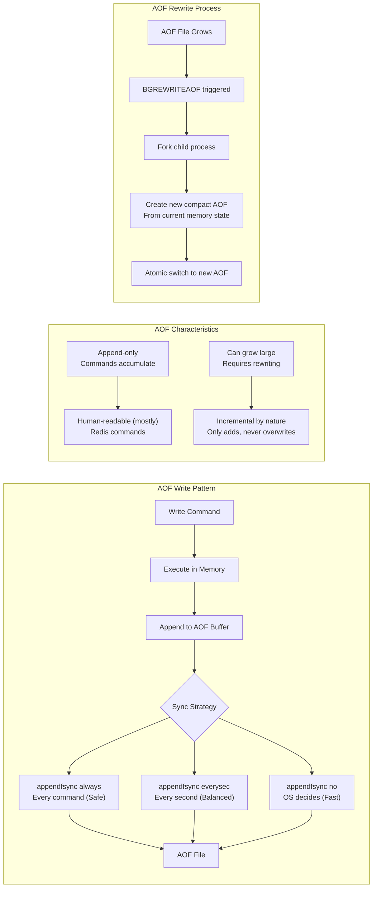

**AOF vs RDB Comparison:**

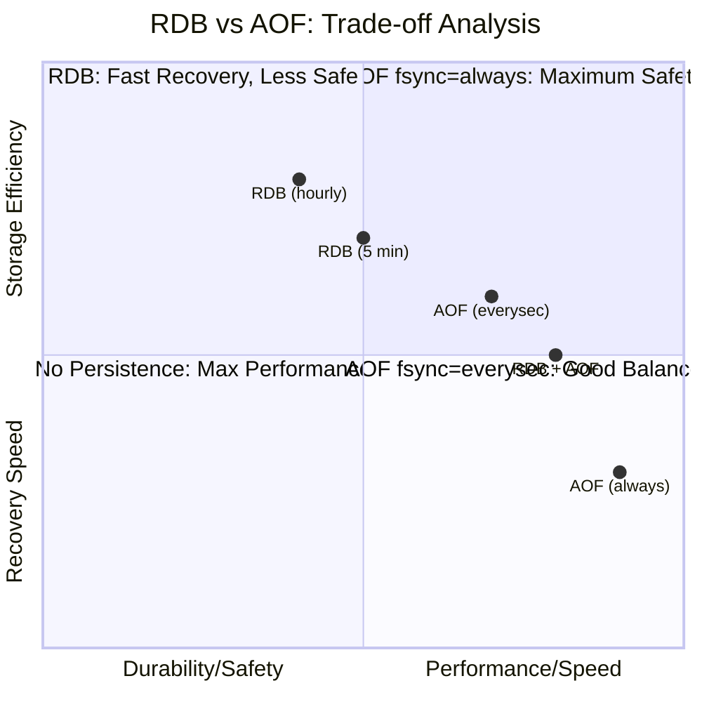

### 1.3 Snapshot: The Concept vs Implementation

**Important distinction**: Snapshot is the **concept**, RDB is the **implementation**.

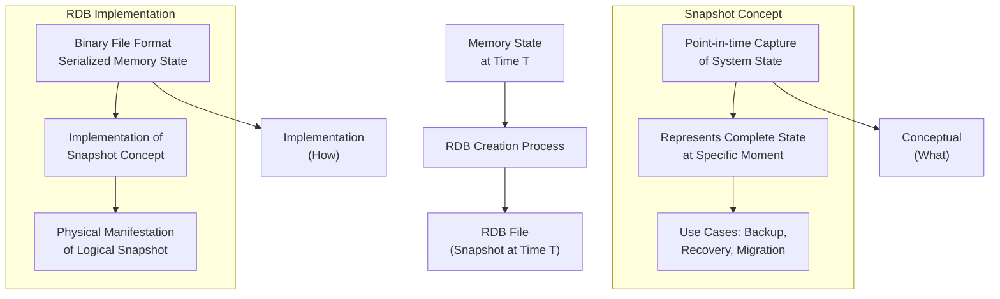

**Snapshot Lifecycle:**
```
1. Memory state exists (runtime)
2. Snapshot triggered (admin or schedule)
3. RDB file created (implementation)
4. RDB persists snapshot (storage)
5. RDB used for recovery (restoration)
```

## 2. Data Distribution: Sharding & Slots

### 2.1 Shards/Sharding - Horizontal Partitioning

**Sharding is the practice of splitting data across multiple Redis instances** to scale beyond single-node limits.

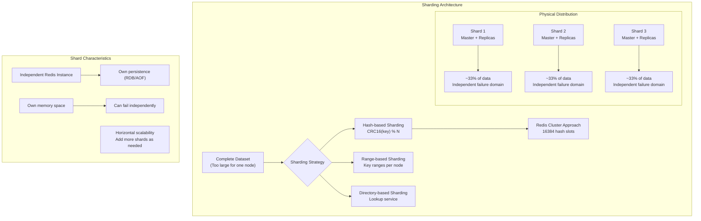

### 2.2 Slots - The Logical Partitioning Layer

**Slots are logical partitions** (0-16383) that provide an indirection layer between keys and physical nodes.

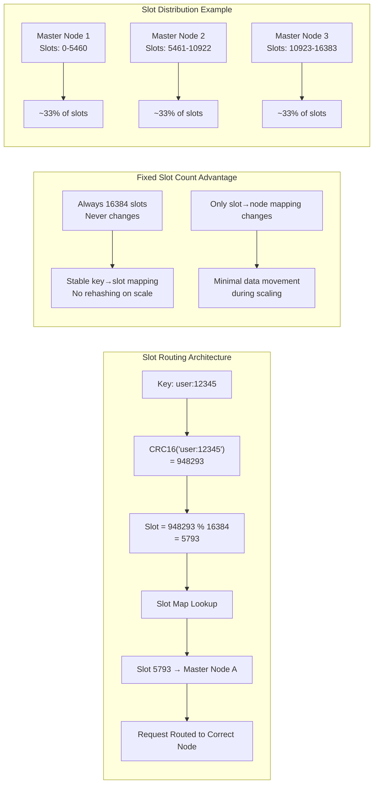

**Why 16384 Slots?**
- Enough for distribution (more than typical node count)
- Small enough for efficient metadata management
- Binary-friendly number (2^14)
- Fits in 16KB with 1-bit per slot in cluster messages

### 2.3 Relationship: Shards vs Slots

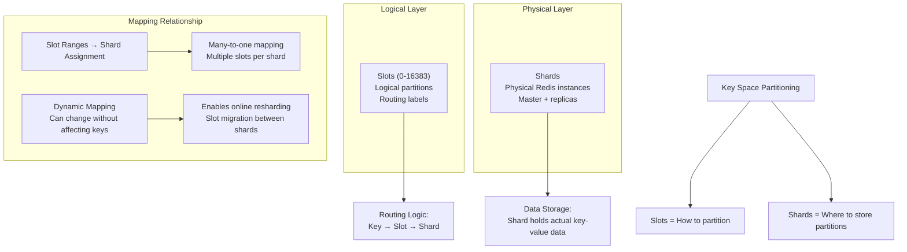

## 3. Node Roles & Replication

### 3.1 Node - The Fundamental Unit

**A node is a single Redis server process** running on physical/virtual hardware.

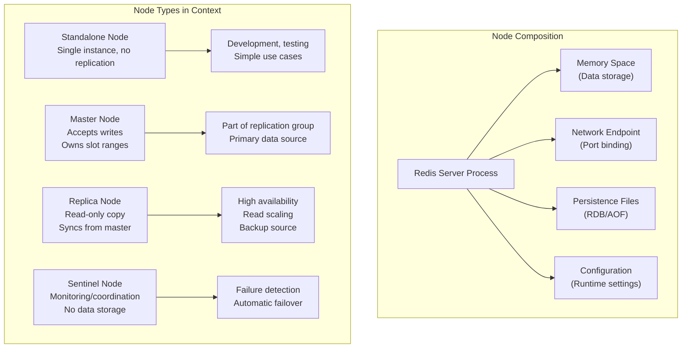

### 3.2 Master & Replica - The Replication Pair

**Master-replica architecture** provides data redundancy and read scalability.

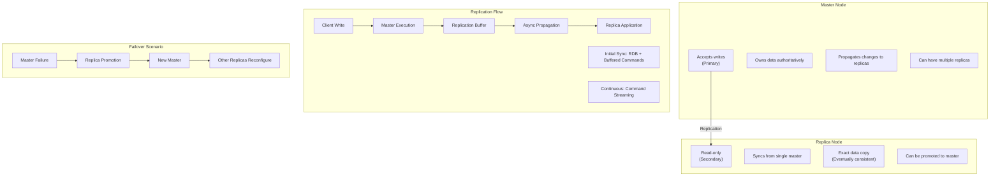

### 3.3 Replication Topologies

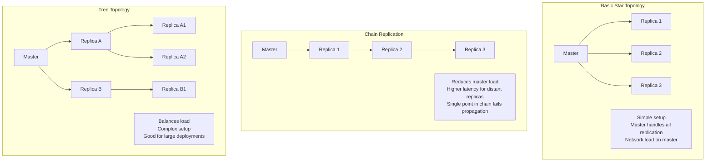

## 4. Redis Cluster: Integrated Architecture

### 4.1 Complete Cluster Architecture

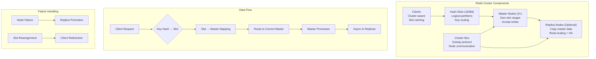

### 4.2 Routing in Redis Cluster

**Smart client routing** with automatic redirection:

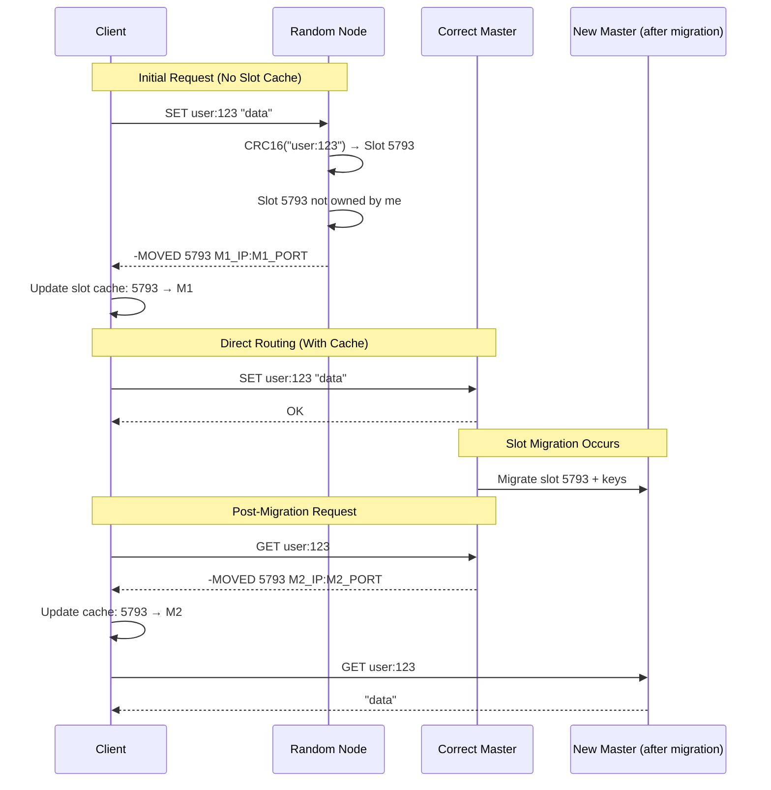

**Routing Components:**
1. **Slot caching**: Clients remember slot→node mappings
2. **MOVED response**: Permanent redirect (update cache)
3. **ASK response**: Temporary redirect during migration
4. **Cluster slots command**: Full mapping retrieval

## 5. Concept Relationships & Data Flow

### 5.1 Complete Data Lifecycle

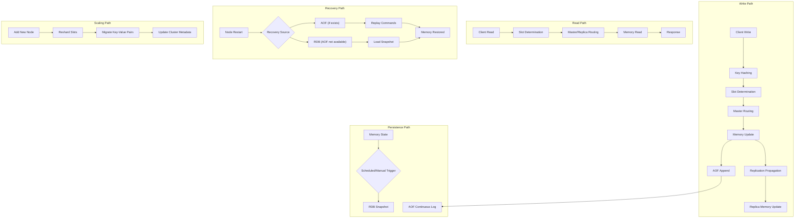

### 5.2 Concept Hierarchy & Dependencies

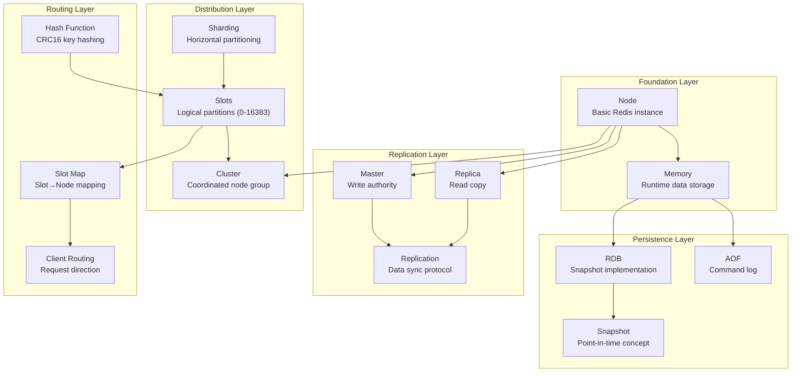

## 6. Advanced Persistence Insights

### 6.1 RDB Size Dynamics Explained

**RDB file size varies** based on multiple factors:

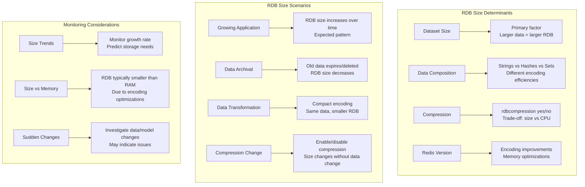

**RDB Size Characteristics:**
1. **Not monotonic**: Can increase or decrease between snapshots
2. **Not incremental**: Each RDB is complete, written from scratch
3. **Compression optional**: `rdbcompression` setting affects size
4. **Encoding dependent**: Redis optimizes storage differently than runtime memory

### 6.2 AOF Growth & Rewriting

**AOF append-only nature** leads to continuous growth:

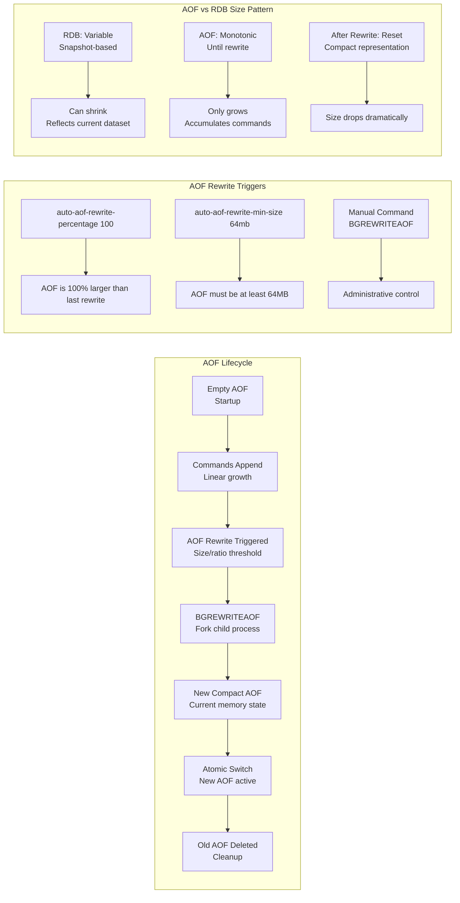

**AOF Rewrite Process:**
1. **Fork child process** (copy-on-write)
2. **Child writes new AOF** from current memory state
3. **Parent continues serving** and buffering new commands
4. **Atomic switch** when child completes
5. **Parent appends buffered commands** to new AOF

## 7. Operational Considerations

### 7.1 Choosing Between RDB and AOF

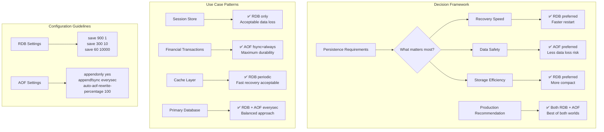

### 7.2 Scaling Strategy Matrix

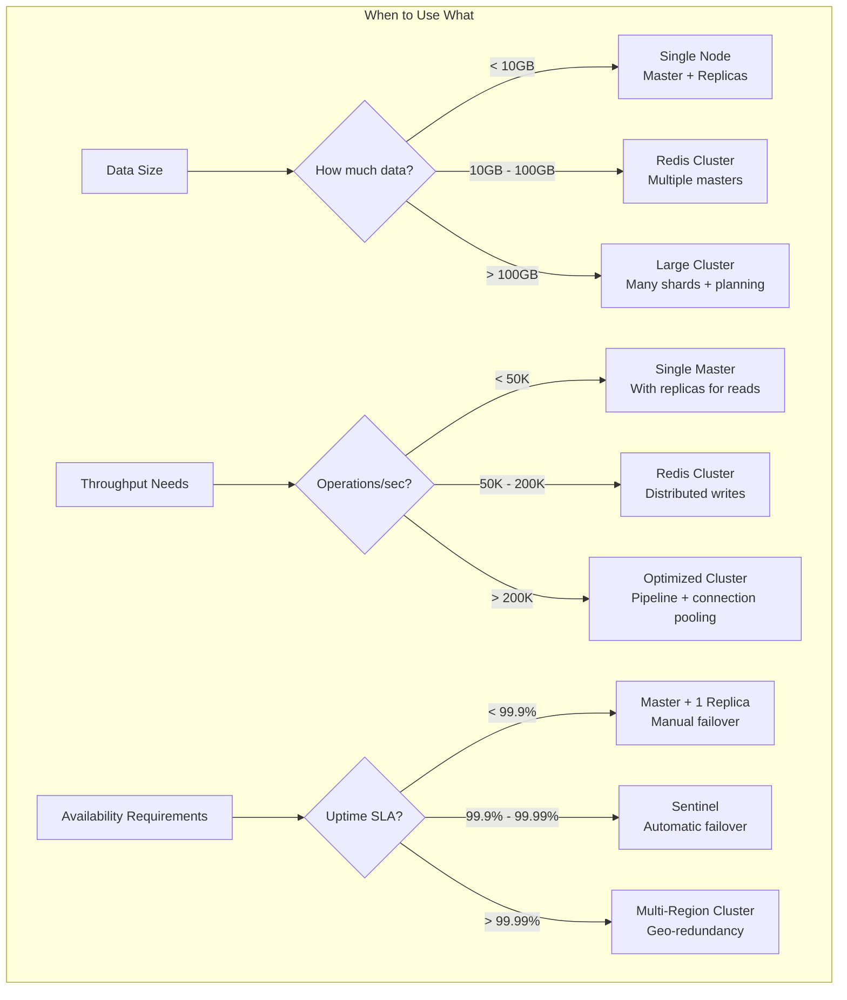

## 8. Summary: Unified Architecture View

### 8.1 The Complete Picture

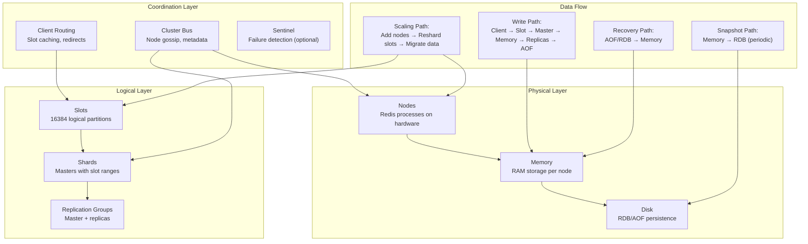

### 8.2 Key Principles

1. **Separation of concerns**: Slots (logical) vs Shards (physical) vs Nodes (instances)
2. **Indirection enables scaling**: Fixed slots allow dynamic node assignment
3. **Memory as source of truth**: Persistence is for recovery, not runtime
4. **Decentralized coordination**: No single point of failure in cluster
5. **Explicit over automatic**: Manual resharding prevents uncontrolled data movement

### 8.3 RDB vs AOF: Final Comparison

| Aspect | RDB (Snapshot) | AOF (Append Log) |
|--------|----------------|------------------|
| **Pattern** | Point-in-time complete dump | Continuous command accumulation |
| **Size Behavior** | Variable - matches dataset | Monotonic growth until rewrite |
| **Write Pattern** | Complete rewrite each time | Append-only, incremental |
| **Recovery** | Fast load of snapshot | Slow replay of command history |
| **Data Safety** | Potential loss since last snapshot | Configurable (everysec/always) |
| **Storage Efficiency** | Compact, encoded format | Verbose, command-based |

**Production Recommendation**: Enable both with `appendfsync everysec` for optimal balance of performance, safety, and recovery speed.
